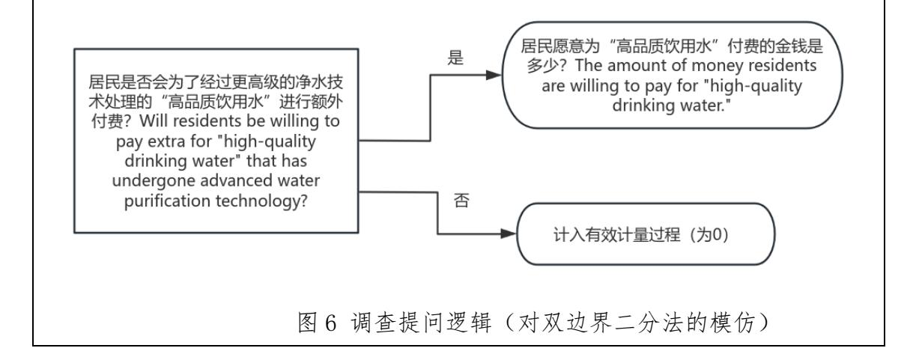
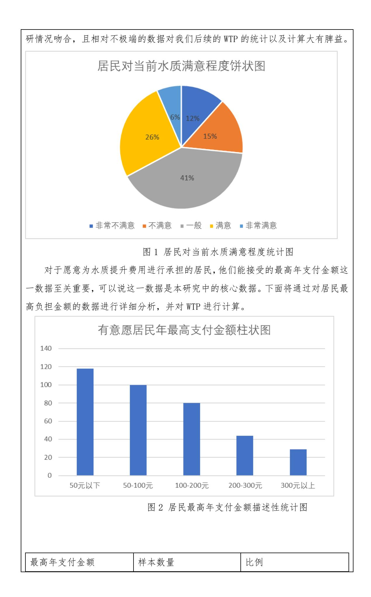
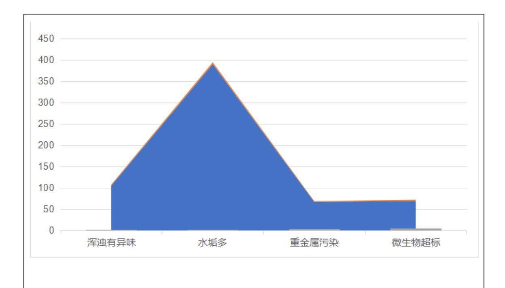
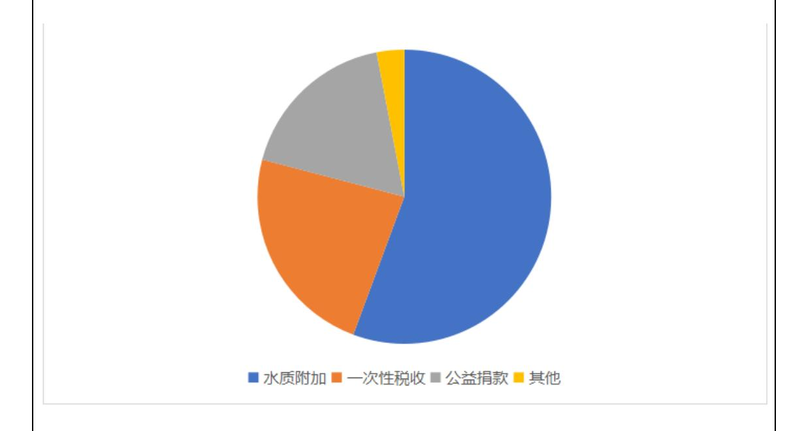
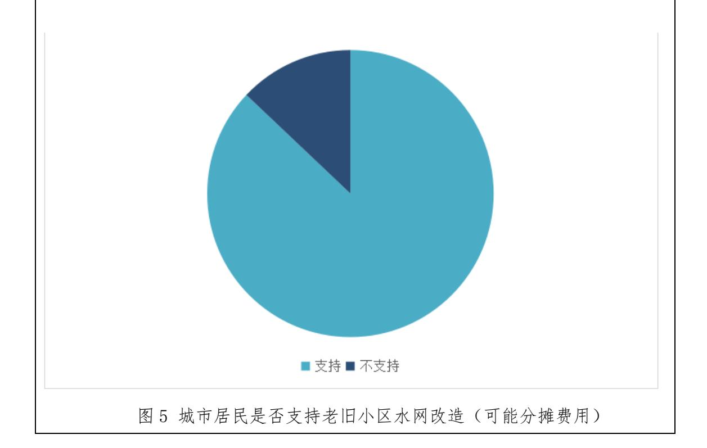

二、立项依据

# 1.立项依据与研究内容(研究意义、国内外研究现状及发展动态分析,需结合 科学研究发展趋势来论述科学意义;或结合国民经济和社会发展中迫切需要解 决的关键科技问题来论述其应用前景。)

一、研究背景

水润民心,泽被万物,水是生态环境的控制性要素,水资源是保障生命、生 活、生产和生态持续发展的最主要资源。保护好水、利用好水,是关乎中华民族 永续发展的千年大计。但改革开放以来,随着我国的经济增长和城镇化进程显著 加快,人口增长、城区面积增加、产业结构改变以及水利工程建设等方面迅猛发 展,不仅影响了河川水体及流域水文演化,也使大量各类污染物排入河川,进而 对水环境质量产生严重威胁。因此,当今生态环境特别是干旱半干旱地区的水资 源环境保护问题,是当今的热点研究课题。

近年来,习近平总书记高度重视节水工作和流域生态环境保护治理工作。党 的十八大以来,总书记多次视察长江、黄河等大江大河和滇池、洱海、丹江口等 重要湖库,多次强调指出要紧盯污染防治重点领域和关键环节,统筹水资源、水 环境、水生态治理。党的十九大报告指出,加快水污染防治,实施流域环境和近 岸海域综合治理。党的二十大报告指出,坚持精准治污、科学治污、依法治污, 持续深入打好蓝天、碧水、净土保卫战;统筹水资源、水环境、水生态治理,推 动重要江河湖库生态保护治理,基本消除城市黑臭水体。习近平新时代中国特色 社会主义思想为我们持续做好重点流域水环境综合治理工作指明了方向,提供了 根本遵循。

2022 年 8 月,习近平总书记在辽宁考察时指出:"从历史长河来看,如果说 我们这一代人能留给后人点什么,我看生态文明建设就是很重要的一个方面。生 态文明建设最能给老百姓带来获得感。"我们研究水质提升问题,有利于深入贯 彻习近平总书记重要讲话和指示批示精神,全面落实党的二十大关于推动重要江 河湖库生态保护治理的重要部署,推进美丽中国建设,不断提升人民群众幸福感、 获得感、满足感,加快实现人与自然和谐共生的现代化。

内蒙古自治区境内共有大小河流千余条,祖国的第二大河--黄河,由宁夏石 嘴山附近进入内蒙古,由南向北,围绕鄂尔多斯高原,形成一个马蹄形。流域面 积在 1000 平方公里以上的河流有 107 条;流域面积大于 300 平方公里的有 258 条。有近千个大小湖泊。全区多年平均水资源总量为 515.7 亿立方米,其中地表 水资源量为 369.99 亿立方米,地下水资源量为 217.84 亿立方米。另外黄河分水 58.6亿立方米,黑河分水6.03亿立方米。全区多年平均水资源可利用量为253.42 亿立方米,其中地表水资源可利用量为 140.12 亿立方米,地下水可开采量为 105.62 亿立方米。年人均占有水量 2152.34 立方米,耕地每公顷平均占有水量 1.13 万立方米,平均产水模数为 4.49 万立方米/平方公里。

内蒙古水资源在地区、时程的分布上很不均匀,且与人口和耕地分布不相适 应。其中松花江流域总面积占全区的 27%,耕地面积占全区的 10.6%,人口占全 区的 16.3%,而水资源总量占全区的 67.0%,人均占有水资源量为全区均值的 4.1 倍;辽河、海河、黄河 3 个流域总面积占全区的 26.0%,耕地占全区的 83.1%, 人口占全区的 72.9%,但水资源仅占全区 23.8%,大部分地区水资源紧缺。此外, 受自然条件限制和人类活动叠加影响,城乡饮用水安全问题日益凸显。选择内蒙 古自治区作为研究对象并进行支付意愿的实证分析,有助于我们更好地了解我国 干旱区半干旱区的水资源现状,同时有助于为其他地区提供借鉴。

具体背景如下:

(一)内蒙古地区水资源禀赋不足,供需矛盾加剧。

1.地表水萎缩。

内蒙古自治区多年平均地表水资源量约 369.99 亿立方米。由于河川径流受 大气降水及下垫面因素的影响,年径流量地区分布不均,水资源也不平衡,局部 地区水量富而有余,而大部分地区干旱缺水。同时,河川径流年内分布不均,年 际间变化比较大。年降水集中在 6~9 月,汛期径流量占全区径流量的 60~80%。 历年间径流量大小不匀,相差很大。年径流量最大与最小的比值,东部林区各河 流为 4~12,中部各河流为 6~22,西部地区部分河流可高达 26 以上。

|      | 地表水资源     | 与 2022 年比 | 与多年平均值比 |
|------|-----------|-----------------|---------|
| 行政分区 | 量         | 较               | 较       |
|      | (亿 m³) | (±%)            | (±%)    |
| 呼和浩特 | 2.58      | 2.4             | -35.8   |
| 市    |           |                 |         |

| 包头市       | 1.41   | -4.9  | -30.8 |  |
|-----------|--------|-------|-------|--|
| 乌海市       | 0.12   | 0     | 0     |  |
| 赤峰市       | 13.89  | -17.5 | -31.2 |  |
| 呼伦贝尔 市 | 271.45 | -5.3  | -3    |  |
| 兴安盟       | 47.38  | 39.6  | 50.1  |  |
| 通辽市       | 5.41   | -36.2 | -17.8 |  |
| 锡林郭勒 盟 | 6.38   | 11.5  | -21.5 |  |
| 乌兰察布 市 | 1.66   | 12.4  | -67.4 |  |
| 鄂尔多斯 市 | 5.41   | -23.4 | -48.7 |  |
| 巴彦淖尔 市 | 1.01   | -18.3 | -41.5 |  |
| 阿拉善盟      | 0.33   | 0     | 0     |  |
| 全区        | 357.03 | -2.4  | -3.5  |  |

表 1 2023 年内蒙古行政分区年地表水资源量及其与 2022 年和多年平均值比较 (数据来源:《2023 年内蒙古自治区水资源公报》)

| 水资源一级 | 地表水资源     | 与 2022 年比 | 与多年平均值比 |
|-------|-----------|-----------------|---------|
| 区     | 量         | 较               | 较       |
|       | (亿 m³) | (±%)            | (±%)    |
| 松花江区  | 320.21    | -0.6            | 2.3     |
| 辽河区   | 17.3      | -25.2           | -26.8   |
| 海河区   | 1.78      | 6.4             | -38.3   |
| 黄河区   | 10.87     | -14.6           | -43.5   |
| 西北诸河区 | 6.87      | 11.1            | -39.1   |

| 357.03 | -2.4 | -3.5 |  |  |
|--------|------|------|--|--|
|--------|------|------|--|--|

表 2 2023 年内蒙古水资源一级区年地表水资源量及其与 2022 年和多年平均值比 较

(数据来源:《2023 年内蒙古自治区水资源公报》)

数据表明,内蒙古地表水普遍存在萎缩状况,特别是辽河区、黄河区的地表 水资源量,与 2022 年比较仍在继续降低。西辽河断流长达 26 年,直接威胁饮用 水源稳定性。

此外研究显示,近二十年内蒙古高原湖泊蓄水量减少显著。相较于 2000 年, 2021 年内蒙古高原湖泊水资源量减少了 24.12 亿立方米。降水的增加并没有维 持住内蒙古高原湖泊水量的增加,说明气候变化是促进湖泊蓄水量增加的因素, 人类活动是导致湖泊蓄水量减少的因素,且影响超过气候变化。

2.地下水开采严重。

内蒙古自治区多年平均地下水资源量为 217.84 亿立方米,与地表水的重复 量为 72.12 亿立方米。全区地下水资源的分布受大气降水、下垫面条件和人类活 动的影响,具有平原区多、山丘区少和内陆河流域更少的特点。平原区扣除与山 丘区地下水资源量间的重复量后的平均地下水资源模数为 3.26 万立方米/平方 公里,为山丘区地下水平均水资源模数的 1.9 倍。内陆河流域地下水资源模数为 0.79 万立方米/平方公里,因而地下水资源十分贫乏,只是在内陆闭合盆地的平 原或沟谷洼地,地下水才比较富集。

|      | 地下水资源     | 与 2022 年比 | 与多年平均值比 |
|------|-----------|-----------------|---------|
| 行政分区 | 量         | 较               | 较       |
|      | (亿 m³) | (±%)            | (±%)    |
| 呼和浩特 |           |                 |         |
| 市    | 6.62      | -3.9            | -11.5   |
| 包头市  | 4.85      | -1              | -9.2    |
| 乌海市  | 0.95      | 5.6             | 2.2     |
| 赤峰市  | 16.36     | -2.9            | -3.8    |
| 呼伦贝尔 | 73.1      | 2.3             | 0.9     |

| 市         |       |       |       |  |
|-----------|-------|-------|-------|--|
| 兴安盟       | 18.2  | 6.2   | 6.3   |  |
| 通辽市       | 28.01 | -13.8 | 9.1   |  |
| 锡林郭勒 盟 | 23.11 | 15.7  | -5.2  |  |
| 乌兰察布 市 | 8.11  | 7.7   | -6.2  |  |
| 鄂尔多斯 市 | 19.5  | -28.7 | -8.4  |  |
| 巴彦淖尔 市 | 9.96  | 0.4   | -0.5  |  |
| 阿拉善盟      | 6.33  | -18.6 | -15.4 |  |
| 全区        | 215.1 | -3.6  | -1.3  |  |

表 3 2023 年内蒙古行政分区年地下水资源量及其与 2022 年和多年平均值比较 (数据来源:《2023 年内蒙古自治区水资源公报》)

|       | 地下水资源     | 与 2022 年比 | 与多年平均值比 |
|-------|-----------|-----------------|---------|
| 水资源一级 | 量         | 较               | 较       |
| 区     | (亿 m³) | (±%)            | (±%)    |
| 松花江区  | 90.69     | 2.7             | 1.5     |
| 辽河区   | 43.49     | -9.8            | 5.4     |
| 海河区   | 3.3       | 1.5             | -6      |
| 黄河区   | 42.52     | -15.5           | -6.8    |
| 西北诸河区 | 35.1      | 6.3             | -7.8    |
| 全区    | 215.1     | -3.6            | -1.3    |

表 4 2023 年内蒙古水资源一级区年地下水资源量及其与 2022 年和多年平均值比 较

(数据来源:《2023 年内蒙古自治区水资源公报》)

在此背景下,内蒙古部分地区仍然存在比较明显的地下水超采状况。全区地 下水超采区面积达 6.7 万平方公里,占可开采区域的 21%,呼和浩特、通辽等地 深层地下水水位年均下降 1.5-2 米,引发水质硬化(总硬度超标率 38%)和氟化 物富集(超标率 27%)。例如 2023 年 9 月,自治区第一生态环境保护督察组督察 通辽市发现,科尔沁区大型孔隙浅层地下水超采区地下水资源管理不严,违规取 用地下水问题多发,地下水超采区治理整改不到位。2016 年第一轮中央环保督 察指出,通辽市地下水水位下降明显,仅 2014 年至 2015 年地下水水位下降 0.85 米。科尔沁区地下水超采区作为自治区 33 个超采区之一,在水利部重点推进的 西辽河流域地下水超采综合治理区域之内。2022 年开采系数为 1.39,仍属于严 重超采区。

3.供需缺口扩大,水资源禀赋不能满足人口增长和经济发展的需求。

内蒙古自治区是水资源严重短缺地区,水资源总量仅占全国总量的 1.9%, 通辽以西 10 个盟市人均水资源量仅为全国平均水平的 1/2,水资源禀赋与人口、 耕地及经济发展极不匹配,水资源短缺、区域不均衡长期制约着经济社会发展, 也引发了一系列水生态问题。2022 年,全区生活用水需求为 18.6 亿立方米,但 实际供水量仅 15.3 亿立方米,缺口 17.7%,农村牧区季节性缺水问题尤为突出。 (二)城乡饮用水安全二元割裂,基础设施与治理能力存在系统性失衡。 1.城市地区水质达标率较高,但隐性风险突出。

| 序 号 | 城市名 | 水源地名称     | 断面名称   | 水      | 水  | 超标指标及其超标倍数 |
|--------|-----|-----------|--------|--------|----|------------|
|        | 称   |           |        | 源      | 质  |            |
|        |     |           |        | 类      | 类  |            |
|        |     |           |        | 型      | 别  |            |
| 1      |     | 呼和浩特市黄    | 引黄入呼取水 | 地 表 | Ⅱ类 |            |
|        |     | 河蒲滩 拐饮 | 口      | 水      |    |            |
|        |     | 用水水源地     |        |        |    |            |
| 2      |     |           | 金川水厂   |        | Ⅲ类 |            |
| 3      |     |           | 如意水厂   |        | Ⅲ类 |            |

| 4  | 呼和浩 |                         | 二水厂         |      | III类 |      |
|----|-----|-------------------------|-------------|------|------|------|
| 4  | 特市  |                         |             |      | 加天   |   |
| 5  | _   |                         | 三水厂         |      | III类 |      |
| 6  |     | 呼和浩特市城                  | 四水厂         | 地下   | III类 |      |
| 7  |     | 区地下 水饮 用水水源地         | 五水厂         | 水    | III类 |      |
| 8  |     |                         | 东门外水厂       |      | III类 |      |
| 9  |     | 包头市昆都仑 水 库 水 源地   | 昆都仑水库       |      | II类  |      |
| 10 |     | 包头市黄河昭 君 坟 水 源地   | 黄河昭君坟       | 地表水  | II类  |      |
| 11 | 包头市 | 包头市黄河画 匠 营 子 水源地  | 黄河画匠营 子  |      | II类  |      |
| 12 |     | 包头市黄河磴 口水源 地      | 黄河磴口        |      | II类  |      |
| 13 |     | 包头市昆都仑 区清水 池 水源地  | 供水公司昆区 站 |      | III类 |      |
| 14 |     | 包头市青山区 青山加 压 站水源地 | 供水公司青山 站 | 地 下水 | III类 |      |
| 15 |     | 包头市东河清 水 池 水 源地   | 东河水厂        |      | III类 |      |

|    |       |                     |             |   | 1 |                |          | 1           |
|----|-------|---------------------|-------------|---|---|----------------|----------|-------------|
| 16 |       | 包头市九原区              | 九原区供水       |   |   | III类           |          |             |
|    |       | 供水站                 | 站           |   |   |                |          |             |
| 17 |       | 小 小 小 心 包 头 市 昆 都 仑 | 阿尔丁水厂       |   | - | III类           |          |             |
| 17 |       | 区阿尔 丁               | PH XX 1 XX) |   |   | III矢           |          |             |
|    |       | 水厂水源地               |             |   |   |                |          |             |
| 18 | 呼伦贝尔  | 呼伦贝尔市红              | 红花尔基水       | 地 | 表 | III类           |          |             |
|    | 市     | 花尔基 水               | 库           | 水 |   |                |          |             |
|    |       | 库水源地                |             |   |   |                |          |             |
| 19 | 满 洲 里 | 满洲里市第二              | 满洲里二水       | 地 | 下 | V类             | 铁(9.5)、渔 | ≇浊度(3.7)、碑  |
|    | 市     | 水源地                 | 源           | 水 |   |                | (2.6)、锰  |             |
|    |       |                     |             |   |   |                | (1.1)、氨  | 氮(0.7)、耗氧量  |
|    |       |                     |             |   |   |                | (0.5)    |             |
| 20 |       | 兴安盟乌兰浩              | 一水厂         |   |   | III类           |          |             |
|    | 兴安盟   | 特市一                 |             |   |   |                |          |             |
|    |       | 水源                  |             | 地 | 下 |                |          |             |
| 21 |       | 兴安盟鸟兰浩              | 三水源一水       | 水 |   | III类           |          |             |
|    |       | 特市二                 | F           |   | - |                |          |             |
| 22 |       | 水源                  | 三水源二水       |   |   | III类           |          |             |
|    |       |                     | Г           |   |   |                |          |             |
| 23 |       |                     | 西水源地西水      |   |   | IV类            | 锰(3.9)、  | 铁(1.7)、氨氮   |
|    |       | 通辽市科尔沁              | Г           |   |   |                | (0.3)    |             |
|    |       | 区集中 式饮              | 西水源地北水      |   | - | IV类            | 仔 (2 2)  | 铁(2.2)、氨氮   |
| 24 | 通辽市   | 用水水源地               |             |   |   | IV 矢           | (0.2)    | 九(2,2)、 致 灸 |
|    |       | -                   | ,           | 地 | 下 | <b>T</b> 7 514 |          |             |
| 25 |       |                     | 南水源地南水 厂 | 水 |   | IV类            | 〔        | 盖(1.7)      |
|    |       |                     |             |   | - |                |          |             |
| 26 |       | 通辽经济技术              | 西水源地河西      |   |   | IV类            | 钅        | 盖(2.3)      |

|                  | 开发区                                 | 水厂                      |                     |          |
|------------------|-------------------------------------|-------------------------|---------------------|----------|
|                  | 三义 堂集 中式                            | 通新净水厂                   | Ⅳ类                  | 锰(2.2)   |
| 27               | 饮用水                                 |                         |                     |          |
|                  | 水源地                                 |                         |                     |          |
| 表 5 2025 年 | 1                                   | 月地市级城市集中式生活饮用水水源地监测情况统计 |                     |          |
|                  | (数据来源:内蒙古地市级城市集中式生活饮用水水源水质月报(2025 年 |                         |                     | 1        |
| 月))              |                                     |                         |                     |          |
|                  |                                     |                         |                     |          |
| 根据内蒙古            | 2025 年 1                      | 月集中式生活饮用水水源地数据,监测的      | 56                  | 个地市级     |
|                  | 集中式生活饮用水水源中,46                      | 个达到Ⅲ类标准,达标率为            | 82.1%;取水量达标率        |          |
|                  | 85.8%,表明大部分供水水质符合国家标准,但仍有           |                         | 14.2%的取水量存在超标问      |          |
|                  | 题。主要超标污染物包括:氟化物、砷、铁、锰、浑浊度、溶解性总固体、耗氧 |                         |                     |          |
|                  | 量、氨氮、总α放射性。其中,锰、铁、砷和总α放射性是高频超标项,反映地 |                         |                     |          |
|                  | 质背景与局部污染的叠加影响。                      |                         |                     |          |
| 监测的              | 10 个地表水水源(如黄河取水口、红花尔基水库等)全部达到Ⅱ类  |                         |                     |          |
|                  | 或Ⅲ类标准,无超标现象,表明地表水管理成效显著。但           |                         | 46 个地下水水源中,      |          |
| 36               | 个达标(78.3%),未达标水源集中于满洲里、通辽、锡林郭勒盟等地。  |                         |                     |          |
| 主要问题如下:          |                                     |                         |                     |          |
| 锰超标(最高           | 7.3                                 | 倍,锡林郭勒盟一棵树水源地);         |                     |          |
| 铁超标(最高           | 9.5                                 | 倍,满洲里市第二水源地);           |                     |          |
| 砷超标(2.6          | 倍,满洲里市第二水源地);                       |                         |                     |          |
|                  | 总α放射性超标(0.8                         | 倍,二连浩特市齐哈日格图水源地)。       |                     |          |
|                  | 此外,尽管城市集中式水源地水质达标率较高,但老旧管网导致的二次污染   |                         |                     |          |
|                  | 问题被严重低估。住建部数据显示,内蒙古城市供水管网平均服役年限达    |                         |                     | 28 年, |
| 漏损率              | 14.7%,高于全国平均水平。包头市                  | 2022                    | 年抽检发现,管网末梢水浑浊       |          |
| 度超标点位占           | 12%,铁、锰沉积现象普遍。                      |                         |                     |          |
|                  | 水源地还存在没有纳入监测范围的新型污染物威胁。2023         |                         | 年呼和浩特市水             |          |
| 源地检出 9        | 种抗生素(如磺胺甲噁唑浓度达                      |                         | 68 ng/L),污水处理厂现有工艺对 |          |
| 其去除率不足           | 50%,而现行国标(GB 5749-2022)尚未将其纳入常规监测。  |                         |                     |          |

2.农村牧区水质达标率低,基础设施维护落后。

农村分散式供水水质达标率仅为 71.3%,其中牧区低至 58%(内蒙古疾控中 心数据)。阿拉善盟额济纳旗 35%的分散式井水氟化物含量超国标 2 倍以上,长 期饮用导致氟斑牙患病率达 42%。

2016-2022 年建设的农村饮水工程中,23%因电费、管护资金不足而停用。 例如,兴安盟突泉县某村 2019 年建成的净水站因年运维成本超 8 万元(村民自 筹占比 60%),仅运行一年后被迫关闭,村民重返手压井取水。牧民季节性转场 导致固定管网覆盖率不足 15%,依赖移动式净水设备成本高昂(单台年运维费用 超 2 万元),且缺乏技术培训,设备闲置率高达 45%。

(三)治理成本分摊失衡,城市与农村、政府与市场的协同作用仍需进一步提升。

现行"城市财政主导、农村自筹补充"的模式加剧城乡不平等。例如,通辽 市农村饮水工程中居民自筹比例高达 40%,远高于城市的 5%,低收入牧民支付压 力巨大。

在城乡一体化战略推进下,2021 年国务院印发《关于建立健全城乡融合发 展体制机制和政策体系的意见》,明确提出"推动城乡基础设施统一规划、统一 建设、统一管护"。然而,水质提升的公共品属性导致市场失灵:一方面,居民 支付意愿受收入、认知等因素制约;另一方面,政府单一投入模式难以为继。在 实践层面,主要引发了三重矛盾:

1. 城乡投入悬殊,存在城市优先导向,且城乡居民负担不均。

2022 年内蒙古城镇饮用水安全投入达 48 亿元,而农村仅为 12 亿元,且其 中 70%用于新建工程,运维资金缺口持续扩大。通辽市某旗县案例显示,城市家 庭年均水费支出占收入比 0.3%,而农村高达 2.1%,低收入牧民甚至需以牲畜抵 偿水费(占比 8%)。

2. 市场化机制失灵。

企业参与不足,农村供水项目投资回报率低(平均回收期超 15 年),2023 年全区仅 3 家民营企业参与 PPP 项目,且集中在呼和浩特周边;价格机制扭曲, 现行"保本微利"定价原则导致农村水价无法覆盖成本(实际收费仅为成本的 60%),财政补贴依赖度高达 70%。

3. 政策执行偏差。

审计署 2022 年通报显示,内蒙古 4 个旗县将 1.2 亿元农村饮水工程资金用 于市政景观建设;巴彦淖尔市强制推广统一净水设备,忽视牧区流动性需求,设 备利用率不足 30%,造成资源浪费。

如何通过环境经济学工具破解"需求侧支付能力不足"与"供给侧资金缺口 扩大"的矛盾,成为亟待解决的现实问题。

# 二、研究意义

#### 1、理论意义

本研究聚焦于城乡饮用水水质提升问题,试图填补内蒙古地区水资源治理领 域的空白。城乡在水资源供给和水质保障方面仍存在较大差距[12]曾万明.我国 统筹城乡经济发展的理论与实践[D].西南财经大学,2011.。百 万 人 口 以 上 的 特 大 城 市 有 90%以 上 长 期 受 缺 水 困 扰 , 这 些城 市 一 般 采 用 超采 地 下 水 或 者挤 占 农 业 用 水 的方 法 解 决 问 题 , 造 成 了 农 业 用 水 紧 缺 , 水资源配置严重不均。根据 2023 年内蒙古自治区水 资源公报,全区人均水资源量 2053m³,人均综合水量 846m³,均低于全国平均水 平。全区农田灌溉亩均毛用水量 207m³,农田灌溉水有效利用系数为 0.583。全 区人均居民生活用水量 89.0L/d,其中城镇居民人均 89.3L/d,农村居民人均 87. 5L/d。研究内蒙古城乡饮用水水质提升,不仅有助于改善农村居民饮水安全问题, 也能促进城乡公共资源的均衡配置。

水资源作为典型的准公共物品,其治理需要政府主导和市场参与相结合的模 式 ([13]刘召,羊许益.农村生态环境危机及其治理——基于公共物品理论的视 角[J].农村经济,2011,(03):104-108.)。政府财政支出有限,市场机制又难以完 全覆盖偏远农村地区,如何合理分配治理成本,成为公共财政研究中的重要议题 ([14]陈祖海.水资源价格问题研究[D].华中农业大学,2001.)。本研究通过测算 居民的支付意愿,探讨不同收入群体对水质改善的接受程度,进而评估政府补贴 与市场化定价的最优组合方式,以提升水资源治理的公平性与效率。

支付意愿(WTP)研究在环境经济学领域具有广泛应用,但针对内蒙古地区 城乡居民的相关研究较少。本研究采用条件估值法(CVM),结合问卷调查数据, 运用 Logit/Probit 模型分析支付意愿的影响因素,为我国其他地区提供可借鉴 的研究方法。国内外研究表明,居民支付意愿受收入水平、环境认知、政府信任

度等多重因素影响(Willingness to Pay for Clean Air: Evidence from Air Purifier Markets in China,Koichiro Ito, Shuang Zhang,NBER Working Paper No. 22367,NBER Program(s): DEV EEE IO)。本研究将验证这些因素是否同样适 用于内蒙古地区,并探索可能的政策调控路径。同时,水资源治理不仅涉及经济 问题,也关乎社会公平和可持续发展,如何在政府、市场与公众之间形成合理的 治理模式,是多中心治理理论关注的核心议题。本研究希望通过城乡对比分析, 探讨政府补贴、市场定价和社会资本参与的最优组合,以推动水资源管理从单一 政府主导模式向协同治理模式转变,为城乡公共物品供给的优化提供理论支撑。 现实意义

本研究的现实意义首先体现在破解内蒙古城乡居民饮用水安全困局。内蒙古 作为典型干旱半干旱地区,地下水氟、砷超标问题长期存在(如河套灌区氟中毒 高发),加之工业污染加剧(黄河流域部分断面水质不达标),居民健康风险显著 高于全国平均水平。长期饮用水质不达标的水可能导致胃肠道疾病、氟中毒等健 康风险([15]耿福明,薛联青,陆桂华,等.饮用水源水质健康危害的风险度评价 [J].水利学报,2006,(10):1242-1245.)。结合改进的 CVM 问卷与 Logit 模型,精 准识别牧民支付意愿的关键驱动因子,通过测算居民对水质改善的支付意愿,本 研究能够评估水价改革或政府补贴政策的可行性,为政府制定更加精准的水资源 管理措施提供数据支撑。同时,政府在推进水质提升过程中面临财政约束,如何 在有限预算内优化成本分摊机制,成为政策制定的关键。本研究通过 WTP 测算和 治理成本分析,为政府提供更合理的财政补贴比例建议,并探讨市场化供水的可 行性,从而在公平与效率之间寻求平衡。为建立分区域阶梯式水价补贴机制提供 依据。例如,对阿拉善等地下水超采区,需优先通过财政转移支付保障基础用水 权益;而对呼包鄂城市群,则可探索再生水配额交易制度,缓解政府财政压力。

近年来,公众对环境问题的关注度不断上升,但居民在水资源保护和治理中 的参与程度仍然较低。内蒙古年均生态补水缺口很大,但当前"三生用水"(生 产、生活、生态)配置失衡,河套灌区农业用水占比超 90%,挤占生态用水空间。 (来源:《内蒙古自治区"农业节水提升年"行动方案》出台 今年全区新增节水 能力 2.7 亿立方米,锡林郭勒盟行政公署 xlgl.gov.cn)支付意愿的测算不仅能 够量化居民对水质改善的经济认可度,还能够通过调研发现公众对水资源治理的

态度,为政府制定环境教育政策提供参考([16]晏明.乡村振兴战略背景下上高 县农村饮用水安全治理问题研究[D].江西财经大学,2019.)。通过对不同群体支 付意愿的分析,本研究能够帮助政府针对性地开展环保宣传,提高公众对水资源 可持续利用的认知,从而增强社会对环境治理的主动性和责任感。水资源治理涉 及政府、市场和公众的多方合作,传统的政府主导模式往往面临行政成本高、资 金压力大的问题,而市场化运营可能导致价格过高、低收入群体难以承受([17] 王博伦.吉林省农户参与农业水污染治理意愿的影响因素研究[D].云南师范大 学,2023.DOI:10.27459/d.cnki.gynfc.2023.000198.)。本研究通过城乡居民支 付意愿调查,结合治理成本分摊研究,提出适合内蒙古地区的政府—市场—居民 共治模式,明确政府、企业、居民在节水改造中的责任边界,以实现可持续的水 资源管理目标。

从更宏观的视角来看,推动内蒙古水资源治理从"政府兜底"向"多元共治" 转型。针对牧区供水管网覆盖率低(2023 年底,内蒙古农村牧区自来水普及率 达到 83.65%,来源《内蒙古日报》)、市场化运营难度大的现状,可参照锡林郭 勒"风光提水+智能水表"经验,建立"政府补贴基础设施+企业负责技术运维+ 牧民承担合理水费"的协同机制。直面内蒙古水安全领域的双重危机叠加挑战: 首先是传统挑战,西辽河流域"十年九旱"与黄河凌汛并存,农业靠天吃饭特征 明显(全区 8500 多万亩耕地灌溉面积高效节水的不到一半,来源《内蒙古日报》 2023-02-20《加快破解水资源瓶颈制约》);新兴风险包括煤矿疏干水排放导致地 下水位下降,风电光伏大规模开发加剧生态用水竞争。通过构建"支付意愿—治 理成本—生态红线"三维决策模型,可为政府提供动态政策工具箱:在阴山北麓 生态脆弱区实施最严格用水红线管理,在蒙东有色金属开发区推行"以水定产" 负面清单,在呼伦贝尔草原试点水权质押融资,实现水资源刚性约束与产业发展 的柔性适配。

随着我国经济社会不断发展,水安全中的老问题仍有待解决,新问题越来越 突出、越来越紧迫。老问题,就是地理气候环境决定的水时空分布不均以及由此 带来的水灾害。新问题,主要是水资源短缺、水生态损害、水环境污染。习近平 总书记强调,水已经成为了我国严重短缺的产品,成了制约环境质量的主要因素, 成了经济社会发展面临的严重安全问题。当前,我国发展已经进入战略机遇和风

险挑战并存、不确定因素增多的时期,水灾害突发性、极端性、反常性越来越明 显,水资源短缺、水生态损害、水环境污染等新问题越来越紧迫。深刻认识我国 社会主要矛盾变化带来的新特征新要求,全面提升防范化解水安全风险的能力和 水平,牢牢守住水安全底线。

总体而言,本研究不仅可以填补内蒙古地区城乡水资源管理研究的空白,还 可以为全国类似地区提供借鉴,助力精准化环境治理。通过理论分析和实证研究 的结合,本研究期望能够为政府优化财政补贴政策、推进水价改革、增强公众环 保意识、构建协同治理模式提供科学依据,最终推动内蒙古乃至全国城乡饮用水 水质的持续改善,满足人民日益增长的美好需要,推进中国是现代化进一步深入。

三、相关研究

# 1、为什么要研究内蒙古的饮用水

内蒙古地区的水资源情况前文已经有所提及,这里主要展示相关的研究。李 乾生、白秀忠等人对内蒙古各个水功能区 2016~2017 年的水质情况及改善状况进 行了考察,发现约有 65%~70%的功能区水质合格,且合格率有一定改善;王春辉、 李淑凤(2013)对内蒙古乌兰浩特市农村生活饮用水水质进行了检测,结果显示 其水质较差,且有多种微生物含量超标,亟待改善[18];岳彩英、魏丽娜分析了 "十一五"期间内蒙古自治区河流水质,发现整体评价为轻度污染,其中部分河 流污染程度较重[19]。因此,对内蒙古地区的水资源情况及社会态度进行考量有 其必要性。

在地区层面,石蕾、梁璐等(2024)对西辽河流域的水资源情况进行了调查, 指出了在水资源保护、开发、利用等方面的不足[20];郑凌宇、靳雨萌等(2024) 针对黄河流域的水资源配给问题进行调研并提出建议[21];还有针对河套地区、 大兴安岭地区等地的专项研究。而本研究针对整个内蒙古地区,具有范围大、涉 及人群广的特点。

在研究领域上,农业、畜牧业、矿业、林草业等行业的研究较多,且方向上 较为多元。包括水资源现状、污染成因及对策、治理模式建议等多方面内容。但 是对于居民生活用水的研究集中在水质监督和健康风险评估,对治理成本和支付 意愿部分研究较少。因此,本研究具有一定的理论和现实意义。

# 2、为什么要衡量支付意愿

衡量某事物的重要程度以及大众的认知除支付意愿法外还有层次分析法、德 尔菲法、熵权法、赋值法等方法,而本项目采取了支付意愿法。

首先,支付意愿具有明确的价值形式,可以为后续模型处理提供便利。对于 这种数据的利用,如崔维军(2014)发现,年龄、文化程度、收入、性别等因素 都显著影响公众对气象服务的支付意愿及金额;刘军弟、王凯等(2009)对消费 者对食品安全的支付意愿及其影响因素进行了研究,发现其显著性因素既包括消 费者性别、年龄、受教育程度、收入、风险感知、价格、消费者对食品安全的认 知与评价等因素[22];对于其他方面,王赟(2018)提出家庭年收入对环保税支 付影响较大[23];李云云(2014)的研究表明,便利条件和感知愉悦性正向影响 微支付易用性和行为意愿,而感知风险影响不显著[24];董洋洋(2014)发现服 务企业通过有形展示可以显著提升消费者的溢价支付意愿,这为品牌效应及品牌 形象建设提供了依据[25]。这些研究利用支付意愿数据构建回归模型分析,便利 了后续对影响因素的研究。

第二,支付意愿更加考虑到了个体的主观意愿,有利于更加真实地反映群众 诉求。如。咸会琛(2013)对青岛市居民改善空气质量的支付意愿进行了研究, 发现 86.71%的居民愿意为此支付,空气质量意识对支付意愿影响最大,而收入 水平对支付数额的影响最大[26];韩子旭、严斌剑(2021)对消费者对主粮品质 属性的偏好和支付意愿进行了调查,发现消费者最重视面粉的食味品质,其次为 食品安全属性,不同收入水平、年龄、性别的消费者对面粉品质属性的偏好存在 显著差异,但是对优质属性的支付意愿普遍较高[27];武慧娟(2022)通过问卷 和 K-Means 聚类方法分析了数字阅读用户的画像及支付行为影响因素,发现用户 愿意为高质量的数字阅读内容支付更高的费用[28]。这些研究着眼于消费者本 身,考虑了经济状况和消费者主观偏好。

第三,支付意愿由于包含"使用货币这一稀缺资源"的前提条件,更多地反 映了公共资源本身的稀缺性特征,与目前水资源现状吻合。如张婧(2024)通过 支付意愿研究了"奥运会"作为公共产品的非使用价值;郝飞[29]、Sharon[30]、 游巍斌[31]等人(2014)分别研究了泉州、新加坡、武夷山等地的旅游业价值; Eleni K. Stigka(2014)指出社会经济因素和环境关注对关于可再生能源的公 众接受度有显著影响[32]。

第四,所需数据可通过问卷和询问得出,不需要专家审议(德尔菲)、指标 研究(熵权法)等额外操作,相对简单直接。如刘颖、蒋秀云(2024)等运用问 卷调查了 462 户苜蓿种植户,获取关于认证种子支付意愿的第一手资料[33][;武](https://kns.cnki.net/kcms2/author/detail?v=KlmjsyJjhUSw79sTKCh3e0QDKPnQKVjTqwY693bj1iyW0RAl_K6b6nB2OynIJ9em3arb4jYzUchXyZQYVqb_-KBbJC1ksexIEniRGXj1XHDXpZlw3QTvvNkduJAgPEkV&uniplatform=NZKPT&language=CHS) [照亮、](https://kns.cnki.net/kcms2/author/detail?v=KlmjsyJjhUSw79sTKCh3e0QDKPnQKVjTqwY693bj1iyW0RAl_K6b6nB2OynIJ9em3arb4jYzUchXyZQYVqb_-KBbJC1ksexIEniRGXj1XHDXpZlw3QTvvNkduJAgPEkV&uniplatform=NZKPT&language=CHS)[阮芳芳\(](https://kns.cnki.net/kcms2/author/detail?v=KlmjsyJjhUSw79sTKCh3e0QDKPnQKVjTvaS2z-h6I6bpk11i79UzhZjcjmgbGIOsNq021tKx69lo3Qk_IqX48SMHjlzAkdsba6Nmrj-6dB-Gf3gDBmWJ_pIzWckgyNLj&uniplatform=NZKPT&language=CHS)2024)通过对 5 个城市 40 个社区的居民调查获取了中心城市社 区公共绿地支付意愿及地理、教育等部分因素对其的影响[34]。

第五,有和本文相关领域的研究,具有较高的参考价值。如陈兴茹(2016) 通过对广州市公众的调查研究发现,每户每月愿意支付 12 元用于水环境改善 [35];李伯华、刘传明(2008)对江汉平原地区(主要是石首市)的农村居民进 行的支付意愿分析显示其愿意为安全的饮用水支付平均 121.94 元/年的费用 [36];吴思美(2020)分析了小城镇居民对改善排水设施的支付意愿,发现 54% 的小城镇居民愿意支付,且宣传和水污染等因素显著影响了支付意愿[37]; 熊 艳(2018)的研究使用 Tobit 模型和 Logit 模型指出居民改善自来水质量的意愿 受到水安全知识、健康意识、家庭自主改善自来水情况和耐用品支出的正向影响, 而年龄则对其产生负向影响[38];吴思美(2020)分析了小城镇居民对改善排水 设施的支付意愿,发现 54%的小城镇居民愿意支付,且宣传和水污染等因素显著 影响了支付意愿[39]等。

# 3、为什么要用 CVM

关于支付意愿(WTP)的研究方法有投标法、联合博弈法、显示偏好法、联 合分析法等方式。本项目采用条件价值法,是因为其相较于其他方法具有显著的 优越性。

一,发展时间长,研究效果好。早在 1947 年,Ciriacy-Wantrup 在 Capital Returns from Soil-Conservation Practices[40]中提到,可以通过直接询问的 方式收集个人愿意为连续提供的公共物品支付多少费用的研究方法——尽管他 未付诸实践。1994 年,由于埃克森石油公司的泄露事件,美国海洋与大气管理局 ( NOAA) 邀请两位诺贝尔经济学奖得主 Kenneth Arrow 和 Robert Solow 主持 的研究小组, 对 CVM 进行了深入审视和评判,其报告肯定 CVM 为一种有效的环 境价值评估方法[41]。此外,Paul R. Portney 认为,这种研究方法是必要的, 其不仅更加符合相关法律法规的精神,也在衡量存在价值的损失和潜在的监管收 益等方面具有优越性[42]。

二,可以同时衡量 WTA 和 WTP。其中 WTP 对应等价变差,指消费者愿意为某 公共物品所带来的效用所付出的额外成本;WTA 对应补偿变差,指公共产品无法 提供时为使消费者的境况不致变差所必须进行的补偿。而投标法、联合博弈法等 主要度量 WTP,难以通过假定某种要素"不存在"而度量 WTA。关于这二者的研 究更多集中在差异分析上:Vassilopoulos(2020)年的研究中则关注社会期望 偏差对空气质量估值中 WTP-WTA 差异的影响,结果表明这种偏差显著影响了政策 估算[43];Brebner(2018)发现不同的引导方法(如 BDM 和 MPL)会导致支付 意愿和支付能力(WTA/WTP)之间的差异,其中 MPL 方法导致的这种差异略大于 BDM 方法[44];Flachaire(2013)提出,市场感知也是影响这一差异的因素[45]。

三,应用范围广,衡量的领域不仅包括使用价值,还包括非使用价值。1967 年,约翰·克鲁蒂拉发表《自然保护的再认识》(Conservation Reconsidered) 提出自然景观具有"存在价值",即其等价变差与补偿变差之间具有一个较大的 差距。这一差距就是某种自然景观或公共产品"存在"的价值——尽管它的存在 可能不会使人们感到便利,但是失去它的确会产生效用损失。类似地,崔峰、丁 风芹等(2012)以南京市玄武湖为样本,研究了城市公园游憩资源非使用价值, 得出 2011 年玄武湖公园游憩资源的非使用价值为 4.73 亿元。而这一价值还会因 生活水平和环保意识的提高而增加[46]。

四,可以直接获取信息。如显示偏好方法基于序数效用理论,需要通过对某 一特定研究群体消费行为的长时间观察和推测,如张莉、赵鹤等(2015)通过对 2009 年 1 月至 2014 年 12 月北京市 771 个住宅项目的交易信息的分析,得出在 1%显著性条件下,多种绿色指标都会使房地产溢价的结论[47];全世文、于晓华 等通过市场实际支付行为的调查验证奶粉产地对支付意愿的影响的预测结果 [48]。而 CVM 理论来源自公共物品理论和福利计量理论,可以通过假设情境进行 调查,并直接获取数据。

此外,CVM 方法在国内外的众多领域有所应用:如郑伟(2014)研究了长岛 自然保护区生态系统维护的条件价值,发现居民和游客的支付意愿因环境挑战和 生态文明建设理念的深入宣传而有所提高[49];Eleni K. Stigka(2014)指出 社会经济因素和环境关注对关于可再生能源的公众接受度有显著影响[50];在农 业废弃物污染防控方面,何可、张俊飚(2014)通过 CVM 研究发现,农户普遍愿 意为农业废弃物污染防控付费,平均支付意愿为 130 元[51];孙杰(2016)研究 了中国居民对健康改善的支付意愿,结果显示有 83.51%的受访者愿意支付一定 金额以改善健康状况[52];oah Larvoe(2025)的研究显示 73%的欧盟橄榄油消 费者愿意为减少 40%农药使用的特级初榨橄榄油支付 22%~26%不等的溢价[53]; Amoah (2019) 的研究显示,加纳家庭愿意每月支付 67 加纳塞地(GHS)(约合 17 美元)以获得可靠的电力供应[54]。这些应用从侧面表明了 CVM 方法具有较 强的实用性,进一步说明了采取该方法的合理性。

还有一些研究将 CVM 与其他方法比较:Mc Intosh (2013) 的研究通过明尼 苏达州公共图书馆服务的案例比较了条件价值评估法和成本节约法,并且得出前 者的收益远高于后者的结论[55];Armbrecht (2014) 通过对比条件价值评估法 与旅行成本法(TCM)两种方法评估了农村文化机构的价值,发现两者在文化体 验的使用价值评估上存在显著差异[56];Balmford (2019) 对条件价值评估法和 避免成本评估法的研究指出,VSL(统计生命价值)研究通常关注平均值而非变 异性,政策制定者在使用成人数据评估儿童死亡时存在一定问题[57];Luis BravoMoncayo 于 2017 年利用神经网络集成模型进行道路交通噪声的条件价值评 估,结果显示其预测精度比传统计量经济模型提高了 85.7%[58]。这些研究进一 步证明了该方法具有独特性和不可替代性。

最后,在方法的改进上,阮氏春香在 2013 年的研究中探讨了 CVM 在森林生 态旅游非使用价值评估中的范围效应问题 ,发现范围效应并非普遍现象,因此 该效应并非 CVM 固有缺陷[59];Tobias Boerger 在 2013 年的研究从动机角度揭 示了参与者可能出于社会形象考虑而高估其支付意愿[60];RK Blamey 于 2014 年的研究提出,消费者偏好在 CVM 调查中可能更多地受到伦理关注而非个人利益 的影响(即更多的偏向"公民"而非"消费者")[61];Pierre-Alexandre 和 Mahieu (2014)通过使用区间数据模型和包含代理变量的组合来研究支付阶梯和选择调 查中的不确定性,从而减少了偏差[62];Pennington(2017)提出了一种优于 Heckman 选择模型的多重插补方法,用于处理 CVM 调查中的抗议反应[63];Chang (2017) 提出了"出售意愿"作为一种新的生态系统服务估值方法,解决了 CVM 中的心理偏差问题[64];廉欢(2020)提出了一种基于随机效用最大化的连续型 条件价值评估方法(RUM-CCVM),该方法在文化遗产景区价值的评估中表现出色

[65];Mc Donald (2020) 引入了一种部分自适应估计程序,结合 GB2 和 SGT 方 法,用于改进 CVM 中的分布假设和估计问题[66];Perni (2021) 的研究验证了 CVM 估算在环境资产估值中的有效性,显示出合理的行为模式[67];Amita Basu (2021)提出了一种改进的 CVM 方法(选择法),缩小了公共物品方面 WTA-WTP 之间的差距[68],李旭珂(2022)利用实物期权和三角模糊化方法提高了企业并 购价值评估的准确性[69]。因此,本项目使用 CVM 方法,可以有较大的后续研究 空间。

# 三、项目实施方案

#### 1.项目的研究内容、研究目标,技术路线

#### 一、研究目标

量化内蒙古城乡居民对饮用水水质提升的支付意愿(WTP)及其影响因素, 测算城乡水质治理的总成本及分摊比例,提出成本-收益优化的政策路径。

进行城乡饮用水水质现状分析,基于内蒙古环保厅数据,对比 12 个盟市城 乡水质达标率(如浑浊度、重金属含量等指标)。

进行居民支付意愿(WTP)评估,采用条件价值评估法(CVM),设计城乡差 异化问卷,覆盖收入水平、环保意识、健康风险感知等变量。运用 Logit/Tobit 模型分析城乡支付意愿差异的关键驱动因素(如收入弹性、政策信任度)。

进行治理成本分摊机制研究,构建包括水源保护、管网改造、运维管理等成 本模块的成本函数。设计分摊模型,基于受益原则(Benefit Principle)和能 力原则(Ability-to-Pay Principle),提出政府、居民、企业三方分摊比例方 案。进行政策模拟与优化,通过成本-收益分析(CBA)和情景模拟(如财政补贴、 阶梯收费),评估不同政策工具的效率与公平性。

二、研究内容

# (一)、内蒙古城乡居民饮用水水质提升支付意愿的调查问卷的设计与发放 1、数据来源

数据来源于具有内蒙古代表性样本的由本团队设计的问卷调查,数量为 448 份。问卷调查法是一种标准化、系统性的研究方法,通过设计结构化问卷收集目 标群体的数据,广泛应用于社会科学、市场研究、政策分析等领域。问卷设计以 及发放完全由本团队操作并实施,2024 年内蒙古居民对于水质提升支付意愿基 准样本来自于内蒙古自治区、主要集中于锡林郭勒盟二连浩特市区以及周边多个 旗县、村镇。基准样本采用单阶段随机抽样方法,目前是将问卷一次性向目标地 区投放并进行募集填写以及调查。截止 2025 年 2 月,一共收入有效样本数量 448 份,我们计划将这 448 份问卷调查作为第一阶段分析问题以及后续对于水质提升 支付意愿计算以及考察的研究依据,随着研究的不断深入,我们也会考虑对于问 卷进行完善、再次投放亦或者是其他更加深入切实的调查方式(例如面对面访谈、 分组现场介入讨论等)本研究使用问卷中的多项数据,例如受访者学历教育背景、 对水质重要性的认识程度量化数据、支付费用等等重要变量。问卷调查时的参考 时间段虽然是 2024-2025 这一狭窄的时间段,但由于研究简化以及本研究的目标

导向,问卷时间序列暂时不考虑向前追溯。问卷数据包括 448 个个人与家庭,其 中大约 90%的样本家庭居住在城镇,大约 10%的样本居住在农村。

#### 2、调查问卷的设计过程

调查问卷的结构一般包括 3 个方面,即标题、说明和内容

#### 2.1 调查问卷的标题

调查问卷标题存在的意义是让调查对象能够快速地了解本次调查的主要内容, 所以问卷标题应充分体现本次调查的主要目的。因此,我们直接将调查研究问卷 命名为"内蒙古城乡居民饮用水水质提升支付意愿的调查问卷"。

#### 2.2 调查问卷的说明

调查问卷的说明位于标题正下方,是对本次问卷目的、主要内容及问卷中所包 含的具有特殊意义的词汇进行的解释和说明,指导调查对象如何顺利填写并完成 下面的问卷内容。同时在此处应向调查对象表达感谢,语言要清晰,态度要诚恳, 这有利于调查对象积极参与后续问卷调查。由于我们研究的主题比较贴近居民生 活实际,且在选择题以及问答题问题以及选项内容的设置上,我们的语言比较通 俗、使用的量化指标易于理解(例如按满意程度来衡量居民对目前水质的态度) 且其中不出现专业性很强的名词,故我们并未对调查说明进行叙述。

#### 2.3 调查问卷的内容

调查问卷在进行设计的过程中要明确本次调查的目标,多收集一些相关信息, 设计调查问卷的维度,确定问卷内容的方向与角度,每个维度都应围绕调查问卷 的主要内容来设计,同时各个维度间应该具有关联性,确保问卷内容的衔接性和 最优化,根据各个维度来设计问卷的问题。通过查找相关研究的文献,内蒙古城 乡居民饮用水水质提升支付意愿调查问卷的内容一般包括以下 3 个维度:(1)调 查对象的基本情况,主要包括调查对象的年龄、性别、居住类型、家庭年收入、 受教育程度等;(2)调查对象的价值取向问题,即内蒙古城乡地区居民对饮用水 水质的满意程度、认为饮用水存在的主要问题,以及是否因水质问题采取额外净 化措施、认为改善水质对健康的重要性、是否愿意参与水质治理监督、对政府环 境治理的信任程度等;(3)关于本文研究所需要的最直接数据,即内蒙古城乡居 民关于水质提升愿意支付的意愿、年最高金额数量,这一数据是后期进行统计以 及计量分析的核心

基于以往文献设计的问卷问题,我们对我们团队的问卷内容进行了精心设计。 在大部分问题与问卷基本框架上,基本延续了以往文献。与此同时,我们也对问 卷内容也进行了思考与创新。

首先,针对城市与农村地区居民的生活水平以及生活环境差异,我们设置了两 个特殊的创新问题,即一个城市居民附加问题"是否支持老旧城市水管网改造" 和一个农村居民附加问题"您认为农村水质提升应优先解决什么问题"。对这两 个问题的单独设置并不是空穴来风。第一,经过本团队前期的调研,城市水管网 改造是城市水质提升十分重要且常见的措施。水管网改造在实践上具有可操作 性,财政投入相对具体可见可预测,这一工程也可以与我国在一二线城市大规模 进行的"老旧小区改造"相结合。对于城市水质提升。对水管网基础设施与各环 节联合治理大有可为,因此调查城市居民对这项重要工程的支持程度便变得格外 关键,只有居民支持程度高,水管网改造才能可持续地推进下去,这对城市供水 管理以及水质提升都大有脾益。第二,之所以对农村居民关于解决侧重的方面进 行提问,这也是经过考量的。由于城乡建设与财政存在差异,农村和城市的基础 建设必然存在很大的差距,农村的供水问题会更加严峻。与此同时受制于农村地 区基础设施的匮乏,对于农村水质的统计检测精确程度必然会不如人口密度巨大 的城市。此外,由于农村经营产业大多数以第一产业和第二产业为主,农村水质 的污染源种类通常较多,饮水源地的污染也时常发生。因此对于农村居民单独的 问卷问题提问有助于我们对农村的水质情况与解决痛点有更客观具体的感知。

其次,在对居民年最高支付金额的问价上,我们所设计问卷的最低档从"0-50 元"开始,最高的是"300 元以上",这一点和以往的问卷调查有所不同。大多 文献的问卷调查大多从 100 元开始分档。考虑到内蒙古地区的发展水平,我们将 各个单位相应地调低,保证在有意愿居民可支付且可考虑的范围内。同时,这样 的修改有利于引导我们本研究的受访群体更加认真审慎的思考,我们可以得到对 于这一关键数据更真实可靠的回馈。

#### 2.4 调查问卷的预调查

调查问卷在设计完成之后需要经过若干名相关专家的讨论,然后随机抽取小数 量样本作为调查对象,用所设计的调查问卷进行预调查,对收集到的数据进行分 析。在预调查的过程中,若发现问卷中存在不合理的问题需要对其进行及时纠正 或删除,若有的内容没有达到预期的效果可适当添加相关问题,使调查问卷更加 完善。受制于我们的研究条件与各项支持,这一环节我们没有进行。

#### 3、问卷的发放

问卷发放的方式根据技术手段和应用场景的不同,主要分为以下几类:(1)传 统发放方式,其中最具代表性的便是纸质问卷。纸质问卷的发放也有不同的方式, 如当面发放:在街头、活动现场或特定场所直接发放并回收,回收率较高,适合 小范围调研或需要即时反馈的场景。又如邮寄问卷:通过邮局寄送纸质问卷,需 附回邮信封,但回收率和时效性较低。与此同时,电话访问也是传统问卷调查的 方式之一,不过现在采用较少 通过电话提问并代填问卷,适用于需要快速触达 目标人群的场景,但受访者配合度是各=个值得关注的问题,受网络电信诈骗以 及广告推销的影响,目前电话发送的形式已经不被大多数主流研究所使用。(2) 电子化发放方式。首先是通过在线平台,利用专业工具(如问卷星、Survey Monkey)生成链接,受访者在线填写后自动汇总数据,适合大规模调研。其次是 社交媒体与邮件推送,通过微信、微博等平台或电子邮件发送问卷链接,依赖用 户主动参与,适合年轻群体或互联网用户。比较专业的方法还有精准投放。借助 算法自动向目标群体推送问卷,常用于精准营销或细分领域研究。(3)混合方式.。 首先是可以将深度访谈与集中填答相互结合。通过人工一对一访谈或组织集中填 写,适合需要深度互动的场景。其次是第三方合作,与其他机构合作借用其渠道 发放问卷,适用于跨行业或资源整合类调研。通过灵活组合这些方式,可有效提 升问卷覆盖率和数据质量。

我们团队对问卷发放的需求是:由于前期收集发放问卷成本比较高且预算不 足,因此以成本较低、可打破时间空间限制为主;由于数据描述性统计和后续理 论分析以及计量过程中预计使用的数据量比较大,因此我们认为问卷发放要尽可 能地范围广、规模大、回收率高;由于要进行创新性分析与实证研究这项工作(而 非粗略的估计和定性分析),因此我们要使得问卷的数据尽量客观可靠、可利用 程度高;考虑到我们访问的群体年龄、教育程度、收入水平均存在差异,由此我 们要选择可以被大多数人广泛了解且能够操作的方式。

综合以上因素,我们对于问卷的发放,最终选择了将我们精心制作的问卷上传 到"问卷星"这一专业信息搜集工具,通过微信这一全国最大的交流平台,充分 利用身边人的社会关系,通过"微信大范围转发传播——受访者填写问卷星中的 问卷——收到数据反馈"这一形式进行问卷的发放。这样的发放方式不仅能够降 低我们调查和初步调研的成本,还同时满足了我们以上的基本所有的需求,在初 步调研中这样的发放方式是合理的。

#### 4、对问卷设计和发放中不足之处的初步思考

虽然对于目前阶段的问卷设计与问卷发放我们均进行了细致充分的考虑,但 是在数据收集过后,经本团队讨论研究,发现了我们在问卷设计和发放周末仍然 存在不完善与未考量之处:

在问卷设计环节中,我们所设计的问题基本多为不存在交互关系的问题: 比如居民 1 在第四题选择了 A 后,在与第四题相关性很高的第五题中选择的答案 我们不可直接从后台数据展示中直接看出,而是要通过对原始问卷的大规模统计 后才可得知居民们对于这两个问题答案的选择,这一点对于我们之后对于问卷中 一些相关关系极高或存在因果关系的若干个问题的交互关系分析是不利的,这无 形中增加了我们的工作量。各个要素、问题之间的相关和交互关系是经济学研究 的重点之一,通过对不仅一个单一问题的整合分析中,我们可以得到很多隐藏在 显性统计之下的结论,有利于我们对深层次问题的进一步探究以及全面掌握问 题。因此如果未来还要进行第二阶段大规模问卷投放,我们应该注意到这一点, 在之后的问卷设计和上传到问卷星时,将相关性高的问题放在一起,并且设置成 单独的交互选择通道。

本次问卷发放中同样存在一定的问题。首先是本次问卷发放存在目标群体选择 偏差,样本缺乏代表性,未精准覆盖目标人群,有可能会导致数据偏离真实需求。 本文研究的主题是"内蒙古城乡居民对水质提升的支付意愿的调查研究",问题 的核心范围是内蒙古自治区这个整体,但是受制于本团队前期各方面工作的不足 以及经费和相应社会关系的短缺,本次问卷发放的主体样本基本只位于二连浩特 市(城市)和内蒙古自治区锡林郭勒盟广大农牧区(农村),而并不是遍及整个 内蒙古自治区,这是一个值得思考的问题。锡林郭勒盟作为本文研究的问卷主要 发放地,受访者的各项数据和支付意愿是否具有很强的代表性?锡林郭勒盟常住 人口仅为 100 万左右,但内蒙古自治区的人口约为 3000 万,其大量分布在呼和 浩特、包头、鄂尔多斯、赤峰这些三四线内蒙古核心城市,这一小人口地区所抽

取的样本是否能够尽可能减少抽样所导致的抽样误差?内蒙古不同地区之间存 在明显的人均收入与人均国民生产总值的差异,收入是影响支付意愿最大的因素 之一,那么锡林郭勒盟这次问卷所调查到的支付意愿是否能够合理、真实、客观 地运用到后续支付意愿的估计和计算中去?这些问题都是后续工作中值得思考 和改进的。

其次 ,激励机制与沟通缺失这一问题也是我们应该去解决的。未提供合理激 励(如红包、小礼品),这会难以调动受访者积极性。如果我们能够在调查过程 给予积极填写问卷调查并在自己的交际圈里积极转发的人一些正向的物质激励 的话,那我们的问卷收集效率可能会更高,问卷填写的质量也会更高。发放时未 说明调查意义或未跟进提醒,也会导致导致回收率低。因此在后续问卷调查中, 我们可以在问卷说明中加入我们的调查意义,同时申请经费进行一些物质奖励, 这样进行物质和精神的双重激励,对我们的问卷调查更有帮助。

#### 5、后续跟进

对于内蒙古城市和农村居民对于水质提升的支付意愿调查,我们在进行了第一 阶段的问卷调查后,还会开展后续的研究与调查工作。我们目前的思路是:

首先是我们可以将问卷进行完善以及弥补不足之处后,再次对问卷进行更大规 模更广泛的投放。我们可以寻求专业机构与更多人的帮助,使得问卷发放的空间 范围不止于内蒙古自治区锡林郭勒盟,而是尽量将其进行地区扩展,最理想的状 况是全内蒙古各个地区的城市和农村我们均会拥有或多或少的样本,这样广泛的 问卷发放可以提升我们抽样研究的代表性,尽可能地减少抽样带来的误差。至于 问卷的有效数量方面,我们会尽可能地收回更多的问卷,数量不再是第一次发放 的 448 份,而是可以将数据源扩大到 800 份左右,通过样本数量的扩大,我们样 本的代表性与分析的精确度同样可以得到提升。

 其次,我们可以采取线下调研与面对面访谈的形式,通过对项目资金的合理恰 当使用,我们可以在暑假这样大块的时间段来到内蒙古自治区各个地方,抽取代 表性强的样本,进行专门、针对性比较强的面对面访谈。面对面访谈作为一种质 性研究方法,其核心优势在于通过物理在场性实现多维度的深度信息交互。首先, 研究者能够直接捕捉受访者的非语言信息,包括微表情、肢体动作和语调变化, 这些非语言线索往往能传递超过 30%的真实意图,为数据解读提供立体化参照。

其次,实时互动的对话机制允许研究者根据访谈进程灵活调整提问策略,通过即 时追问、澄清和验证,有效突破预设问题的局限,尤其适用于复杂议题的探索性 研究。再次,面对面的社交场域能激活受访者的情境记忆,相较于远程访谈可提 升 18%-25%的细节回忆准确度。相关研究还表明,物理共在性可增强双方的情感 联结,使敏感话题的披露率提升 40%以上,同时研究者可通过环境控制(如灯光、 座位布局)营造低压力访谈氛围,将有效回答率维持在 85%以上。这种高密度交 互模式特别适合需要建立深度信任的研究项目,在 1.5-2 小时的典型访谈时长 内,既能保证信息采集的完整性,又可避免远程沟通中的注意力衰减问题。因此, 通过成本相对更高的面对面访谈,我们可以获得更多高质量的数据,用来进一步 支撑我们的研究结果。

#### 附问卷内容

# 内蒙古城乡居民饮用水水质提升支付意愿的调查

- 1. 您的居住类型:
- A. 城市(县级市及以上城区)
- B. 农村(乡镇及以下)
- 2. 您的年龄:
- A. 18-30 岁
- B. 31-45 岁
- C. 46-60 岁
- D. 60 岁以上
- 3. 性别:
- A. 男
- B. 女
- 4. 家庭年收入(人民币):
- A. 3 万元以下
- B. 3-6 万元
- C. 6-10 万元
- D. 10 万元以上
- 5. 您的教育程度:

- A. 小学及以下
- B. 初中
- C. 高中/中专
- D. 本科/大专
- E. 研究所及以上
- 6. 您对当前饮用水水质的满意度
- A. 非常不满意
- B. 不满意
- C. 一般
- D. 满意
- E. 非常满意
- 7. 您认为当前饮用水的主要问题(可多选):
- A. 浑浊/有异味
- B. 水垢多
- C. 疑似重金属污染
- D. 微生物超标
- E. 其他
- 8. 您是否因水质问题采取额外净化措施:
- A. 是(如购买净水器、煮沸等)
- B. 否
- 9. 您认为改善水质对健康的重要性:
- A. 完全不重要
- B. 不太重要
- C. 一般
- D. 重要
- E. 非常重要
- 10. 假设政府计划提升水质至国家一级标准(可直接饮用),您是否愿意为此支 付费用?
- A. 愿意(跳转第 11、12 题)

B. 不愿意(跳转第 13 题)

- 11. 若愿意,您能接受的最高年支付金额为:
- A. 50 元以下
- B. 50-100 元
- C. 100-200 元
- D. 200-300 元
- E. 300 元以上
- 12. 您倾向的支付方式:
- A. 水费附加
- B. 一次性税收
- C. 公益捐款
- D. 其他
- 13. 若不愿意,主要原因是(可多选):
- A. 经济负担重
- B. 认为政府应全额承担
- C. 对水质改善效果不信任

D. 其他

- 14. 您认为水质治理责任应如何分摊(政府、居民、企业,总比例 100%):
- 15. 您对政府环境治理的信任度:
- A. 完全不信任
- B. 不太信任
- C. 一般
- D. 信任
- E. 非常信任
- 16. 您是否愿意参与水质治理监督(如社区水质公示):
- A. 愿意
- B. 不愿意
- 17. (城市居民附加问题)您是否支持老旧小区供水管网改造(可能需分摊部分

费用)?

A. 支持

B. 不支持

18. (农村居民附加问题)您认为农村水质提升应优先解决:

A. 水源保护

B. 管网延伸

C. 家用净水设备补贴

D. 其他

19. 您对城乡饮用水水质改善的其他建议:

# (二)、WTP 数值计算、统计与交互式分析

1、问价环节——参照双边界二分式问价法

 条件价值法(Contingent Valuation Model, CVM)是一种非市场价值评 估技术,被广泛应用于公共物品隐性价值的评估。CVM 要求选择有效的引导技术 获取受访者的支付信息。当前 CVM 最常用的引导技术为支付卡、开放式询价和双 边界二分式询价。相比支付卡和开放式询价方式,双边界二分式的询价方式能利 用第一次投标值作为第二次投标值的响应因子来减少受访者的潜在偏好异常,通 过逐步逼近受访者愿意接受价格的上下限,最大程度地测度受访者的真实 WTP。 因此,本研究可以采用双边界二分式询价方式获取数据,并利用区间回归模型和 双变量 Probit 模型估计居民对高水质用水的 WTP 及影响因素。但是,本文对双 边界二分式的过程进行修改,制定了适合本研究的问价形式。

若我们完全参照双边界二分式询价法对居民进行问价,那么过程和原理应是这样 的:进行双边界二分式的提问前,居民被置于以下假定场景:"现有居民使用的 生活饮用水普遍存在质量不高、不可直接饮用、异味、水垢多的问题,在政府和 企业的共同发力下,现有净水设备可以将普通的生活用水进行水质提升,供应"高 品质饮用水"。当高水质用水比原有生活用水高出 B0%时,您是否愿意购买?如 果不愿意(或愿意),当高水质用水的价格比原有生活用水高出 Bl%(或 Bh%)时, 您是否愿意购买?"为避免潜在的利益竞价,研究使用"廉价磋商"脚本告知农 户,所提供的信息仅用于学术研究。此外,通过开放式询价方式预调查居民对高 水质用水的 WTP 时,共设置 10%、20%、30%、40%、50%和 60%六个初始投标值, 在第一阶段为受访者随机分配一个投标值,并根据受访者的回答情况,将后续投 标值移至初始投标值的上邻或下邻。

但是,由于本研究研究样本过少,总样本数量远远小于一千,且因为我国公 有制为主体、多种所有制经济共同发展的经济制度,高水质用水的定价和供给不 是单一的"市场——企业"行为,这一过程中必然伴随着国有企业类似于"调控" 的市场行为和国家的财政补贴行为,水质提升用水的定价不能与其他市场经济商 品(如刘颖、蒋秀云《农户对认证牧草种子的支付愿及影响因素》中所使用的认 证苜蓿种子)划上等号。为了研究方便与模型设定、理论分析的便利性,因此我 们仅仅进行一次问价行为,先将居民按照是否愿意为水质提升付费这一意愿式问 题进行分类,对有意愿的居民进行进一步问价,无意愿居民则按照 0 计入计量过 程。这一过程与逻辑不仅符合我们日常的简易问价环节,更能使得我们后续的工 作能够更好地进行下去,不受我们上述的影响因素的干扰。

2、水质认知程度与可支付金额数据分析以及交叉性分析

 根据描述性统计数据表中数据得出:当论及居民对当前水质的满意程度,"非 常不满意"的样本有 52 份,占比 11.61%;"不满意"的样本有 67 份,占比 14.96%; "一般"的样本有 182 份,占比 40.63%;"满意"的样本有 118 份,占比 26.34%; "非常满意"的样本有 29 份,占比 6.47%。且本组数据的均值为 3.011,因此 我们可以看出居民对现有水质的满意程度整体居于中立水平,这一结论与现实调

| 50 元以下                    | 118 |         | 26.34% |
|------------------------------|-----|---------|--------|
| 50-100 元                  | 100 |         | 22.32% |
| 100-200 元                 | 80  |         | 17.86% |
| 200-300 元                 | 44  |         | 9.82%  |
| 300 元以上                   | 29  |         | 6.47%  |
| 不计入                          | 77  |         | 17.19% |
|                              |     |         |        |
|                              |     |         |        |
| 数据类型(相关数据使用组中值,前 两组合并为一组) |     | 数值      |        |
| 平均数𝑥̅                        |     | 118.73  |        |
| 众数𝑀0                         |     | 50      |        |
| 中位数𝑀𝑒                        |     | 50      |        |
| 标准差S                         |     | 95.97   |        |
| 方差𝑆 2                     |     | 9211.06 |        |

| 离散系数𝑉𝑠 | 80.83% |
|--------|--------|
|        |        |
| 极差R    | 300    |
|        |        |
| 峰态系数K  | 0.0001 |
|        |        |
| 偏态系数SK | 0.0032 |
|        |        |

# 表 7 对最高年支付金额的描述性统计

 由此我们可以分析:对水质提升有意愿的居民,其愿意年最高支付金额的平均 数落入 100-200 元区间,但是众数与中位数远远低于这一数值落入了第一区间, 说明居民们愿意支付较低金额的仍然占据多数,大部分居民不愿为水质提升支付 高于平均水平的金额

对于这一统计数据的异常,我们可以从一个合乎常理的角度进行分析——居 民在水质提升上遇到了经典的经济学问题,即"搭便车"问题。对水质提升所采 取的途径(包括更换陈旧地下水管网、更换先进净水设备、对水源地进行溯源治 理等等)大部分是非排他性和非竞争性的公共产品与服务类型,在现阶段有意愿 的居民眼中,如果此项水质提升计划可以落地,完全可以倾向于少承担成本,将 更多的成本分担给其他个体以及国家来达成对个人用水的成本——收益最优化 选择,这样便产生了"搭便车"的问题。因此,政府适当的财政补贴以及在项目 初期宣传差异化定价用水可以更好地解决这一问题,提升水质提升工作的资金链 安全性。

其次,这一组数据的异众比率和离散系数比较大,可见数据集中程度比较一 般。当然,数据的集中程度应该在与对照组进行比较后才可以判断,为了本研究 的严谨性不进行进一步分析。

接着我们将水质认知程度和年最高可支付金额结合起来,进行交叉性分析:

| 费 用 / 水 | 非常不满 | 不满意 | 一般 | 满意 | 非常满意 |  |
|---------------|------|-----|----|----|------|--|
| 质认知程          | 意    |     |    |    |      |  |
| 度             |      |     |    |    |      |  |
| 50 元以下     | 9    | 11  | 13 | 36 | 2    |  |
| 50-100 元   | 20   | 21  | 70 | 21 | 7    |  |
|               |      |     |    |    |      |  |
| 100-200       | 7    | 13  | 29 | 13 | 4    |  |
| 元             |      |     |    |    |      |  |
| 200-300       | 8    | 7   | 6  | 12 | 2    |  |
| 元             |      |     |    |    |      |  |
| 300 元以     | 4    | 9   | 11 | 6  | 0    |  |
| 上             |      |     |    |    |      |  |
|               |      |     |    |    |      |  |
| 空(不愿          | 4    | 6   | 53 | 36 | 14   |  |
| 意支付)          |      |     |    |    |      |  |

表 8 水质认知程度与年最高支付金额交叉分析

根据表中数据得出:

"非常满意和满意":大部分受访者的支付意愿集中在 100 元及以下以及 不远至支付,其中,受访者支付意愿主要集中 50 元以下这个区间上的最多。

"一般":持一般态度的受访者,其支付意愿分布比较均匀,其中,支付意 愿在 50-100 元和不愿意支付这两个区间上居多。

"非常不满意和不满意":200 元以上的支付意愿逐渐变低,价格越高,支 付意愿越低,300 元及以上支付意愿最低。

3、调查对象的支付意愿(WTP)计算与计算结果分析

接下来使用平均加权法计算居民支付意愿 WTP,进而对全省的水质提升可支

付金额进行粗糙估计。将表 1 中数据采用加权方式,统计可以得出样本的平均支 出意愿:

$$WTP = \sum M_i F_i \div n \tag{1.1}$$

将上述数据代入后,可以计算出:WTP = 118.73

由内蒙古人民政府官网公开数据可知,内蒙古 2023 年常住人口的数量为 2396 万人,那么有支付意愿的人群可以由本样本空间进行粗略估计:

支付人数=2396 万×371/448=1984.2 万

可收取水质提升总费用=平均加权 WTP×支付人数=23.6 亿元

内蒙古地区境内水质提升工程有着巨大的群众支付基础。由于本研究所设置 的问卷与双边界二分式引导技术要求的有所不同,因此我们利用平均加权法进行 计算。加权方式所计算出 WTP 值下的 2023 年内蒙古地区水质提升总支付金额 的经济价值估计为 23.6 亿元。

这一结果的计算与估计是比较粗糙的。因为本问卷数量样本仅有 448 份,且 在内蒙古地区的问卷发放分散度与平均度不一,因此这一数据只可作为粗糙估 计。要想获得更加具体的统计,应对内蒙古地区人口年龄结构、人均可支配收入、 家庭数量与结构进行更加深入的统计,这样可以得出更加科学的结果。不过,可 以看出:若内蒙古进行全面水质提升行动并向居民进行费用征收,这一征收金额 的数量比较可观。

# (三)、模型构建的初步准备

1、估计方法

 很多相关文献采用 OLS 方法对支付意愿方程进行估计。但由于本文样本数据 只获得大于0的支付意愿,样本存在删失问题,若采用OLS估计参数将会存在较大 偏误。为此,选择 Tobit 模型估计支付意愿方程更加合理。对非经济变量参数的 估计,现有文献存在三种观点。大多数文献用可观测指标作为知识和态度的代理 变量并对模型进行估计。一些学者认为采用代理变量估计参数存在偏误,由此提 出了一个包括可观测变量和态度知识等潜在变量在内的结构方程组进行估计,这 种方法被称为混合选择模型。但由于需要估计的方程和变量较多,该方法只适用 于方程和变量较少的情况。一部分文献非经济因素对支付意愿的影响可能是非线 性的,所以采用非参数方法对支付意愿影响因素的参数进行估计,可能会获得较

高的拟合程度,但由于模型缺乏经济学理论基础,所以估计出的参数缺乏可靠的 经济意义。基于此,本文将选择代理变量法来估计非经济变量的参数。

# 2、变量说明

 本文将居民是否愿意提升用水质量和居民改善自来水质量的支付意愿作为因 变量,记作 Pay。自变量主要包括:1.教育程度。文化素质水平是影响观念认知 的重要因素。一般认为文化认知水平认知程度越高,对身体健康重视程度越高。 对身体健康重视程度越高,支付意愿水平也会相应有所提升。将此自变量记作 Edu。2.家庭年收入。收入是消费和支出的基础与前提。家庭年收入越高,对水 质提升收费以及支付意愿越能够接受,因为支付意愿对应所占收入的比重也会变 小,将此自变量记作Inc。3.年龄。年龄代际之间的差别会带来认知水平的差异, 进而也会对水质提升支付意愿造成影响,将其记作Age。4.居住类型。居住类型 是研究中重要的变量,居住类型的不同代表着基建水平的不同以及水源供应的差 异,会对水质支付意愿造成影响,记作Loc。5.改善水质对健康的重要性。这一 非经济因素对于我们的研究也是很重要的,因为重要性认识和支付意愿将直接相 关,记作Imp。

下表将展示变量(含自变量、因变量与无关变量)描述性统计的初步分析,这可 为后续的模型构建进行初步准备。

| 变量           | 描述                                                          | 均值    | 标准差   |
|--------------|-------------------------------------------------------------|-------|-------|
| 性别 Gender | 男=1,女=2                                                     | 1.377 | 0.490 |
| 年龄 Age    | 18-20 岁=1 31-45 岁=2 46-60 岁=3 60 岁以上=4 | 2.252 | 0.784 |
| 居住类型 Loc  | 城市=1 农村=2                                                | 1.122 | 0.329 |

| 家庭年收入 Inc           | 3 万元以下=1 3-6 万元=2 6-10 万元=3 10 万元以上=4 | 2.560 | 1.014 |
|------------------------|------------------------------------------------------------|-------|-------|
| 教育程度 Edu            | 小学及以下=1 初中=2 高中/中专=3 本科/大专=4 研究生及以上 =5      | 3.629 | 0.714 |
| 饮用水水质满 意程度          | 非常不满意=1 不满意=2 一般=3 满意=4 非常满意=5                 | 3.011 | 1.066 |
| 是否采取净化 措施           | 是=1 否=2                                                 | 1.136 | 0.343 |
| 改善水质对健 康的重要性 Imp | 完全不重要=1 不太重要=2 一般=3 重要=4 非常重要=5                | 4.690 | 0.538 |
| 支付水质提升 费用的意愿 Pay | 愿意=1 不愿意=2                                              | 1.208 | 0.405 |

| 是否愿意参与 | 愿意=1  | 1.107 | 0.310 |
|--------|-------|-------|-------|
| 水质治理监督 | 不愿意=2 |       |       |

表 9 所有变量初步描述性统计表

# (四)、政策建议与问题分析——基于数据中的措施开放性问题进行统计学分析

结合表 9 进行统计学分析,以上数据处理与变量描述性统计样本总容量为 448,值得注意的是,表中有关信任度、责任变量的赋值均采用 Likert 量表法, 即:完全同意=5;比较同意=4;一般=3;不太同意=2;完全不同意=1。Likert 量表 法,即李克特量表(Likert scale)是一种常用的评分加总式量表,由美国社会 心理学家李克特(Rensis A. Likert)于 1932 年在原有的总加量表基础上改进 而成。Likert 量表通常由一组陈述组成,每个陈述都有五种或七种回答选项, 通常这些选项表示对陈述的认同程度,如"非常同意"、"同意"、"不一定"、"不 同意"、"非常不同意",或者"非常不符合"、"不太符合"、"难以判断"、"比较 符合"、"非常符合"。被调查者的态度总分就是他们对各道题的回答所得分数的 加总,这一总分可以说明他们的态度强弱或在不同量表上的状态。通过对其进行 量表处理,更方便于我们将其应用于后续的模型构建与量化分析中。

通过对以上数据的分析以及数据搜集中设置的措施类问题,我们可以对政策 的着力点与侧重点进行分析:

1、关于当前饮用水的主要问题:

图 3 当前饮用水主要问题占比堆积面积图

由此表可见,对于饮水问题的直观反映来说,居民对浑浊有异味以及水垢多 的反应较为激烈。事实上对于这两个问题,我们应该用不同的眼光看待。

首先,对于我们生活中经常遇到的水垢问题,现有饮用水基建水平以及标准 难以做到完全去除水垢,并且其必要性也受环境经济学界质疑。关于水垢的形成 机理,水垢主要是由水中的矿物质,特别是钙离子(Ca²⁺)和镁离子(Mg²⁺),在 加热过程中形成的难溶矿物质沉淀。这些离子与水中的碳酸氢根离子(HCO₃⁻) 等结合,形成碳酸钙(CaCO₃)、氢氧化镁(Mg(OH)₂)等难溶性化合物,这便是 我们日常生活中水垢的主要成分。关于水垢对健康的影响,科学界也众说纷纭。 "无害论"者认为:喝带有少量水垢的水通常不会对人体健康产生危害。水垢中 的矿物质盐类,如钙和镁,是人体所需的微量元素,且多数人的钙镁摄入量都偏 低。从这个意义上来说,硬水(即含有较多矿物质的水)能补充一部分矿物质, 对人体健康有一定的好处,我们应该将重心放在水垢标准制定,即衡量"适量矿 物质"上,而不是完全去除水垢。而"有害论者"认为:长期饮用带有水垢的水, 矿物质盐可能无法及时排出体外,与胃酸发生反应后可能产生不适,如腹胀、腹 痛等。为了健康应尽可能地减少硬水摄入。居民可以在进行水质软化的基础上, 对水器进行定期清洁,来提升饮用水的口感与质量。

而饮用水异味问题则与我们的健康息息相关。饮用水异味问题来源多样,包 括水源污染、净水厂处理不当、输送过程中的二次污染以及人为因素等。这些原 因可能导致饮用水出现漂白粉味、土腥味、金属味或化学品味等不同类型的异 味。,进而对人体产生一定的健康影响。在解决饮用水异味问题上,需要政府、 企业和公众共同努力。政府应加强对饮用水安全的监管,定期检测水质并公布结 果,完善相关法律法规,对违反规定的企业和个人进行处罚。企业应提高净水厂 的处理技术,确保水质达标,并选用优质的管材和水箱材质,防止在进行水质处 理时二次污染,使得净化水源初衷适得其反。公众则可以通过煮沸、使用活性炭 过滤器等家庭水处理设备来进一步净化水质、去除异味。

2、关于水质提升的收费方式

图 4 居民关于水质提升收费方式统计饼状图

由此图我们可以发现,对于政府如何引导提升水质,居民们的主要看法有水 费附加、一次性税收和公益捐款这三种方式,在其中水费附加最受居民青睐,可 能阶梯水价对于这一现象有所影响。阶梯水价是对使用自来水实行分类计量收费 和超定额累进加价制的俗称,它将水价分为不同的阶梯,在不同的定额范围内执 行不同的价格。一般的阶梯水价计算方法是:水费=第一阶梯水量基数×第一阶 梯水费价格+第二阶梯水量基数×第二阶梯水费价格+第三阶梯水量基数×第三 阶梯水费价格。计算时,需根据实际的用水量基数情况和对应的阶梯水费价格来 确定。阶梯水价是对使用自来水实行分类计量收费和超定额累进加价制的俗称, 它将水价分为不同的阶梯,在不同的定额范围内执行不同的价格。在具体的社会 意义上,阶梯水价旨在充分发挥市场、价格因素在水资源配置、水需求调节等方 面的作用,增强企业和居民的节水意识,避免水资源的浪费。通过设置不同价格 的阶梯,可以引导人们减少用水量,优化用水结构,促进水资源的合理分配和可 持续发展。

那么对于水费附加,便可使用类似于阶梯水价直接作用于饮用水价格的措 施。政府可以通过财政补贴的方式支持水质提升项目,同时要求民众分摊部分费 用。这种分摊便可通过水费附加的形式实现,即在常规水费基础上增加一定比例 的费用。四川某些地区可能采取"上级补助一点、地方扶持一点"的模式,充分 利用维修养护资金进行水价补贴,以降低群众水费开支,但仍需民众承担部分因 水质提升而产生的额外费用,这一部分便可将水质进行区分进行差异化定价,充 分利用中国特色社会主义市场经济优势,在保障居民基础用水的同时,更好地满 足居民对高水质饮用水的需要。

3、对城市老旧小区供水网改造的思考

由此图可见,城市居民赞成老旧小区水网改造的占绝大多数。随着城市化进 程的推进,城市老旧小区的水管网系统逐渐暴露出各种问题,如管道老化、堵塞、 漏损严重等,这些问题不仅影响了居民的日常生活,还造成了水资源的浪费。因 此,对城市老旧小区水管网进行改造升级显得尤为重要。改造首先要进行管网排 查与评估:对老旧小区的地下水管网进行全面排查,评估管道的运行状况和存在 的问题,为改造工程提供依据。其次要进行管道更换与修复以及优化管网布局, 根据排查结果,对老化、破损的管道进行更换或修复,采用耐腐蚀、耐高压的新 型管材。结合小区实际情况,重新规划管网布局,确保水流顺畅,减少管道阻力。 资金筹集困难是改造的主要阻力之一。改造工程需要大量资金,而资金来源有限。 目前我国对于此问题的解决方案一般为多元化筹集资金,包括政府补贴、社会资 本投入、居民分摊等方式。鉴于居民的高意愿,政府可以对老旧小区居民进行费 用分摊,不过应注意分摊价格的设置,以及充分考虑改造工作对居民日常生活的 影响。

# 三、技术路线

文献综述 → 理论框架构建 → 问卷设计与预调研 → 数据采集与清洗 → 计量经济分析(Stata/R) → 成本分摊建模(MATLAB/Python) → 政策情景模 拟 → 成果输出

#### 2.拟解决的关键问题和实现方法

(1)、精准测算内蒙古居民饮用水水质提升支付意愿及影响因素

关键问题:内蒙古地区地理跨度大,不同盟市间经济发展水平参差不齐,居 民收入差距明显,从相对发达的呼包鄂地区到经济欠发达的偏远牧区,居民可支 配收入差异直接影响其对饮用水水质提升的支付能力和意愿。同时,各地自然环 境和生活方式不同,例如,牧区居民多依赖分散式供水,对水质问题的感知和需 求与城市居民差异显著;工业发达地区受污染影响,居民对水质提升的关注点也 有所不同。此外,传统调查方法易受被调查者主观认知偏差、社会期望效应等因 素干扰,导致获取的支付意愿数据存在误差,难以精准反映居民真实想法。

实现方法:运用条件价值评估法(CVM),结合内蒙古地区实际情况设计科学 合理的问卷。采用多阶段分层抽样与随机抽样相结合的方法,先根据经济发展水 平、地理位置等因素将内蒙古各盟市划分为不同层次,再从每个层次中随机抽取 样本,确保涵盖城市、乡镇和农村牧区等不同区域,提高样本的代表性。在问卷 设计中,利用双边界二分式询价法获取支付信息,通过设置合理的价格区间和引 导性问题,逐步逼近居民真实的支付意愿边界。运用 Logit/Tobit 模型进行计 量分析,将居民的收入水平、教育程度、健康风险认知、用水习惯等作为控制变 量,深入剖析各因素对支付意愿的影响方向和程度,有效控制其他因素干扰,提 高研究结果的准确性。

# (2)、科学核算内蒙古饮用水水质治理成本并确定分摊方案

关键问题:饮用水水质治理成本涵盖多个方面,水源保护需要投入资金进行 生态修复、污染治理;管网建设和维护涉及管道铺设、设备更新等费用,且内蒙 古部分地区地理环境复杂,如山区、沙漠地带,增加了管网建设的难度和成本; 运维管理成本包括人员工资、设备运行能耗等。这些成本受地理条件、技术选择、 市场价格波动等多种因素影响,核算过程复杂。在确定政府、居民、企业三方分 摊比例时,既要考虑各方从水质提升中获得的收益,又要兼顾其经济承受能力, 平衡公平与效率,避免因分摊不合理导致项目推进受阻或社会矛盾产生。

实现方法:构建全面细致的成本函数,将水质治理成本细分为水源保护成本、 管网建设成本、运维管理成本等多个模块。针对每个成本模块,收集内蒙古各地 区的实际数据,如当地的生态修复工程费用、管网建设的材料和人工成本、运维 管理的能耗和人员工资标准等,运用成本核算的专业方法进行准确估算。依据受

益原则和能力原则设计分摊模型,通过成本 - 收益分析(CBA)评估不同分摊方 案下各方的成本与收益情况。利用情景模拟方法,设置不同的财政补贴力度、企 业参与方式和居民收费标准等情景,对比分析各情景下分摊方案的效率与公平性 指标,如社会福利变化、各方负担均衡程度等,从而确定科学合理的三方分摊比 例。

# (3)、基于研究成果提出切实可行的水质提升政策建议

关键问题:内蒙古水资源时空分布不均,部分地区水资源短缺与污染问题并 存,生态环境脆弱,在制定水质提升政策时,需要综合考虑经济、社会、环境等 多方面因素,平衡短期成本投入与长期生态效益和社会发展需求。同时,不同地 区在水资源条件、经济结构和社会文化等方面存在差异,政策需因地制宜,避免 "一刀切",确保政策在各地区具有可操作性和有效性。

实现方法:依据支付意愿和成本分摊的研究结果,结合内蒙古各地区的水资 源状况、经济发展水平、产业结构和生态环境特点,提出具有针对性的差异化政 策建议。例如,对于水资源短缺且生态脆弱的地区,建议加大政府在水源保护和 节水设施建设方面的投入,引导居民和企业参与节水行动;对于工业污染严重的 地区,制定严格的企业污染排放标准和惩罚机制,同时鼓励企业加大环保投入, 采用先进的污水处理技术。利用政策模拟平台,运用系统动力学、计量经济模型 等方法,对不同政策组合进行模拟预测,分析政策实施后对水质提升效果、经济 发展、社会福利和生态环境的影响。通过多轮模拟和对比分析,评估不同政策的 实施效果,优化政策路径,为政府制定科学合理、切实可行的水质提升政策提供 全面、专业的决策依据。

# 3. 本项目的特色与创新之处

# (1)、研究方法的优化与拓展

改进传统的条件价值评估法(CVM),根据内蒙古地区居民的经济状况、文 化背景和认知水平,对双边界二分式询价法进行创新性调整。通过前期调研和数 据分析,设置更符合当地实际的价格区间,简化问价过程,减少被调查者的理解 障碍和主观偏差,从而更准确地获取居民对饮用水水质提升的支付意愿数据。在 数据分析阶段,综合运用多种计量经济模型,如 Logit 模型用于分析居民支付 意愿的影响因素,Tobit 模型处理样本删失问题,区间回归模型和双变量 Probit 模型估计居民的支付意愿及影响因素,从多个角度深入剖析研究问题。这种多模 型结合的方法能够充分发挥不同模型的优势,相互补充和验证,相比单一模型分 析,能更全面、深入地揭示影响居民支付意愿的内在机制和复杂关系,显著提升 研究结果的可靠性和科学性。

# (2)、聚焦区域特性的深入研究

本项目专注于内蒙古地区饮用水问题,紧密围绕该地区独特的区域特性开展 深入研究。内蒙古水资源分布不均,生态环境脆弱,部分地区长期面临水资源短 缺和水质恶化的双重挑战,且不同地区经济发展水平差异较大,这些特点对居民 的饮用水水质需求、支付意愿以及水质治理成本和政策实施效果产生了深远影 响。项目深入挖掘这些地区特性对研究问题的影响机制,通过实地调研、数据分 析和案例研究,全面了解内蒙古不同地区居民的用水状况、对水质的关注重点以 及对水质提升的期望和诉求。在此基础上,提出针对性的研究方案和解决策略, 为解决内蒙古乃至我国干旱半干旱地区类似的饮用水问题提供了具有地域特色 和实践价值的参考范例,丰富了水资源管理领域针对特定区域研究的理论和方法 体系。

# (3)、政策建议的创新性与实用性

基于严谨的实证研究结果,提出了具有创新性的政府 - 市场 - 居民共治模 式。明确界定政府、市场和居民在饮用水水质提升过程中的责任边界,充分发挥 政府在政策制定、监管和公共服务提供方面的主导作用,引导市场资源参与水质 治理项目,鼓励企业进行技术创新和投资建设;同时,提高居民的参与意识和责 任感,通过合理的成本分摊机制,使居民成为水质提升的积极参与者和受益者, 形成三方协同合作、共同治理的良好局面。设计了一系列具有创新性的分区域差

异化政策工具,例如,针对地下水超采区,提出通过财政转移支付保障居民基础 用水权益,并建立严格的水资源开采管理制度,加强对地下水的保护和修复;对 于经济相对发达的地区,探索建立再生水配额交易制度,鼓励企业和社会资本参 与再生水利用项目,提高水资源的循环利用效率,缓解水资源供需矛盾。这些政 策建议紧密结合内蒙古各地区的实际情况,兼顾了生态保护、经济发展和社会公 平等多方面目标,具有很强的针对性和可操作性,为地方政府制定切实可行的水 资源管理政策提供了科学、实用的决策参考,有助于推动内蒙古地区饮用水水质 提升工作的有效开展和水资源的可持续利用。

# 4.项目实施进度和安排

第一阶段:文献阅读、理论学习、初步调研

2025 年 1 月至 2025 年 6 月

(1)通过大量阅读相关的文献,了解支付意愿和治理成本相关的理论和研究状 况;

(2)从各个渠道收集相关的数据并进行简单的处理分析,初步搭建模型

(3)对内蒙古地区城乡居民进行初步的问卷发放调研,了解其支付意愿状况

第二阶段: 调研与社会实践

2025 年 7 月至 2025 年 8 月

进一步分层发放问卷,并利用暑假时间进行实地调研与走访,深入了解内蒙古地 区水资源现状及居民支付意愿状况

第三阶段: 数据分析和情况研究

2025 年 9 月至 2025 年 12 月

整理分析调研的数据,并通过搭建和完善研究模型对具体情况进行分析和研究 第四阶段:总结

2026 年 1 月至 2026 年 4 月

整理研究过程中的各种材料并最终完成研究,撰写调研报告并提出政策建议。

# 5.主要参考文献

[1]2023 年内蒙古水资源公报

[2]内蒙古地市级城市集中式生活饮用水水源水质月报(2024.8-2025.1)

[3]呼和浩特市水资源公报 2023 年

[4]二连浩特市地下水(饮用水源)环境本底调查分析报告

[5]西乌旗地下水环境报告

[6]住建部《城市供水统计年鉴》(2023 年)

[7]水利部《全国农村饮水安全现状调查报告》(2023 年)

[8]内蒙古农牧厅《牧区饮水安全工程评估报告》(2022 年)

[9]内蒙古财政厅《城乡饮用水安全专项资金使用报告》(2023 年)

[10]国家发改委《社会资本参与水利工程建设案例集》(2023 年)

[11]审计署《内蒙古自治区农村饮水安全资金专项审计结果公告》(2022 年)

[12]曾万明.我国统筹城乡经济发展的理论与实践[D].西南财经大学,2011.

[13]刘召,羊许益.农村生态环境危机及其治理——基于公共物品理论的视角 [J].农村经济,2011,(03):104-108.)

[14]陈祖海.水资源价格问题研究[D].华中农业大学,2001.

[15]耿福明,薛联青,陆桂华,等.饮用水源水质健康危害的风险度评价[J].水利

学报,2006,(10):1242-1245.

[16]晏明.乡村振兴战略背景下上高县农村饮用水安全治理问题研究[D].江西财 经大学,2019.

[17]王博伦.吉林省农户参与农业水污染治理意愿的影响因素研究[D].云南师范 大学,2023.DOI:10.27459/d.cnki.gynfc.2023.000198.

[18]王春辉,李淑凤.2013 年内蒙古乌兰浩特市农村生活饮用水水质检测结果分 析[J].医疗装备,2015,28(08):12-13.

[19]岳彩英,魏丽娜.内蒙古河流水质污染特征分析[J].北方环

境,2013,25(09):52-55.

[20]石蕾,梁璐,孙静婷,等.内蒙古西辽河流域水环境现状与对策研究[J].科技 资

讯,2024,22(24):163-166.DOI:10.16661/j.cnki.1672-3791.2411-5042-7517. [21]郑凌宇,靳雨萌,黄骁东,等.内蒙古黄河流域水资源配置存在的问题及对策 建议[J].内蒙古水利,2024,(12):71-72.

[22]刘军弟,王凯,韩纪琴.消费者对食品安全的支付意愿及其影响因素研究[J]. 江海学刊,2009,(03):83-89+238.

[23]王赟,张丽萍 and 鲍兴元. 2017. 基于正交实验的居民环保税收支付意愿 研究, 宁波大学学报:人文科学版, 2017, 30(4):129-132

[24]李云云 、张晋朝. 2014. 消费者使用微支付意愿的实证研究, 信息资源管 理学报, 2014, 4(4):60-68

[25]董洋洋、鲁虹. 2014. 服务有形展示对品牌信任与溢价支付意愿的影响分 析, 商业时代, 2014,000(32):63-65

[26]咸会琛 、胡萌. 2013. 青岛市居民对改善空气质量的支付意愿研究, 城市 发展研究, 2013,20(8):95-100

[27]韩子旭,严斌剑.消费者对主粮品质属性的偏好和支付意愿研究——以小包 装面粉为例[J].农业技术经

济,2021,(04):30-45.DOI:10.13246/j.cnki.jae.2021.04.003.

[28]武慧娟,赵天慧,孙鸿飞,史天娇. 2022. 基于支付意愿的数字阅读用户画像

聚类研究, 情报科学,2022, 040(005):118-127

[29]郝飞,李洪波. 2014. 基于条件价值法的泉州市居民休闲时间价值评估, 乐 山师范学院学报,2014, 29(10):53-58

[30]Chang, Sharon and Mahadevan, Renuka. 2014. Fad, fetish or fixture: contingent valuationof performing and visual arts festivals in Singapore,INTERNATIONALJOURNALOFCULTURALPOLICY, 2014, 20(3):318-340 [31]游巍斌,何东进,洪伟,刘翠俞建安. 2014. 基于条件价值法的武夷山风景名 胜区遗产资源非使用价值评估, 资源科学, 2014, 000(9):1880-1888 [32]Eleni K. Stigka,John A. Paravantis and Giouli K. Mihalakakou. 2014. Social acceptance ofrenewable energy sources: A review of contingent valuation applications, RENEWABLE ANDSUSTAINABLE ENERGY REVIEWS, 2014, 32

[33]刘颖,蒋秀云,苗保莉,等.农户对认证牧草种子的支付意愿及影响因素[J]. 草业科学,2025,42(02):514-527.

[34]武照亮,阮芳芳.中心城市社区公共绿地支付意愿及影响因素研究——基于 居民不确定性视角的分析[J].干旱区资源与环

境,2024,38(05):20-29.DOI:10.13448/j.cnki.jalre.2024.094.

[35]陈兴茹,白音包力皋 and 许凤冉. 2016. 公众对河流水环境改善的支付意 愿调查研究, 中国水利水电科学研究院学报, 2016, 14(3):187-192

[36]李伯华,刘传明,曾菊新.基于农户视角的江汉平原农村饮水安全支付意愿的 实证分析——以石首市个案为例[J].中国农村观

察,2008,(03):20-28.DOI:10.20074/j.cnki.11-3586/f.2008.03.003.

[37]吴思美,王晓明,李慧民 and 张媛媛. 2020. 小城镇居民改善排水设施的支 付意愿分析, 城市问题,2020, 000(002):89-95

[38]熊艳. 2018. 居民改善自来水质量的支付意愿与因素识别, 财经问题研究, 2018, 000(3):48-54

[39]吴思美,王晓明,李慧民 and 张媛媛. 2020. 小城镇居民改善排水设施的支 付意愿分析, 城市问题,2020, 000(002):89-95

[40]Ciriacy-Wantrup SV. Capital Returns from Soil-Conservation

Practices. Journal of Farm Economics. 1947;29(4):1181-1196. Accessed February 12, 2025.

[41]https://search.ebscohost.com/login.aspx?direct=true&db=edsjsr&AN= edsjsr.1232747&lang=zh-cn&site=eds-live

[42]Arrow K, Solow R, Portney R P, et al. Report of the NOAA Panel on Contingent Valuation, Federal Register, 1993,58: 4 602-4 614 Journal of EconomicPerspectives, 1994, 8( 4)

[43]Vassilopoulos, Achilleas,Avgeraki, Niki and Klonaris, Stathis. 2020. Social desirability andthe WTP-WTA disparity in common goods, ENVIRONMENT DEVELOPMENT AND SUSTAINABILITY,2020, 22(7):6425-6444

[44]Brebner, Sarah and Sonnemans, Joep. 2018. Does the elicitation method impact theWTA/WTP disparity?, JOURNAL OF BEHAVIORAL AND EXPERIMENTAL ECONOMICS, 2018, 73

[45]Flachaire, Emmanuel,Hollard, Guillaume and Shogren, Jason F. 2013. On the origin of theWTA-WTP divergence in public good valuation, THEORY AND DECISION, 2013, 74(3):431-437

[46]崔峰,丁风芹,何杨,等.城市公园游憩资源非使用价值评估——以南京市玄 武湖公园为例[J].资源科学,2012,34(10):1988-1996.

[47]张莉,赵鹤,胡晓珂,等.绿色住宅能多卖多少钱——基于显示性偏好法与意 愿调查法的北京市绿色住宅溢价分析[J].中国房地产,2015,(21):21-27.

[48]全世文,于晓华,曾寅初.我国消费者对奶粉产地偏好研究——基于选择实验 和显示偏好数据的对比分析[J].农业技术经济,2017,(01):52-66.

[49]郑伟,沈程程,乔明阳,石洪华. 2014. 长岛自然保护区生态系统维护的条件 价值评估, 生态学报,2014, 34(1):82-87

[50]Eleni K. Stigka,John A. Paravantis and Giouli K. Mihalakakou. 2014. Social acceptance ofrenewable energy sources: A review of contingent valuation applications, RENEWABLE ANDSUSTAINABLE ENERGY REVIEWS, 2014, 32

[51]何可、张俊飚 、丰军辉. 2014. 基于条件价值评估法(CVM)的农业废弃物

污染防控非市场价值研究, 长江流域资源与环境, 2014, 23(02) [52]孙杰,郝亚玮、孙利华. 2016. 应用条件价值评估方法估算中国居民对健康 改善的支付意愿, 中国新药杂志, 2016, 25(20):2301-2304 [53]Noah Larvoe,Yasmina Baba,Zein Kallas and Felicidad De Herralde. 2025. Consumeracceptance and willingness to pay for olive oil with reduced pesticide use in the Euro-Medi,JOURNAL OF AGRICULTURE AND FOOD RESEARCH, 2025, 19 [54]Amoah, Anthony,Ferrini, Silvia and Schaafsma, Marije. 2019. Electricity outages in Ghana:Are contingent valuation estimates valid?, ENERGY POLICY, 2019, 135 [55]McIntosh, Christopher R. 2013. Library return on investment: Defending the contingentvaluation method for public benefits estimati, LIBRARY & INFORMATION SCIENCE RESEARCH,2013, 35(2):117-126 [56]Armbrecht, John. 2014. Use value of cultural experiences: A comparison of contingentvaluation and travel cost, TOURISM MANAGEMENT, 2014, 42 [57]Balmford, Ben,Bateman, Ian J,Bolt, Katherine,Day, Brett and Ferrini, Silvia. 2019. The valueof statistical life for adults and children: Comparisons of the contingent valuation and c,RESOURCE AND ENERGY ECONOMICS, 2019, 57 [58]Loubiere, Sandrine,Taylor, Owen,Tinland, Aurelie,VargasMoniz, Maria

and OShaughnessy,Branagh. 2020. Europeans' willingness to pay for ending homelessness: A contingentvaluation study, SOCIAL SCIENCE & MEDICINE, 2020, 247

[59]阮氏春香、温作民. 2013. 条件价值评估法在森林生态旅游非使用价值评估 中范围效应的研究,南京林业大学学报(自然科学版), 2013, 37(01):122-126 [60]Boerger, Tobias. 2013. Keeping up appearances: Motivations for socially desirableresponding in contingent valuation interv, ECOLOGICAL ECONOMICS, 2013, 87

[61]RK Blamey,Mick S Common and John C Quiggin. 2014. RESPONDENTS TO CONTINGENTVALUATION SURVEYS: CONSUMERS OR CITIZENS?, Australian Journal of Agricultural Economics,2014, 39(3

[62]PierreAlexandre,Mahieu,Pere,Riera,Bengt,Kristrm,Runar,Brnnlund and Marek,Giergiczny.2014. Exploring the determinants of uncertainty in contingent valuation surveys, Journal ofEnvironmental Economics and Policy, 2014, 3(2):186-200

[63]Pennington, Mark,Gomes, Manuel and Donaldson, Cam. 2017. Handling Protest Responsesin Contingent Valuation Surveys, MEDICAL DECISION MAKING, 2017, 37(6):623-634

[64]Chang, Y and Yoshino, K. 2017. Theory of Willingness to Sell to Valuate Ecosystem Servicesin the Contingent Valuation Method, JOURNAL OF ENVIRONMENTAL INFORMATICS, 2017,29(1):53-60

[65]廉欢,王尔大,陈哲昂,张冠宇 and 刘轶芳. 2020. 基于随机效用最大化的 连续型条件价值评估, 系统工程理论与实践, 2020, 040(012):3259-3269

[66]McDonald, James B,Walton, Daniel B and Chia, Bryan. 2020.

Distributional Assumptionsand the Estimation of Contingent Valuation Models, COMPUTATIONAL ECONOMICS, 2020,56(2):431-460

[67]Perni, Angel,BarreiroHurle, Jesus and MartinezPaz, Jose Miguel.

2021. Contingent valuationestimates for environmental goods: Validity and reliability, ECOLOGICAL ECONOMICS, 2021, 189

[68]Basu, Amita and Srinivasan, Narayanan. 2021. A Modified Contingent Valuation MethodShrinks Gain-Loss Asymmetry, JOURNAL OF BEHAVIORAL AND EXPERIMENTAL ECONOMICS,2021, 94

[69]李旭珂、石静. 2022. 随机利率条件下基于实物期权法的企业并购价值评 估, 平顶山学院学报,2022, 037(005):10-14