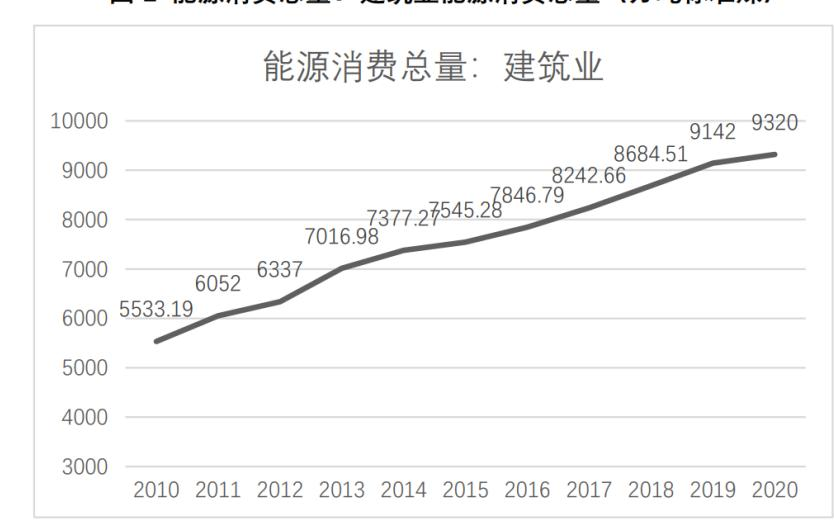
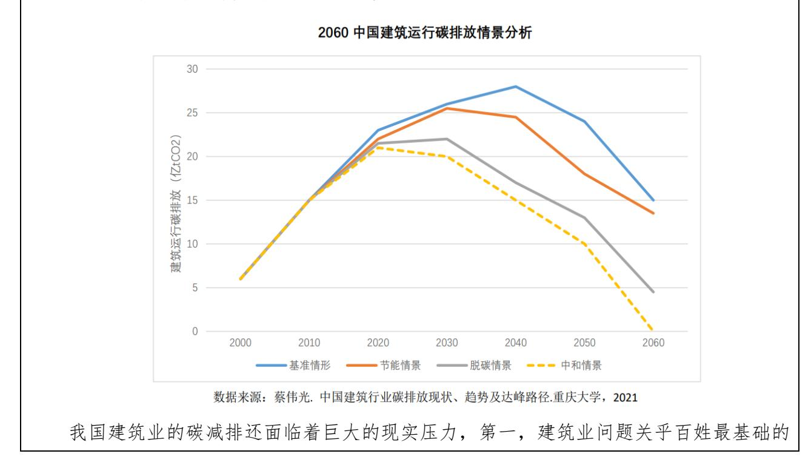
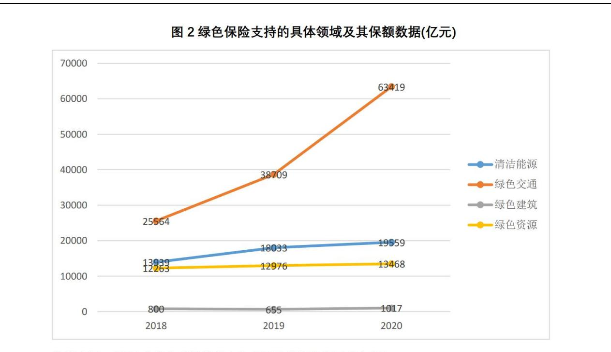
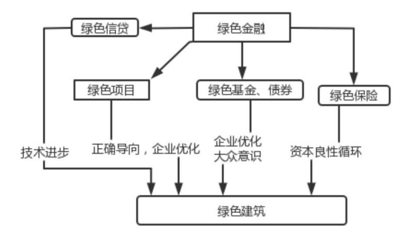
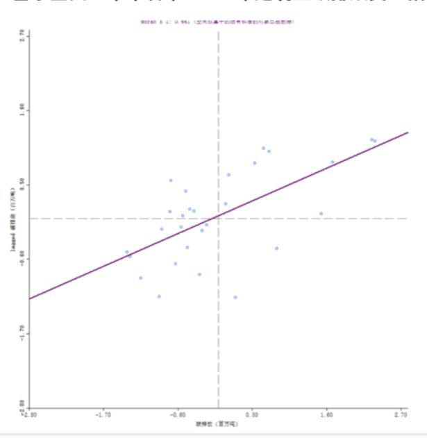
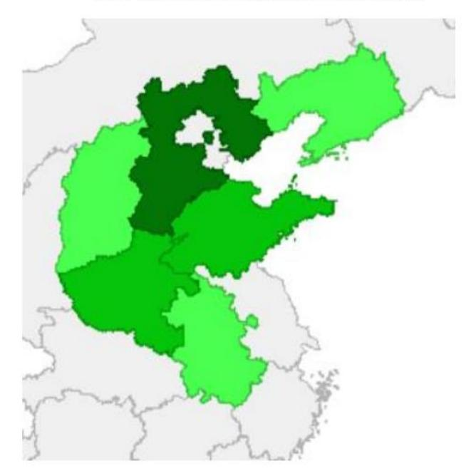
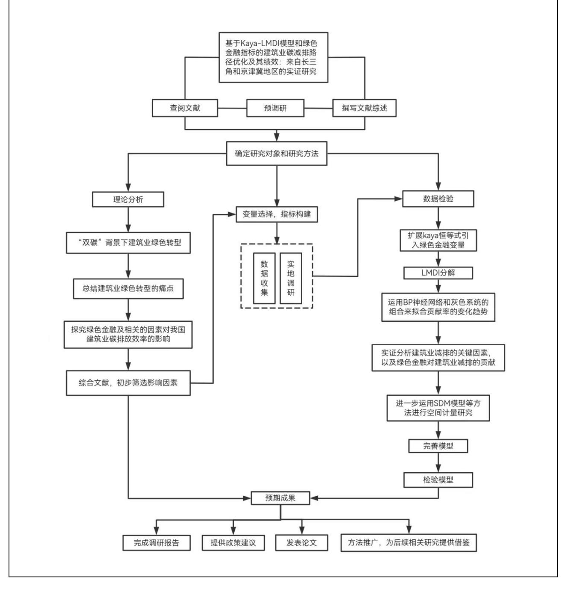

# 二、项目实施方案:

### 1.立项依据与研究内容(研究意义、国内外研究现状及发展动态分析):

#### 一、研究背景

随着全球经济的不断发展,环境问题日益恶化,已经越来越影响到全球经济的可持续 发展和人类的正常生活,使我们不得不为此付出高昂的成本代价。近年来,世界各国通过 包括发展绿色金融、积极进行产业转型等各种途径来降低碳排放,保护生态环境。中国作 为一个负责任的大国,必须积极实施碳减排,推动绿色转型,为全球可持续发展贡献智慧 和力量。

近年来,我国坚定不移的走碳减排和绿色发展之路。党的十八大以来,在习近平新时 代中国特色社会主义思想指引下,中国坚持绿水青山就是金山银山的理念,坚定不移走生 态优先、绿色发展之路。党的十九大报告指出,建立健全绿色低碳循环发展的经济体系, 为我国经济体系和产业结构的进一步改革指明了大方向。党的二十大报告指出,加快发展 方式绿色转型,推动经济社会发展绿色化、低碳化是实现高质量发展的关键环节。我国产 业结构的绿色转型已迫在眉睫,肩负着保护人民生命健康、促进经济可持续发展、践行大 国责任担当的三重重要责任。

国家"十四五"规划中明确提出,要深入推动在产业、建筑、交通运输等领域的低碳转 型。在此背景下,建筑行业在实现温室气体减排目标的过程中扮演着重要作用,亟需承担 应对气候变化的关键作用,承担起节能减排工作、实现经济绿色可持续发展的重任。建筑 行业的碳减排和绿色转型对于实现双碳目标至关重要。我国的"绿色金融"应运而生,成 为我国"双碳"事业的推动因素。然而,由于经验不足、市场发展不充分、相关技术不完善 等问题,我国绿色金融支持建筑业碳减排和绿色转型还存在着诸多痛点和堵点,制约着我 国建筑业的绿色转型和我国经济社会的绿色发展。

长江三角洲城市群作为中国三大城市群之一,是我国创新能力最强、开放程度最高、 经济发展最活跃的区域之一,同时也是"双碳"目标下最有实力率先形成绿色低碳发展新 范式的重要区域。京津冀地区是我国经济较为发达的地区之一,但同时也是我国环境污染 最为严重的地区之一,亟需通过碳减排来改善区域发展。当前我国绿色金融支持建筑业碳 减排和绿色转型还处于起步阶段,发展程度十分有限,选择长三角和京津冀两个我国极富 代表性的地区作为研究的初始样本并进行对比和实证分析,有助于我们更好的了解绿色金 融和建筑业碳减排在我国的发展状况,同时有助于为其他地区提供借鉴。

#### 具体背景如下:

#### (一)我国建筑业碳排放问题突出,实现"双碳"目标任重道远

国家统计局的数据显示,过去十余年,我国建筑业能源消费总量不断攀升(如下图所 示)。《2020 年全球建筑和建造业状况报告》显示,我国建筑建造行业运行过程中的终端能 耗全球占比高达 35%,碳排放全球占比更是高达 38%,如此巨大的消耗下,我国建筑业的碳 减排面临着巨大的压力。

研究显示,在基准情景下,我国建筑运行阶段碳排放将于 2040 年达峰,碳排放峰值约 为 27.01 亿 t CO2,达峰时间严重落后于我国 2030 碳排放达峰目标,到 2060 年仍将有 15 亿 t CO2,将严重制约我国碳中和目标的实现。

住房问题,是关乎国计民生的重要行业,不能简单通过限制产能来实现碳减排;第二,在 我国地方上还存在着大量违规建设、低质量建设,导致建筑业高能耗、高排放和低能源利 用率,这些建筑的处理面临着复杂的民生、成本等问题,短期内难以彻底改变;第三,我国 还处在社会主义初级阶段,生产力水平发展不平衡、不充分,既造成了发展过程中的高能 耗,也表明了我国经济增长和碳减排的平衡仍需继续探索;第四,从能源结构来看,我国 目前仍然十分依赖煤炭等碳排放化石能源,清洁能源在我国能源消费结构中占比较低,这 就导致我国碳减排会产生较高的成本,改变能源市场现有的平衡。此外,当前我国城市建 筑碳减排工作的难点还包括:统计制度未与国际接轨、参考数据缺乏全面性与科学性、建 筑碳核算方法有待完善、忽视建筑运行环节的碳减排工作等。

但同时,IPCC 相关报告指出,建筑业依靠其减排方面的高潜力和低成本占有一定优势。 我国十四五建筑业发展规划中也提出,要坚持绿色发展的基本原则,推广绿色化建造方式, 减少建筑材料与能源的消耗量,达到控制并降低碳排放的目的,进而促进可持续发展。因 此,在"碳达峰、碳中和"目标下,关注建筑业减排问题是合理且切时的,建筑行业必然要 进行绿色转型,建筑行业及相关企业作为主要碳排放者,需要在全产业链、供应链开展碳 减排行动。

#### (二)顶层设计与配套制度体系尚未完善,绿色金融支持建筑业绿色转型严重受限

基于建筑业碳减排的巨大压力和建筑业关乎国计民生等复杂状况,推动绿色金融发展 成为实现经济绿色发展、实现"碳达峰、碳中和"目标以及建设"现代经济体系"的必然要 求。在国家重大战略目标的指引下,我国各级政府积极推动建立与绿色金融和建筑业碳减 排相适应的制度和政策体系。

绿色金融和建筑业碳减排需要政策和市场的双重努力,并建立符合国际惯例的标准化 系统。当前我国建筑业碳减排发展存在推广困境,一大原因就是绿色金融和建筑业碳减排 的市场体系不够完善,当前建筑市场行为主体主动参与建筑行业绿色转型的意愿程度并不 高,"图纸上的绿色建筑"现象突出;同时我国相关产业的创新能力不足,科技创新投入意 识不强,能源、环保等重要的技术提供的支持不足,技术的推广还面临着包括技术成熟度 不高、技术标准规定不完善不统一等问题。

除此之外,我国在相关政策体系的搭建过程中,还存在着经验不足、风险未知的问题, 以及过于依靠"行政命令"手段、"经济激励"刺激不足的问题,完善顶层设计的框架还需 要进行大量的努力。因此,我们此时关注绿色金融发展和建筑行业碳减排及绿色转型的问 题,顺应了国家的"双碳"目标,我们也志在为国家顶层设计和配套制度体系的完善提供 建议和参考。

# (三)我国绿色金融发展尚处在初级阶段,对建筑业碳减排及绿色转型的支持力度远远不 够

2021 年,中共中央、国务院发布《关于完整准确全面贯彻新发展理念做好碳达峰碳中 和工作的意见》,提出"积极发展绿色金融"、"建立健全绿色金融标准体系"。我国大力推 动绿色金融的发展,但是当前我国绿色金融体系还相当的不完善,存在着大量痛点堵点。

目前,虽然我国已经存在包括绿色贷款、绿色债券、绿色保险、绿色基金、绿色信托以 及碳金融产品等多种绿色金融产品,但从整个市场的角度来看,大部分都是以绿色债券为 主,碳期权这类绿色衍生工具更少。融资渠道也相当有限,难以满足社会各界对资金的多 元化需求。同时由于绿色金融尚处在发展阶段,目前也大多用于新兴领域,相关的政策体 系并不够完善,技术水平等方面也仍需发展,因此绿色金融的风险管理体系还相对薄弱(如 下表)。

| 年份                |            | 2018     |          |            | 2019     |          |            | 2020     |          |
|-------------------|------------|----------|----------|------------|----------|----------|------------|----------|----------|
| 各类赋予的权重           | GDP 权 重 | 存款 权重 | 贷款 权重 | GDP 权 重 | 存款 权重 | 贷款 权重 | GDP 权 重 | 存款 权重 | 贷款 权重 |
| 权重值               | 50%        | 25%      | 25%      | 50%        | 25%      | 25%      | 50%        | 25%      | 25%      |
| 全国绿色金融发 展水平指数值 |            | 31.6     |          |            | 45.9     |          |            | 42.3     |          |

我国绿色金融整体发展水平仍然较低,绿色金融发展水平的提升动力不强劲,从李雪 林(2022)论文的绿色金融发展指数的评分来看,政策推动力不足是重要原因。

当前在金融政策制定方面还没有深刻意识到其对建筑业碳减排和绿色转型的支持作 用,对建筑业绿色转型的支持力度远远不够。以绿色保险为例,我们可以看到相比于能源、 交通等领域,绿色保险对建筑业的支持是远远不够的,2018-2019 年间,绿色保险保额支持 甚至在其它领域都有上升,但在支持绿色建筑的领域却出现了下降(如下图)。

# (四)长三角地区绿色金融和建筑业碳减排及绿色转型起步较早,但发展程度有限;京津 冀地区发展有限且不平均,区域协同仍需提升。

在全国范围来看,长三角地区作为我国经济发展效率最高、金融创新最为活跃的区域 之一,绿色金融起步较早且有条件加快推进绿色金融发展,助力实现建筑业碳减排和绿色 转型,但目前也存在着上述提到的诸多问题。京津冀地区是我国经济较为发达的地区之一, 北京集聚全国主要金融机构总部,已建立起完善的金融生态,但天津和河北的发展相对滞 后,区域协同发展仍需加强。因此我们着重选择长三角地区和京津冀地区作为研究的起点, 并希望通过对长三角地区的研究为京津冀地区和其他地区的绿色金融发展和建筑业碳减排 提供借鉴,推动京津冀协调发展。

近年来,长三角地区积极通过政策推动绿色金融和标准体系建设(如下表)。

| 省市  | 时间               | 政策名称                            |
|-----|------------------|---------------------------------|
| 上海市 | 2021年3月          | 《2021年上海信贷政策指引》                 |
| 上毋旧 | 2021 年 11 月      | 《上海加快打造国际绿色金融枢纽服务碳达峰碳中和目标的实施意见》 |
|     | 2018年10月         | 《关于深入推进绿色金融服务生态环境高质量发展的实施意见》    |
| 江苏省 | 2020年4月          | 《省政府关于推进绿色产业发展的意见》              |
|     | 2021年11月         | 《关于大力发展绿色金融的指导意见》               |
|     | 2017 年 6 月       | 《浙江省湖州市、衢州市建设绿色金融改革创新试验区总体方案》   |
| 浙江省 | 2018年6月          | 《关于推进浙江省绿色金融发展的实施意见》            |
| 们让自 | 2021年7月          | 《关于金融支持碳达峰碳中和的指导意见》             |
|     | 2021年10月         | 《湖州市绿色金融促进条例》                   |
| 立溫少 | <b>2016</b> 年12月 | 《安徽省绿色金融体系实施方案》                 |
| 安徽省 | 2019年1月          | 《安徽省企业环境信用与绿色信贷衔接办法(试行)》        |

但目前长江三角洲地区绿色金融还未形成一个统筹发展的格局。如在绿色项目认定方 面,目前浙江湖州、衢州虽已形成一套流程化、线上化绿色项目认定标准和方法,但有较 强的地域性,难以直接推广至长三角地区,更不要说推广到全国。京津冀地区出台了《金 融支持北京绿色低碳高质量发展的意见》等相关的文件,但目前绿色金融相关的政策体系 距体系化、统筹化还有很大的差距。

在张卓群等(2022)[22]的论文中,基于 Dagum 基尼系数的研究揭示了我国城市碳排 放强度总体差异的数值水平及其具体来源,识别出各国家重大战略区域之间相对差异的变 化轨迹,并给出相应的动态演进特征(如下图所示),我们选择了京津冀地区和长三角地区 的演进特征进行比较,在分布位置上来看全国层面碳排放强度的核密度曲线表现出整体左 移的趋势,表明我国大部分城市的碳排放强度处在下行轨道上,但是作者在文中指出京津 冀地区在样本时期内曾经短暂地出现过曲线右移,意味着该区域内的减碳压力较大,一些 绿色环保政策的出台发布与落地实施仍有较大的难度。在主峰分布形态来看,长三角的分 布曲线主峰的高度上升且宽度变小,说明这些区域内各城市碳排放强度的绝对差异正在逐 渐缩小,而京津冀地区变化较小。从波峰数目来看,京津冀地区仍是双峰,说明内部差异 明显,而长三角地区从双峰向单峰演变,内部分化特征弱化。总的来看,京津冀和长三角 的区域碳排放强度特征具有一定差异,具有比较意义。

总的来看,当前我国建筑行业的碳减排及绿色转型已迫在眉睫,对我国经济社会带来 了巨大的压力,我们必须通过发展绿色金融、推动建筑行业的碳减排及绿色转型,才能实 现保护人民身体健康,促进经济可持续发展、践行大国责任担当的巨大使命。

本研究立足于"双碳"目标下我国建筑业碳减排和绿色转型存在的诸多痛点堵点,通 过对绿色金融对我国建筑业碳减排和绿色转型的影响进行探究和分析,聚焦于当前我国建 筑业碳减排及绿色转型的不足,并提出相关政策建议,以期推动我国绿色金融的发展以及 建筑行业的碳减排和绿色转型,为我国实现"双碳"目标、深化绿色发展注入不竭的动力。

## 二、研究意义

#### (一) 理论意义

#### 1.拓宽建筑业碳减排及绿色转型的研究边界

建筑业碳减排及绿色转型是一个由许多要素构成的、复杂的动态体系。我们在研究过 程中,以长三角地区和京津冀地区为样本,先梳理了前人文献中建筑业碳减排及绿色转型 的相关影响因素,发现缺少对该地区相关影响因素的研究,也没有引入近些年得到发展的 绿色金融对建筑业碳减排及绿色转型的影响。基于此,我们设定碳排放相关指标,构建嵌 入绿色金融指标的 Kaya-LMDI 碳排放因素分析理论模型,引入绿色金融指数的指标,希望 通过实证方法分析长三角地区和京津冀地区碳减排的影响因素以及绿色金融对建筑业碳减 排的贡献。我们弥补了长三角地区和京津冀地区在该方面的研究空白,建筑业碳减排及绿 色转型的研究边界得到了拓展。

#### 2.展望未来我国"碳达峰、碳中和"背景下,建筑业绿色转型发展的前景

"双碳"目标的提出为我国实现可持续的绿色发展指明了方向。国家大力推动建筑业

的绿色转型,形成绿色、高效的建筑业发展体系,为我国建筑行业的碳减排和绿色转型提 供了有效路径,有利于实现建筑业的高质量发展和可持续发展。随着我国进一步深入"推 动绿色发展,促进人与自然和谐共生",建筑业绿色转型具有较为广阔的发展前景。但这并 不是一个简单的目标,必须把握好建筑行业碳排放的具体影响因素和相关机制,从全过程 入手,才能根本改变建筑行业高污染、高碳排放的状况。在对我国建筑行业碳排放和绿色 转型的现状进行探索和分析后,未来我们还将持续关注这一动态的过程,在持续深入洞察 行业的背景下,助力我国建筑业深化绿色发展。

(二)实践意义

1.探索"碳中和、碳达峰"的"双碳"目标下,我国建筑业进行绿色转型的优化方法 和优化路径,并提出相关建议,助力"双碳"目标的实现

我国紧紧围绕"双碳"目标,推动建筑行业脱碳和可持续发展,但在建筑行业碳减排 及绿色转型的过程当中,还存在着诸多困难和瓶颈,影响着脱碳减排的效率和绿色转型的 质量。只有解决了建筑行业在脱碳过程当中存在的问题,深刻洞察转型的方法和路径并寻 找优化的解决之道,才能推动行业绿色转型向纵深发展,切实改善人民生活质量。我们将 通过研究深刻把握影响长三角地区和京津冀地区建筑业碳减排及绿色转型的关键因素,助 力两个地区的政府找到推动建筑业碳减排的着力点。同时,通过横向的对比,也为包括京 津冀地区在内的我国其他地区建筑业碳减排及绿色转型提供借鉴。

#### 2.有利于更加深刻地认识绿色金融支持建筑业碳减排及绿色转型的状况,洞察行业

绿色金融融入建筑业的绿色发展是我国当前关注的重点问题,也是世界范围内正在探 索的有效脱碳路径。本项目立足于我国实际,通过对京津冀、长三角两个我国代表性地区 的实证分析和对比,深刻洞察了两个地区绿色金融支持建筑业发展的状况,并进行了横向 与纵向相结合的分析,立体的展现了绿色金融对建筑业碳减排及绿色转型的支持作用,也 有助于我们发现并解决问题。我们希望能够推动政府重视绿色金融的作用,从绿色信贷、 绿色项目、绿色债券等方面细化细则,推动建筑业良性发展(如下图所示),最后实现建筑 业的绿色转型。

#### 三、国内外研究现状和发展动态

(一)碳排放效率影响因素

#### 1.影响因素的分类:

通过阅读文献,我们先将国内外研究对于碳排放影响因素种类研究进行了分类:

内部主要影响因素有:企业技术水平、行业能源消费结构、所有权属性等;

外部环境因素主要有:经济发展水平、环境规制程度、产业结构等。

企业技术水平:陆菊春等(2013)研究表明,生产能力对建筑业低碳竞争力具有较大影 响。之后,王兆峰等在 2019 年通过实证检验了技术进步对碳排放效率具有积极的正向影 响,提出应大力推动技术进步实现节能减排。

行业能源消费结构:向鹏成等(2019)研究认为,优化能源消费结构、提升建筑业市场 化程度并提高劳动力素质,可以促进建筑业碳排放效率的提升。

所有权属性:所有权属性是市场化程度的衡量标准之一,建筑业企业所有权的不同,对 建筑业的资源配置、行业竞争力、产业结构和技术革新都有一定的影响,进而对建筑业碳 排放效率产生影响。向鹏成等(2019)研究发现,所有权属性的影响为正,表明建筑业市场 化的提升有助于促进建筑业绿色全要素生产率。以非国有建筑企业总产值占建筑业总产值 的比重进行衡量。

经济发展水平:孙焱林等(2016)研究认为,经济发展水平对碳排放效率有利但影响较 小,优化能源消费结构及产业结构有利于提升碳排放效率。

环境规制程度:马海良等(2020)研究认为,不同类型的环境规制,会通过对市场的资 源配置产生不同影响,从而对碳排放效率产生不同程度的影响。

针对建筑业碳排放效率影响因素的研究,学者们大都沿用了上述的影响因素,对建筑业 碳排放效率的影响作用进行了实证研究。蒋博雅等(2021)[17]研究了江苏省建筑业碳排 放的影响因素,认为上述提到的影响因素中能源强度是促进碳排放降低的主要影响因素, 建筑业经济水平是促进碳排放提升的主要影响因子。

结合上述对于碳排放影响因素的研究现状,我们采用的 Kaya 等式有效地分离出了能源 强度、人均 GDP 等 Kaya 分量,并利用 LMDI 方法进行进一步的量化分析,这让我们的研 究更加具有现实参考价值和科学依据。

此外,从研究方法的综合视角来看,关于建筑业的碳排放因素测度,相关文献的分析路 径主要有单因素和多因素两种,但是单因素无法保证研究变量为主要关键变量,所以还是 多因素分析法属于当下研究的主流。而多因素研究方法中 Kaya 等式和 LMDI 模型是研究 界比较普遍的方法,但是二者的结合研究却并不常见。本研究不仅将二者结合,充分发挥 两个模型的优势,还创新性的根据本文的选题给出了 Kaya 等式的更新形式,添加了绿色金 融 Kaya 分量。

接下来将呈现目前学界对于碳排放影响因素分析方法的研究现状和发展动态,同时展 示本研究所借鉴和学习的关于 Kaya 等式和 LMDI 方法的相关研究。

在利用 Kaya 等式对碳排放影响因素进行测度和分析前,学者对于碳排放量和强度的测 度各有不同。主要有二手数据直接获取、投入-产出分析法、产品全生命周期方法和投入产 出生命周期法(EIO-LCA)等方法。

Acquaye 等(2010)使用投入-产出分析技术估算了爱尔兰建筑部门和分部门的能源和 温室气体排放强度,并估算了其对爱尔兰国家排放的贡献。

田涛等(2016)[16]在阐述全生命周期碳足迹评价方法、概念、意义基础上,对应用相 关标准开展石化产品碳足迹评价进行研究,包括物流足迹追踪、评价边界确定、排放清单 及量化、共生过程分配等,提出了石化产品碳足迹评价的具体方法,结合某产品实例分析 了碳足迹评价方法在石化行业的应用。

计军平等(2011)[24]基于中国 2007 年经济投入产出生命周期评价(**EIO-LCA**)模型, 构建了部门温室气体排放矩阵,从生产和需求两个视角分析了温室气体排放在部门间的分 布结构。此方法将两个分析视角整合在同一个框架内,能更好地认识温室气体排放与部门生 产和最终需求的关系。结果表明:1.从生产角度看,电力、热力的生产和供应业的直接排放 量最大并且主要供给建筑部门;2.从需求角度看,建筑业的隐含排放量最大;3.从单位产出 的排放看,电力、热力的生产和供应业的隐含排放量最大。

相同的,常远等(2011)[25]在我国城市化进程加速与基础设施大规模建设的社会发展 背景下,研究建筑物化能消耗量及其所导致的大气污染物排放量。从全社会经济活动的角 度出发,以建筑生命期为主线,建立投入产出生命周期(EIO-LCA)模型,比较和分析建筑 物化能的来源与组成,量化主要大气污染物的排放。该文丰富了全生命周期评价模型在我 国建筑领域的应用。该研究和上面季军平先生的研究结果都是本文选题的重要依据。

**2.Kaya** 恒等式

(1)建筑能耗及碳排放情况研究:在 20 世纪 90 年代,Kaya 等式首次应用于建筑领域, 一些研究揭示了建筑能耗和碳排放的情况,为后来的研究提供了基础。

(2)建筑碳排放加权结构研究:进入 21 世纪,研究者开始将 Kaya 等式更广泛地应用 于建筑业,以开展详细的分析研究。

查东兰等(2007)[27]对我国 28 个省区 1995~2005 年间能源利用效率的差异性进行 了比较;引入 Theil 指数和 Kaya 因子,深入研究能源消耗导致的地区间人均 CO2 排放的差 别。结果显示 Kaya 因子中贡献最大的是能源强度指标,处于绝对的优势地位,但纵向来看 呈下降趋势。贡献度大的其次是人均 GDP,还呈上升趋势,碳排放系数贡献相对较小,2002 年后开始下降。该文是较早提出利用 Kaya 因子对碳排放加权结构进行分析的研究,为后续 的跟进研究奠定了良好的研究思路和优化方向。

祁神军等(2013)[31]运用经济投入-产出分析法,建立建筑业完全碳足迹模型,核算 建筑业直接碳排放和间接碳排放;应用 Kaya 恒等式,构建建筑业直接碳排放和间接碳排放 变动的分解模型,将促使建筑业碳排放总量变动的因素分解为能源结构效应、能源强度效 应、产业规模效应、经济产出效应。对于建筑业碳排放量的核算,此研究在前人的基础上 加入了"经济投入-产出法",相较于之前的研究实现了建筑业直接碳排放和间接碳排放效 应的科学量化,为后续 Kaya 等式的分析提供了良好的数据环境。

(3)建筑碳排放影响因素研究:该阶段研究者通过 Kaya 等式来研究建筑碳排放的影响 因素,从而为制定有效减排政策提供依据。同时,一些研究者也将 Kaya 等式与其他建筑碳 排放影响因素的量化指标相结合,包括建筑质量、建筑使用年限等因素,实现对 Kaya 等式 的优化,使其更加符合贴近现实研究情况。

李志强等(2011)[30]通过 Kaya 公式计算并描述了山西省 1994~2008 年工业中各行 业的碳足迹,并界定了高能耗行业。通过分解模型定量分析了山西省 1998~2008 年高能耗 行业碳足迹的影响因素贡献大小,结果表明经济增长对二氧化碳排放促进作用最大,技术 引进对二氧化碳的抑制作用最大。由此提出山西省急需在提高能源使用效率的同时优化产 业结构,以提高对二氧化碳排放的抑制作用的政策建议。该文献虽然并不是专注于建筑业 的碳排放研究,但是其利用 Kaya 等式分析碳排放影响因素的方法是适合各个行业的碳排放 分析的一种研究范式,故本研究将该文献引用到参考文献之中,并充分学习和了解该研究 对于碳排放影响因素的分析方法,夯实本研究的理论基础。

姚宇,韩翠翠等(2011)[26]将 Kaya 公式引入产业低碳化发展研究中,对 Kaya 公式 进行修正和扩展,把影响产业碳排放的因素分解为能源结构碳强度、规模产业能源强度、 单位产出的产业规模比率和产业 GDP,解决了产业低碳化发展中影响因素影响力的判断问 题。本研究就是以该文提出的产业内碳排放指标更新 Kaya 等式,实现建筑业碳排放的影响 因素分析,并进一步根据其他文献添加新的测度变量。该文是本团队发现的罕见的关于 Kaya 等式的扩展和修正的研究。其研究行业虽然是交通运输业,但是其对于 Kaya 分量的 更新思路十分值得本研究的借鉴和学习。

上文作者的研究被后来的学者进行了进一步的优化,Wu 等(2020)[58]提出了一个修 正的 Kaya 等式 U-Kaya 公式,该公式包含一个直接的城市化因素,以确定原有 Kaya 分量 和城乡人均 GDP 与碳排放量之间的关系,并将其应用于蒙特卡罗模拟的碳排放动态预测。 通过政府主导模式、市场主导模式和混合型政府市场主导模式三种不同的城市化政策模式 对 2020 年中国可能的碳排放进行了预测。结果表明,城市化率、能源碳排放系数和能源强 度的提高将导致碳排放的增加。

转向建筑业,本团队发现 Mavromatidis[56]等在 2016 年的一篇文献提到,利用瑞士能 源战略 2050 预测瑞士完整的碳排放量,使用更适用于建筑业的变量更新 Kaya 等式,对影 响建筑业碳排放的主要因素进行深入探究。本研究拟借鉴了该文和上文中对于 Kaya 等式的 更新思想,创新性的提出"绿色金融"Kaya 分量,实现本研究模型的优化。

值得一提的是,A.Robalino-López 等(2016)基于 Kaya 等式的四个分量,分析了 10 个 南美国家 1980-2010 年人均二氧化碳排放量的收敛过程。随后利用 Philipis 和 Sul 方法来检 验每个 Kaya 分量是否存在全球趋同的趋势,同时还考虑了三个外来的国家组,探究了地区 发展不平衡问题。结果表明,该地区作为一个整体,在人均二氧化碳排放量方面并未呈现 出全球趋同格局。该研究对于本研究的启发是极大的,也为本研究的未来的发展优化指明 了方向。本项目未来会向着绿色金融对碳排放影响因素的空间效应进行分析,利用莫兰指 数等科学数学工具,从长三角地区的研究转向京津冀地区再转向全国的动态分析。

(4)建筑业碳排放测度方法整合:随着经济社会的发展,Kaya 等式所面对的研究场景 和应用领域也越来越多元复杂,所以学者开始将 Kaya 等式和其他的碳排放测度方法进行结 合,不仅如此,很多学者还会将 Kaya 等式和深度学习结合,从而达到研究目的且保证模型 的科学性。

邢璐等(2011)[29]就是基于 Kaya 公式的分析框架,采用对数平均 Divisia 因素分解法 分析了能源碳排放强度、单位 GDP 能耗、人均收入和人口因素对我国 1978—2009 年 CO2 排放的影响。结果表明,我国人均收入的高速增长带来了 CO2 排放量的快速增长,人口对 于 CO2 排放量的拉动作用稳定在一个较低水平,单位 GDP 能耗的持续下降对抑制 CO2 排 放起到了持续而显著的作用,能源碳排放强度变化微弱。因此,在进一步提高能源利用效 率的同时,发展新能源产业,调整现有能源结构,是我国实现低碳经济的重要途径。

赵宇婧,黄顺勤等(2021)[61]采用 Kaya 等式和双随机森林方法对城市低碳经济发展 的影响因素进行了分析。通过对中国部分城市的样本数据的回归分析和预测,筛选出了城 市低碳经济发展的重要影响因素,并提出了相关政策建议。

李林,周震宇等(2018)[62]结合 Kaya 恒等式和能源效率指数,对江苏省碳排放影响 因素进行了研究。文章分析了不同影响因素对碳排放影响的不同程度,以及碳排放强度和 总量的动态变化。该研究为制定和优化碳减排政策提供了参考。

姚顺顺等(2020)[63]利用 Kaya 恒等式和灰色关联法,对武汉市产业碳排放特征进行 了分析。文章探究了不同产业的碳排放差异和影响因素,以及碳减排潜力和可行性。该研 究为提高武汉市产业碳排放水平,实现碳减排目标提供了科学依据。

这些文献都是将 Kaya 等式与其他方法相结合,探索中国碳减排问题的方法和政策建议。 这些方法对于分析碳排放的复杂性和多因素效应,提高分析的准确性和精度具有重要意义。 不难看出,关于建筑业对于 Kaya 等式和其他方法相结合的研究目前处于探索阶段,相对标 准的研究思路体系还没有成型,本研究及时的发现了这一空白,针对性的提出了利用 Kaya 等式和 LMDI 方法的结合,充分利用两种方法的优势,为国家建筑业节能减排路径优化贡 献力量。

#### **3.LMDI** 模型

在传统的 Kaya 等式分析框架下,本研究还利用 LMDI 实现对 Kaya 分量的分解分析。

分解分析作为研究事物变化发展特征及其作用机理的一种分析框架,在环境经济研究 中得到广泛应用。将排放分解为各因素的作用,定量分析因素变动对碳排放变动的影响, 成为研究这类问题的有效技术手段。通行的分解方法主要分为两种,一种是指数分解方法 IDA,一种是结构分解方法 SDA。IDA 方法只需使用部门加总数据,特别适合分解含有较 少因素、包含时间序列数据的模型,故本研究采用 IDA 类中的 LMDI 对我国建筑业碳排放 影响因素进行分析。LMDI 属于 Divisia IDA 的一个分支,由于具有全分解、无残差、易 使用以及乘法分解与加法分解的一致性、结果的唯一性、易理解等优点而在众多分解技术 中受到重视,目前在许多领域得到广泛应用。

#### (1)**LMDI** 方法基本演进过程

Boyd 等[50]提出的分解方法采用始年和末年能源消费量的平均值作为权重,并采用对 数方法计算相应因素的增量。 这种方法应用的最为广泛,但是当数据中有零存在时会出现 计算问题。该研究中关于零值的计算问题,间接推动了 LMDI 方法的出现。

很快,Ang B.W.[51]在 2004 年首次提出了 LMDI 分解方法,并将其引入能源消费分 解结构中,在 2005 年用该方法解释了碳排放的影响因素,并将其视为一种能够分解碳排 放影响的实用性方法,是研究能源消耗及环境问题时常用的方法,应用领域广泛。

Ang B.W. 和 Lee S.Y. 提出的分解方法采用 2 个年份相应参数的简单算术平均值作为 因子权重[52]。 这种方法不会产生很大的余值,且即使数据中包含零值也不会出现计算问 题,但是这种方法应用的却很少。

后来 Ang 等人比较了之前的几种分解方法,在此基础上提出了对数平均权重分解法 [53],采用一个对数平均公式,替换了之前的简单算术平均权重计算方法。 这一方法的优 点是可不产生余值,且允许数据中包含零。Ang 等应用该方法对包括中国在内的 3 个国家 进行了实证分析。此后,LMDI 方法成为应用最为广泛的方法。

再后,Ang B.W.进一步在研究中从理论基础、适应范围、应用便利性、结果表达等方面 综合比较因素分解法多种形式的优劣性,认为拉氏指数分解中残量过大会影响分解结果, 而 LMDI 法能够消除残差项,并可以在加和分解与乘积分解之间建立一定关系[54]。通过 实证研究,LMDI 法是目前各种方法中相对合理的一种[55]。

#### (2)**LMDI** 方法建筑业的研究动态:

国内外学者利用 LMDI 因素分解方法对建筑业碳排放的排量测算、驱动因素、强度效 应、时空差异及脱钩效应展开了一系列富有价值的研究。对于本研究影响因素的分解和模 型构建提供重要思路。

#### ①研究深度的提高,分析细化和应用场景的扩展:

吴易桐,李祉祺,赵增丰,徐涯昕(2022)[10]采用 LMDI 方法进行分解中国建筑业用 电量的历史演变,然后通过蒙特卡罗模拟来分析其建筑业用电量的未来发展趋势。文章的 创新点主要体现在:聚焦中国建筑业用电量,并将其分解为用电强度、产业结构、经济发 展和人口规模四大驱动因素的影响,模拟建筑业用电量的变化趋势。

罗剑,牟绍波,杨贵中(2017)[11]运用 LMDI 方法分析建筑业动态竞争力。以 2006- 2015 年 31 个省市建筑业数据为基础,运用 LMDI 将我国各地区建筑业的动态竞争力分解为 规模竞争力和效益竞争力。规模竞争力主导建筑业竞争力的变化,效益竞争力的影响相对较 小.

张家楠(2020)[12]利用经典 LMDI 指数分解法模型对建筑业挥发性有机化合物进行 因素分解,将建筑业挥发性有机化合物排放分解成五个驱动因素:人口、城镇化进程、投资 贡献、投资回收率以及技术进步。结果表明,城镇化进度和人口增长是必然的发展进程。

上述三篇研究提供了 LMDI 分析建筑业碳排放因素的一个基本分解研究思路,为本研 究的方法选择提供了理论依据。

②应用领域的扩展:从全国延伸至城市群至省份,城市群研究涉及较少

杜强,陆欣然,冯新宇,白礼彪(2017)[13]根据建筑业碳排放特点对 2005—2014 年 我国各省该行业直接与间接碳排放进行了系统核算,并结合各省碳排放特征进行了分组分 析。在此基础上,运用 LMDI 的方法将行业碳排放因素进行分解。基于 LMDI 的因素分解发 现,产出规模效应和间接碳排强度分别是我国建筑业最主要的正向和负向影响因素。从另一 方面该文献也为本研究的选题提供了一定的现实依据。相同的[,蔡园等](https://kns.cnki.net/kcms2/author/detail?v=5nDQLMO6ERvzUqnXARsuoN1F6CBbwKQErZzmuR0xth0TT72c8B75esMaq87GWAITxRbL7O6YQYzi-4TZbZZ-Z0cNoovlTEZMrfZkpI-Hc2E=&uniplatform=NZKPT)(2021)[16]基于 LMDI 分解的实证研究发现,能源消费直接碳排放强度、单位产值创造力、间接碳排放强度 以及建筑业经济规模是促进湖北省建筑业碳排放增加的因素。

安璐(2021)[15]采用 LMDI 分解模型对辽宁省建筑业碳排放影响因素进行分析,结果 显示建筑业的产业规模、间接碳排放、碳排放强度等因素是造成建筑业碳排放量增长的负 面因素,能源效率、能源结构、产业结构等因素是促使建筑业碳排放量减少的正面因素,其 中产业规模效应和能源效率效应是影响辽宁省建筑业碳排放的关键因素。

蒋博雅,黄宝麟,张宏(2021)[17]基于对数平均指数分解(LMDI)模型将江苏省建筑业 碳排放驱动效应分解为能源结构、能源强度、建筑业经济水平、人口密度、新增节能建筑 面积率及新增建筑面积 6 个影响因子,解析碳排放变动量及各因子贡献率排序,详细剖析其 驱动效应。研究结果表明能源强度为促进碳负变的主要影响因子,建筑业经济水平为促进碳 正变的主要影响因子。

不难发现,大部分研究聚焦于特定省份,但是对于城市群的相关研究很少,本研究发现 了这一研究方向的空白,并依托长三角、京津冀区域一体化的国家战略,提出本研究的重 点方向。

但是本文的选题也并非毫无根据。胡超霞等在 2020 年的一篇文章就是采用 IPCC 碳排 放系数法测算了京津冀地区建筑行业碳生产率,然后运用对数平均迪氏指数分解法 (LMDI),对京津冀地区建筑行业碳生产率因素分解模型进行合理建模,定量分析了 2004- 2017 年间能源利用效率、碳排放地区结构、碳排放能耗等对该地区建筑行业碳生产率的影 响情况,该研究对于本文分析长三角地区建筑业碳排放问题给出规范的基本思路,也对于本 文促进京津冀地区建筑行业低碳经济发展的研究落脚点给出政策建议方向。

#### ③由单一使用到与其他方法相结合,提高预测准确性

[崔朋飞\(](https://kns.cnki.net/kcms2/author/detail?v=3q6cCi6hV7OmAvc_ltWmHZyaq_AkDbhAvGf4etlEGlaxCMdOCyIf4Jq_qQht4Ec7Hd6Geh10UqS7Ud0YxQwWaAIH-js41tXDuYr9XgWSIn8=&uniplatform=NZKPT)2019)[18]采用生命周期分析方法与 LMDI 相结合,从建材准备、建造施工、 运行使用和建筑拆除四个阶段建立碳排放量清单,然后,运用 LMDI 因素分解方法,构建基 于生命周期的建筑业碳排放量分阶段分解模型,解析不同阶段碳排放系数、能源(建材)消费 结构、能源(建材)消费强度、劳动生产率、施工规模和人口密度等六个因素对建筑业碳排 放量变化的贡献,找出关键正向、负向因素。

范建双,周琳(2019)[19]将空间自相关和核密度函数方法和 LMDI 相结合,首先在对 中国 30 个省(市、自治区)建筑业碳排放量进行核算的基础上,运用空间自相关和核密度函 数方法对其时空特征进行刻画和分析,并进一步采用乘积式对数平均迪式指数分解(M— LMDI)方法对中国建筑业碳排放量进行因素分解。

[冯博,](https://kns.cnki.net/kcms2/author/detail?v=3q6cCi6hV7MVCTfqhMWaiM1n5dsy8EWwgyVZ99DweKBHiYD2w4FrKnkmdCBkIo8yr3B8sklZU98cO0dlwqatw19ZYykdakpTbYHqrSqnNkg=&uniplatform=NZKPT)[王雪青\(](https://kns.cnki.net/kcms2/author/detail?v=3q6cCi6hV7MVCTfqhMWaiM1n5dsy8EWwfcM1OE4CzvUtf3ChB_4zgSY-DPbCl5AUzUiCkTlBbI4BoLQXyncTTQV3MfxqZYbM1DmSVgCALas=&uniplatform=NZKPT)2015)[20]利用 Tapio 脱钩模型分析了各省建筑业碳排放的脱钩状态, 并运用 LMDI 方法对碳排放的影响因素进行分解分析。研究结果表明,我国各省建筑业碳排 放量在整体上呈逐年上升的趋势,但省际间存在较大差异。结果表明,各省建筑业碳排放量 及其脱钩状态具有明显差异,5 种因素对碳排放的影响程度不尽相同。

[马敏达\(](https://kns.cnki.net/kcms2/author/detail?v=3q6cCi6hV7NFsjN6En2dtFrj2SKPXFvP6iEeYMf3khbxF9w6mZjRYtyV2NzDPdfu1Y2oLrhnFyMmy5S2NhDJcDRKlPNJVwWiwq52D63CTl4=&uniplatform=NZKPT)2018)[21]首先对建筑部门的历史碳排放强度进行量化表征,采用 IPAT 模型家 族的 Kaya 恒等式以及 STIRPAT 模型解析建筑碳强度的变化特征及其影响因素,进而运用岭 回归与 LMDI 分解法量化上述影响因素对建筑碳强度变化的贡献水平,在此基础上,利用 Tapio 解耦指数解析建筑碳强度与经济活动强度之间的解耦效应,并使用碳排放库兹涅茨曲 线模型对上述解耦效应进行验证。最后提出了基于 Kaya 恒等式的静态情景设定与基于蒙特 卡洛模拟的动态情景分析相结合的建筑碳排放达峰情景推演方法,最后评估不同排放尺度 下建筑部门历史二氧化碳减排量。这篇文章综合运用多种分析方法,将 LMDI 方法进行多 元化创新,极具研究和借鉴意义。

蔡园等(2022)[23]以湖北省为研究对象,运用 LMDI 因素分解模型对 2006~2019 年 湖北省建筑业碳排放量进行估算,运用 LMDI 因素分解模型探讨湖北省建筑业碳排放量的 驱动因素。本研究借鉴其基于核算方法的改进,将建筑业间接碳排放作为单独的因素,与 扩展后的 Kaya 恒等式相结合。

#### 4.**Granger** 模型

程明等(2015)通过深入研究了我国建筑业总产值与碳排放量之间的关系,对二者展开 了 Granger 因果检验和脉冲响应分析,发现建筑业总产值对碳排放增长有着显著的促进作 用,但碳排放对总产值没有存在明显的影响。

#### 5.**STIRPAT** 模型

杨艳芳等(2016)研究了北京市建筑碳排放的影响因素,从全生命周期角度将建筑碳排 放分为材料的准备阶段、施工阶段和使用阶段依次计算得出建筑碳排放量,运用 STIRPAT 模型建立影响因素模型,分析出了城镇化率、北京市人口数、人均可支配收入、人均建筑 面积等影响因素,发现人口城市化是北京市建筑碳排放相关影响因素中对其影响程度最大 的。

#### 6.**Tapio** 模型

郑剑娇等(2018)运用 Tapio 脱钩模型分析其脱钩状态,分解出常住总人口、第三产业 增加值、单位建筑面积能耗值、单位增加值的建筑面积、人均居住建筑面积等因素,并测 算了深圳市住宅与公共建筑的碳排放量及其影响。

| 作者               | 方法                | 影响因素                                            |
|------------------|-------------------|-------------------------------------------------|
| 祁神军和张云波          | Kaya 恒等式          | 能源结构效应、经济产出效应、能源强度效应、产业规 模效应                 |
| 李爽等              | Kaya 恒等式          | 人均 GDP、城市化水平、建筑能源强度、建筑产业规模 和建筑能源消费碳强度        |
| Mavromatidis 等   | Kaya 恒等式          | 建筑面积                                            |
| Robalino-López 等 | Kaya 恒等式          | 人均国内生产总值(GDP)、能源强度和 CO2 强度                      |
| Wu 等             | Kaya 恒等式          | 人口增长、城乡人均 GDP、城市化率、能源消耗强度和 碳排放量              |
| 杨艳芳等             | <b>STIRPAT</b> 模型 | 人口数、城镇化率、人均建筑面积、人均可支配收入                         |
| 刘兴华等             | <b>STIRPAT</b> 模型 | 常住人口、建筑面积、第三产业增加值、居民消费水 平、单位建筑面积能耗           |
| 刘彤等              | <b>STIRPAT</b> 模型 | 人口规模、人均国内生产总值、建筑业能源消费结构和 能源消耗强度              |
| 谭春平等             | LMDI模型            | 能源结构、能源效率、住房水平、能源消耗结构                           |
| 马晓明等             | LMDI 模型           | 能源结构占比、第三产业增加值、居民人均收入、单位 面积能耗、单位收入住宅面积、人口数量  |
| 郑剑娇等             | LMDI 模型           | 常住总人口、第三产业增加值、单位建筑面积能耗值、 单位增加值的建筑面积、人均居住建筑面积 |
| 宋金昭等             | LMDI 模型           | 能源结构效应、能源碳排放强度效应、间接碳排放强 度、效应能源强度效应           |
| Lu 等             | LMDI 模型           | 面积效应、结构效应、人口密度、价值强度和能源强度                        |
| 程明等              | Granger 方法        | 中国建筑业总产值                                        |

## (二)绿色金融

国际上对绿色金融并没有一个被大家普遍接受的定义。一些文献认为绿色金融与基于 使用和应用背景的可持续金融相同。刘宁杰、刘文龙(2022)[7]将绿色金融解释为一种对 环保、节能、清洁能源、绿色交通、绿色建筑等领域的项目投融资、项目运营、风险管理等 提供的金融服务。而国际金融公司将绿色金融定义为旨在保护自然资源和确保环境保护的 投资工具(IFC,2009)。中国人民银行将其定义为"为支持改善环境、减缓气候变化和更 有效地利用资源的经济活动提供的金融服务"。

姬强和张大永(2019)[46]通过基于宏观层面数据的时间序列分析,认为金融对可再 生能源增长变化的总体贡献率为 42.42%。周等(2020)[39]通过主成分分析法得出绿色金 融对经济发展和环境质量可以创造双赢的局面。Muhammad 等(2022)[45]通过 QQR 方法 证实绿色金融是减少一氧化碳的最佳财务策略。Gagan 等(2022)[44]认为,绿色金融已成 为一种战略,不仅包括旨在减少温室气体排放和适应气候变化的工具,还包括解决更广泛 环境问题的金融产品和服务,例如工业污染控制,废物管理,环境卫生和个人卫生以及生 态保护。

我们通过阅读文献深刻的认识到了绿色金融对于经济和环境双重发展的重要作用,并 将其作为主要的研究因素和研究方向。

此外,Dikau 和 Volz(2018)[34]认为一旦绿色建筑进入建设阶段,绿色金融就可以作 为绿色建筑再融资的长期资本。Zhang 等(2019)[35]认为各种公共或私人投资者都可以获 得足够的绿色债券来支持绿色建筑。Deng 等人(2019)[37]和 Croutzet 和 Dabbous(2021) 证明了绿色金融对可持续项目、可再生能源、碳信用额和应对气候变化的金融科技模式的 重要性。Szumilo(2015)[38]证明了在建筑领域,绿色金融改善了金融投资和长期绿色设 计、建设,以及风险较低的物业管理。

这些文献给了我们探究绿色金融支持建筑业碳减排及绿色转型的灵感和信心,因此我 们进一步阅读了相关的文献。

#### (三)绿色金融支持建筑业碳减排及建筑行业绿色转型

关于绿色金融支持建筑业碳减排及绿色转型方面,Hassan F.等(2022)[49]通过对 98 个发达国家和发展中国家的样本调查得出更高水平的绿色房地产融资会对建筑行业的 CO 产生负面和重大影响的结论。对于具体的制约和驱动因素,本团队还阅读参考了如下的文 献:

绿色金融支持建筑业碳减排及建筑行业绿色转型发展面临的制约因素方面,李张怡、刘 金硕(2021)[6]认为,国家对地产行业收紧的政策、金融产品缺乏创新和多样性、绿色建 筑信息披露机制和认证机制不完善、消费潜力不足、研发技术有待体突破,这些都对金融 服务建筑业的碳减排形成一定制约。马骏等(2020)[8]认为,绿色金融在支持绿色建筑的 过程中存在六大障碍:房地产调控政策未对绿色建筑进行差别化处理、绿色建筑的行业监 管政策和配套措施不足、增量成本与增量收益存在时间错配、绿色建筑产业链上中小企业 面临融资困境、消费端未充分激活、绿色金融的配套政策和产品体系不足。刘明迪、边俊 杰(2021)[9]提出,在绿色建筑的政府引导、绿色认证评估、风险分担、融资开发、消费 和国际合作等六个关键环节存在一定问题,导致绿色金融对绿色建筑支持不足。Del Gaudio 等人(2022)[47]表明,绿色贷款降低了银行的盈利能力,增加了违约风险,并降低了信用 风险。

建筑业碳减排及建筑行业绿色转型的驱动因素方面。Isaac 等(2022)[49]认为在绿色 金融支持绿色建筑的过程中主要存在八大驱动因素:有利的经济(投资)回报、降低绿色 金融的利息费用、社会和环境行动主义、促进负责任和道德的投资、明确定义的绿色金融 法规、利益相关者之间的强力协作、有利的微观经济条件、对建筑环境中绿色融资模式的 认知提升。Taghizadeh-Hesary 和 Yoshino(2019)[60]建议建立绿色信贷担保和提高绿色能 源项目的回报率,作为刺激绿色经济发展的关键因素。而 Migliorelli 和 Dessertine(2019) [40]认为绿色建筑投资回报的增加将吸引建筑和房地产领域的更多金融家投资绿色金融工 具,通过绿色融资工具促进负责任的投资被概念化,以推动私人投资进入建筑业。Siew (2015)[41]认为全面和清晰的法律框架将确保绿色金融模式得到监管,以服务于利益相 关者的利益,从而在金融市场和房地产行业中得到认可。此外,Huynh(2020)[42]认为有利 的宏观经济条件,如有利的通货膨胀和利率,将为绿色金融工具的蓬勃发展提供有利条件。 总之,An 和 Pivo(2020)[43],以及 Gilchrist 等(2021)[59]认为关键驱动因素将帮助建筑 公司和金融家了解绿色金融工具,并推动对其的巨额投资,促进了绿色金融的发展。

上述制约因素和驱动因素都有利于我们进一步的理解我国绿色金融支持建筑业碳减排 及绿色转型的状况,并为我们的研究提供大量思路和方法上的参考,有利于我们更好的针 对问题,提出相关的政策建议和见解。

#### (四)已有文献研究的不足。

1.从研究方法上来看,现有对于我国绿色金融对建筑业碳排放效率的研究大多基于宏 观方面的数据和政策,对于具体区域的建筑业和相关政策的实地具体调研相对较少,且实 证分析较少。只有基于具体的区域进行深入研究,才能提出针对具体行业的行动路线图, 使政策更具有可行性。

2.现有的通过绿色金融实现建筑业减排的创新融资模式尚未在产业界得到全面开发、 应用和推广。建筑业碳减排大多仍由传统的项目融资模式资助,许多关于绿色金融的研究 也超出了建筑业的范围。

3.从国内外比较看,国内对于建筑业碳减排及绿色转型的研究大部分聚焦于对绿色建

筑提供金融服务的单个产品,而绿色金融支持绿色建筑发展不仅仅涉及产品创新,还包括 背后的政策制度设计,要进一步提高绿色金融和绿色建筑标准、政策的耦合度,努力实现 两者的无缝衔接。

4.数据指标选取:建筑行业的碳排放本身就不容易测量和记录,很难获得建筑能耗和对 应的碳排放数据,从而限制了 Kaya 等式在该领域的应用。而 LMDI 方法的结果可能依赖于 所选择的指标和数据集。因此,不同的研究方法可能会产生不同的结果,为理解碳排放问 题提供了不同的视角。

5.模型自身的局限性:传统的 Kaya 等式仅考虑了人均能源消耗、能源消耗中的碳排放 因素和人口数量三个因素,而忽略了建筑工程设计、建筑物运营和维护等其他重要因素, 这些可能导致建筑业中 Kaya 等式研究的不足,这也是本研究的重点针对方向。

6.行业自身的特殊性:由于建筑行业的特殊性,它的碳排放量变量与其他行业存在很大 差别。因此,使用 Kaya 等式的统计方法和数据需要谨慎评估,同时还需要考虑数据的不确 定性和风险。这也是本研究在数据选取方面的重要依据。

7.方法适用范围局限:Kaya 等式在描述碳排放方面的一些局限性,可能不适用于特别 复杂的建筑设计和应用,而对于更广泛的应用需要更为复杂的建模方法。同样的,大多数 LMDI 研究都限于单一地区或国家,这可能导致研究结论不具有普遍性。此外,由于建筑业 的复杂性,研究范围除了考虑建筑的温室气体排放方面也需要考虑到建筑的资源使用和生 命周期。

#### 四、可行性分析

首先,在研究方法方面,我们首先根据相关文献提供的数据路径进行建筑业典型影响因 素的搜集,由于绿色金融相关的数据披露程度不高,尤其是涉及具体地区的数据。根据对 绿色金融与建筑业关联度的比较,长三角和京津冀地区有较强的代表性。因此,我们已经 从相关的数据平台和数据网站获取了大量相关的数据,对于其他需要的数据,我们拟计划 前往七个城市进行实地调研;如果受限于现实条件原因无法实地调研,我们还可以采用线 上访谈的形式获取需要的信息。此外,前期对相关文献的大量阅读为后续研究开展打下坚 实基础。

其次,在模型构建方面,我们首先根据现有的研究确定了 Kaya-LMDI 这一有效可靠的 模型,并深入研究学习了该模型的原理,严格基于模型原理对其进行了扩展和延伸,扩大 了其影响因素覆盖面,并引入了绿色金融指标,能够准确地分析研究长三角与京津冀地区 建筑业碳排放的影响因素。为了保障模型的可靠性,我们还建立了切实可行的模型检验优 化流程,在后续的模型实际执行中,能时刻检验模型的准确性并对其优化,具有很高的可 行性。

最后,在成员能力方面,项目成员具有经济学、统计学、计算机科学、商学等学科背景, 有助于从更加全面的视角分析绿色金融对建筑业碳减排中所起的作用。同时,成员拥有丰 富的编程和建模经验,通过构建模型及对模型进行创新性的扩展变形分析因素的影响强度, 达到实证研究目的。

# 2.项目的研究内容、研究目标、技术路线

## 一、研究目标:

1、探索并总结当前我国绿色金融支持建筑业碳减排及绿色转型中存在的问题 通过对 现有文献和行业研究报告的阅读,了解"双碳"背景下绿色金融支持建筑业碳减排及绿色 转型的现状及存在问题,重点关注目前需要改进的问题,以期助力绿色金融支持建筑业碳 减排转型。

2、根据存在问题构建模型,设定人口因素(总人口,城镇化率),经济因素(人均 GDP), 技术因素(碳排放强度,能源消耗强度),结构因素(产业结构,能源结构)和绿色金融指 标等碳排放相关指标,构建引入绿色金融指标的 Kaya-LMDI 碳排放因素分析理论模型,结 合目前京津冀地区与长三角地区相比的建筑业碳减排现状等问题设定相关指标,并继续收 集数据,为实证分析做好准备。

3、在充分的数据收集和实地调研后实证绿色金融和建筑行业碳减排及绿色转型存在的 问题,为行业发展提供政策建议 通过在长三角地区和京津冀地区两个地区进行深度调研, 收集关于人口、经济、技术和结构因素以及绿色金融五个方面的数据,实证我们所构建的 嵌入绿色金融指标的 Kaya-LMDI 碳排放因素分析理论模型合理性,对"双碳"背景下绿色 金融支持建筑业碳减排及绿色转型存在的缺陷有更深入的认识。结合调研结果,改进建筑 业碳减排和绿色金融目前发展中存在的痛点和堵点并提出政策建议,加快建筑行业的绿色 升级。

4、展望"双碳"模式下建筑行业碳减排未来发展方向及发展前景,随着国家不断深入 的政策支持和人们对建筑行业碳减排的不断了解,绿色发展将融入更多参与主体,朝建筑 行业绿色转型的方向持续发展。本项目将在改进行业发展现状基础上,展望"双碳"背景 下,建筑业碳减排的发展。

## 二、研究内容

### 1.模型构建:

#### (1)研究方法:

##### ①**Kaya** 恒等式:

***A.选择背景***

首先需要明确的是需要选择什么样的因素分析方法,目前主流的分析方法分为结构分 解分析法(SDA)和指数分解分析法(IDA),其中 SDA 主要依赖于投入产出表来对影响因素 进行分析,而 IDA 主要依赖于不同产业不同能源的总数据来分析比较,更适合我们对长三角地区建筑业的碳排放研究。

IDA 的思路是采用一种分解模型,即把目标变量分解成若干影响因素的组合,再计算这 些影响因素的贡献值来进行下一步的分析。为此,我们下一步需要确定一种分解模型。

而近十年来,碳排放问题引起了全球许多研究人员的关注,许多用来定量分解分析碳排放的模型也已经相继出现。其中,日本学者 Yoichi Kaya 在 IPCC 的 seminar 上提出的 Kaya 恒等式是目前已有的模型中应用最广泛的模型,也是扩展相对较充分的因素分解模型。因此,我们选择它作为基本的模型来构建长三角地区和京津冀地区建筑业的碳排放因素分解模型,以分析对比两个地区的建筑业碳排放现状,从而寻求打破长三角地区碳排放发展受限局面的方法,并根据长三角地区的分析对京津冀地区提出切实可参考的建议,探索"双碳"经济下建筑业"绿色转型"的优化路径。

***B. 基本形式***

Kaya 恒等式的基本形式如下,它将碳排放量与人口、经济、能源等因素建立了联系:  $C = P \times \frac{GDP}{P} \times \frac{E}{GDP} \times \frac{C}{E}$ 

公式中,C指代碳排放量,P指代人口数量,E指代能源消费量,可以写成如下形式: C=P×GP×EI×CI

其中, GP 即 $\frac{\text{GDP}}{\text{P}}$ , 指代人均 GDP, EI 即 $\frac{\text{E}}{\text{GDP}}$ , 指代能源强度, CI 即 $\frac{\text{C}}{\text{E}}$ , 指代单位能源的碳排放强度。

***C. 等式的扩展***

Kaya 恒等式只涵盖了几个影响因素,这对于我们的研究而言明显是存在不足的,因此, 根据实际需要,也就是要对长三角地区(上海、江苏、浙江、安徽)和京津冀地区(北京、 天津、河北)的建筑行业的碳排放因素进行分析,我们可以将 Kaya 恒等式改写成以下形 式:

$$C = \sum_{i=0}^{n} \sum_{j=0}^{m} \frac{C_{ij}}{E_{ij}} \times \frac{E_i}{E_i} \times \frac{YI_i}{YI_i} \times \frac{YI_i}{Y_i} \times \frac{Y_i}{P_i} \times P_i \times (UR_i + RP_i)$$
(式 1)

其中, i 代表长三角地区和京津冀地区的不同省份, j 代表不同的能源类型。对式 1 进一步整理, 即可得到联系所需影响因素和两个地区建筑业碳排放的关系恒等式:

$$C = \sum_{i=0}^{n} \sum_{j=0}^{m} CI_{ij} \times FS_{ij} \times EI_{i} \times ES_{i} \times PCG_{i} \times P \times RP$$

$$+ \sum_{i=0}^{n} \sum_{j=0}^{m} CI_{ij} \times FS_{ij} \times EI_{i} \times ES_{i} \times PCG_{i} \times P \times UR$$

(式 2)

利用以上 Kaya 恒等式的扩展,我们分解得到了所需的影响因素,其中总共可以分为四 类:人口因素(总人口,城镇化率),经济因素(人均 GDP),技术因素(碳排放强度,能 源消耗强度),结构因素(产业结构,能源结构)。所有变量代表的含义如下表所示(详细解 释在后文变量分类中给出):

| 变量                 | 表示的含义              | 变量                         | 表示的含义        |
|--------------------|--------------------|----------------------------|--------------|
| C ij    | i 省份建筑业 j 燃料的碳排放量  | Y                          | i 省份的总经济产出   |
| E ij    | i 省份建筑业 j 燃料的能源消耗量 | P i             | i 省份的人口总量    |
| $\mathbf{E}_{i}$   | i 省份建筑业的总能源消耗量     | UR i            | i 省份的城镇化水平   |
| YI i    | i 省份建筑业的经济产出       | <b>RP</b> i     | i 省份的农村人口比重  |
| CI ij   | i 省份建筑业 j 燃料的碳排放强度 | $\mathrm{ES}_{\mathrm{i}}$ | i 省份的建筑业产业结构 |
| $\mathrm{FS}_{ij}$ | i 省份建筑业 j 燃料的能源结构  | PCG i           | i 省份的人均 GDP  |
| $EI_i$             | i 省份建筑业的能源消耗强度     |                            |              |

表 5 变量的构造

***D.扩展: 与绿色金融建立关系***

为了引入绿色金融指标,必须考虑引入指标后产生的其他项,由于构造一个引入绿色金融指标的 Kaya 等式的扩展过于困难,这里我们加入一个不做考虑的影响因素,用来平衡绿色金融指标带来的影响,称之为平衡因素,即产生以下 Kaya 等式的扩展:

$$\begin{split} \mathbf{C} &= \sum_{i=0}^{n} \sum_{j=0}^{m} \mathbf{CI}_{ij} \times \mathbf{FS}_{ij} \times \mathbf{EI}_{i} \times \mathbf{ES}_{i} \times \mathbf{PCG}_{i} \times \mathbf{P} \times \mathbf{RP} \times \mathbf{Gr}_{i} \times \mathbf{EL}_{i} \\ &+ \sum_{i=0}^{n} \sum_{j=0}^{m} \mathbf{CI}_{ij} \times \mathbf{FS}_{ij} \times \mathbf{EI}_{i} \times \mathbf{ES}_{i} \times \mathbf{PCG}_{i} \times \mathbf{P} \times \mathbf{UR} \times \mathbf{Gr}_{i} \times \mathbf{EL}_{i} \end{split}$$

其中 Gri 表示 i 省份的绿色金融指标,是四个绿色金融的时间序列整合成的单一指标,描述了绿色金融的影响。而 ELi 本质上是一个残差项,它指代 Kaya 等式中难以观察和量化的其他因素,尽管它们很可能存在一些影响,但是很难单独拆分处理进行分析,因此将他们整合成一个平衡因素,以简化模型。

采用引入平衡因素的方法来加入绿色金融指标的方式尽管一定程度上降低了模型的精确性,但同时也在一定程度上提高了扩展后模型的可用性。这里我们充分考虑了模型的精确性和可用性,认为这种扩展能够在二者之间找到一个平衡点,是一个相对合适的扩展。

#### (2)研究模型(LMDI):

##### ①分解模型的选择

***A. 分解法的选择:***

在指数分解法当中,最为常用的两种分解分析方法是 Laspeyres 分解分析法和 Divisia 分解分析法。

(1) Laspeyres 分解分析法:由美国斯坦福大学教授 PaulR.Ehrlich 提出,是一种易于 计算和理解的方法,其基本思想是保持其他影响因素不变,对某一影响因素进行微分,来 求出它的变化对目标量的影响。

但 Laspeyres 法当中影响因素并没有得到充分的分解,可能存在较大的残差,会影响最 终模型的准确度。

(2) Divisia 分解分析法: 是另一种常用的指数分解法, 基本思想是将各个影响因素看成时间的连续可微函数, 再依次对时间微分, 从而分解得到影响因素的变化对目标量的贡献率。

由于近似方法选取的不同, Divisia 法主要分为两种:算数平均迪氏指数分解法(AMDI) 和对数平均迪氏指数分解法(LMDI)。

结合近些年相关的研究,我们认为:由于 Divisia 法中的 LMDI 方法的完全分解等优良 特性,LMDI 方法在处理本研究方向上更为合适。因此,我们选择 LMDI 方法作为分解模 型。而 LMDI 也存在加法和乘法两种形式,两者各有侧重,这里我们选取两种形式结合使 用的 LMDI 来进行研究。

现在,给出LMDI的形式如下(推导证明在后):

加法形式:  $\Delta X_{k} = \sum_{i} \frac{V_{i}^{T} - V_{i}^{0}}{\ln(V_{i}^{T} / V_{i}^{0})} \ln(x_{k,i}^{T} / x_{k,i}^{0})$ 

乘法形式:  $Dx_k = \exp\{\sum 1/2(V_i^0 / V^0 + V_i^T / V^T)\ln(x_{k,i}^T / x_{k,i}^0)\}$ 

其中 $\Delta X_k$ 和 $Dx_k$ 都是影响因素对应的贡献率,对应加法形式、乘法形式。

***B. 分解法的补充:***

尽管 LMDI 是一种没有残差的完全分解方法,但 LMDI 方法是对数和分式的运算,所 以一旦影响因素的变化出现零值,就会计算得到无穷大的数据,所以对零值的处理需要采 用别的方法。

这里,我们采用以下方法来处理 LMDI 的"0" 值问题。

| 序号 | $\mathbf{X}^{0}_{\mathrm{i}}$ | $\mathbf{X}_{i}^{\text{T}}$ | $\mathrm{V}^{\mathrm{0}}$ | $\mathbf{V}^{\mathrm{T}}$ | $\Delta V x_i$            |
|----|-------------------------------|-----------------------------|---------------------------|---------------------------|---------------------------|
| 1  | 0                             | +                           | 0                         | +                         | $\mathbf{V}^{\mathrm{T}}$ |
| 2  | +                             | 0                           | +                         | 0                         | $-\mathbf{V}^{0}$         |
| 3  | 0                             | 0                           | 0                         | 0                         | 0                         |
| 4  | +                             | +                           | 0                         | +                         | 0                         |
| 5  | +                             | +                           | +                         | 0                         | 0                         |
| 6  | +                             | +                           | 0                         | 0                         | 0                         |
| 7  | +                             | 0                           | 0                         | 0                         | 0                         |
| 8  | 0                             | +                           | +                         | +                         | 0                         |
|    |                               |                             |                           |                           |                           |

表 6 "0" 值问题的处理

##### ②分解模型的建立步骤

***A. 处理过程(以乘法为例):***

a. 以加入绿色金融因素的 Kaya 公式作为 LMDI 的分解对象:

$$C = \sum_{i=0}^{n} \sum_{j=0}^{m} CI_{ij} \times FS_{ij} \times EI_{i} \times ES_{i} \times PCG_{i} \times P \times RP \times Gr_{i} \times EL_{i}$$
$$+ \sum_{i=0}^{n} \sum_{j=0}^{m} CI_{ij} \times FS_{ij} \times EI_{i} \times ES_{i} \times PCG_{i} \times P \times UR \times Gr_{i} \times EL_{i}$$

b. 首先对等式两边都对时间微分:

$$\begin{split} & \frac{dC}{dt} = (\sum_{j=0}^{n} \sum_{j=0}^{m} \frac{dCI_{i}}{dt} \times FS_{i} \times EI_{i} \times ES_{i} \times PCG_{i} \times P \times RP \times Gr_{i} \times EL_{i} + \\ & \sum_{i=0}^{m} \sum_{j=0}^{m} CI_{i} \times \frac{dFS_{ij}}{dt} \times EI_{i} \times ES_{i} \times PCG_{i} \times P \times RP \times Gr_{i} \times EL_{i} + \\ & \sum_{i=0}^{n} \sum_{j=0}^{m} CI_{ij} \times FS_{ij} \times EI_{i} \times ES_{i} \times PCG_{i} \times P \times RP \times Gr_{i} \times EL_{i} + \\ & \sum_{i=0}^{n} \sum_{j=0}^{m} CI_{ij} \times FS_{ij} \times EI_{i} \times ES_{i} \times PCG_{i} \times P \times UR \times Gr_{i} \times EL_{i} + \\ & \sum_{i=0}^{n} \sum_{j=0}^{m} CI_{ij} \times \frac{dFS_{ij}}{dt} \times FS_{ij} \times EI_{i} \times ES_{i} \times PCG_{i} \times P \times UR \times Gr_{i} \times EL_{i} + \\ & \sum_{i=0}^{n} \sum_{j=0}^{m} CI_{ij} \times \frac{dFS_{ij}}{dt} \times EI_{i} \times ES_{i} \times PCG_{i} \times P \times UR \times Gr_{i} \times EL_{i} + \\ & \sum_{i=0}^{n} \sum_{j=0}^{m} CI_{ij} \times FS_{ij} \times EI_{i} \times ES_{i} \times PCG_{i} \times P \times UR \times Gr_{i} \times EL_{i} + \\ & \sum_{i=0}^{n} \sum_{j=0}^{m} CI_{ij} \times FS_{ij} \times EI_{i} \times ES_{i} \times PCG_{i} \times P \times UR \times Gr_{i} \times EL_{i} + \\ & \sum_{i=0}^{n} \sum_{j=0}^{m} CI_{ij} \times FS_{ij} \times EI_{i} \times ES_{i} \times PCG_{i} \times P \times RP \times Gr_{i} \times EL_{i} + \\ & \sum_{i=0}^{n} \sum_{j=0}^{m} CI_{ij} \times FS_{ij} \times EI_{i} \times ES_{i} \times PCG_{i} \times P \times RP \times Gr_{i} \times EL_{i} + \\ & \sum_{i=0}^{n} \sum_{j=0}^{m} CI_{ij} \times FS_{ij} \times EI_{i} \times ES_{i} \times PCG_{i} \times P \times RP \times Gr_{i} \times EL_{i} + \\ & \sum_{i=0}^{n} \sum_{j=0}^{m} CI_{ij} \times FS_{ij} \times EI_{i} \times ES_{i} \times PCG_{i} \times P \times RP \times Gr_{i} \times EL_{i} + \\ & \sum_{i=0}^{n} \sum_{j=0}^{m} CI_{ij} \times FS_{ij} \times EI_{i} \times ES_{i} \times PCG_{i} \times P \times UR \times Gr_{i} \times EL_{i} + \\ & \sum_{i=0}^{n} \sum_{j=0}^{m} CI_{ij} \times \frac{1}{FS_{ij}} \frac{dFS_{ij}}{dt} \frac{FS_{ij}}{C} \times EI_{i} \times ES_{i} \times PCG_{i} \times P \times UR \times Gr_{i} \times EL_{i} + \\ & \sum_{i=0}^{n} \sum_{j=0}^{m} CI_{ij} \times FS_{ij} \times EI_{i} \times ES_{i} \times PCG_{i} \times P \times UR \times Gr_{i} \times EL_{i} + \\ & \sum_{i=0}^{n} \sum_{j=0}^{m} CI_{ij} \times FS_{ij} \times EI_{i} \times ES_{i} \times PCG_{i} \times P \times UR \times Gr_{i} \times EL_{i} + \\ & \sum_{i=0}^{n} \sum_{j=0}^{m} CI_{ij} \times FS_{ij} \times EI_{i} \times ES_{i} \times PCG_{i} \times P \times UR \times Gr_{i} \times EL_{i} + \\ & \sum_{i=0}^{n} \sum_{j=0}^{m} CI_{ij} \times FS_{ij} \times EI_{i} \times ES_{i} \times PCG_{i} \times P \times UR \times Gr_{i} \times EL_{i} + \\ & \sum_{i=0}^{n} \sum_{j=0}^{m} CI_{ij} \times FS_{ij} \times EI_{i} \times ES_{i} \times PCG_{i} \times P \times UR \times Gr_{i} \times EL_{i} +$$

e. 则经整理即可得到分解结果式:

$$\begin{split} &\frac{C^{T}}{C^{0}} = \exp[\sum_{i=0}^{n} \sum_{j=0}^{m} \frac{C^{T}_{ij} - C^{0}_{ij}}{C^{T} - C^{0}} \times \frac{\ln(C^{T}) - \ln(C^{0})}{\ln(C^{T}_{ij}) - \ln(C^{0}_{ij})} \times \ln\frac{CI^{T}_{ij}}{CI^{0}_{ij}}] \\ &\times \exp[\sum_{i=0}^{n} \sum_{j=0}^{m} \frac{C^{T}_{ij} - C^{0}_{ij}}{C^{T} - C^{0}} \times \frac{\ln(C^{T}) - \ln(C^{0})}{\ln(C^{T}_{ij}) - \ln(C^{0}_{ij})} \times \ln\frac{FS^{T}_{ij}}{FS^{T}_{ij}}] \\ &\times \exp[\sum_{i=0}^{n} \sum_{j=0}^{m} \frac{C^{T}_{ij} - C^{0}_{ij}}{C^{T} - C^{0}} \times \frac{\ln(C^{T}) - \ln(C^{0})}{\ln(C^{T}_{ij}) - \ln(C^{0}_{ij})} \times \ln\frac{EI^{T}_{i}}{EI^{0}_{i}}] \\ &\times \exp[\sum_{i=0}^{n} \sum_{j=0}^{m} \frac{C^{T}_{ij} - C^{0}_{ij}}{C^{T} - C^{0}} \times \frac{\ln(C^{T}) - \ln(C^{0})}{\ln(C^{T}_{ij}) - \ln(C^{0}_{ij})} \times \ln\frac{ES^{T}_{i}}{ES^{0}_{i}}] \\ &\times \exp[\sum_{i=0}^{n} \sum_{j=0}^{m} \frac{C^{T}_{ij} - C^{0}_{ij}}{C^{T} - C^{0}} \times \frac{\ln(C^{T}) - \ln(C^{0})}{\ln(C^{T}_{ij}) - \ln(C^{0}_{ij})} \times \ln\frac{PCG^{T}_{i}}{PCG^{0}_{i}}] \\ &\times \exp[\sum_{i=0}^{n} \sum_{j=0}^{m} \frac{C^{T}_{ij} - C^{0}_{ij}}{C^{T} - C^{0}} \times \frac{\ln(C^{T}) - \ln(C^{0})}{\ln(C^{T}_{ij}) - \ln(C^{0}_{ij})} \times \ln\frac{P^{T}}{P^{0}}] \\ &\times \exp[\sum_{i=0}^{n} \sum_{j=0}^{m} \frac{C^{T}_{ij} - C^{0}_{ij}}{C^{T} - C^{0}} \times \frac{\ln(C^{T}) - \ln(C^{0})}{\ln(C^{T}_{ij}) - \ln(C^{0}_{ij})} \times \ln\frac{RP^{T}}{RP^{0}}] \\ &\times \exp[\sum_{i=0}^{n} \sum_{j=0}^{m} \frac{C^{T}_{ij} - C^{0}_{ij}}{C^{T} - C^{0}} \times \frac{\ln(C^{T}) - \ln(C^{0})}{\ln(C^{T}_{ij}) - \ln(C^{0}_{ij})} \times \ln\frac{QR^{T}}{QR^{0}}] \\ &\times \exp[\sum_{i=0}^{n} \sum_{j=0}^{m} \frac{C^{T}_{ij} - C^{0}_{ij}}{C^{T} - C^{0}} \times \frac{\ln(C^{T}) - \ln(C^{0})}{\ln(C^{T}_{ij}) - \ln(C^{0}_{ij})} \times \ln\frac{QR^{T}}{QR^{0}}] \\ &\times \exp[\sum_{i=0}^{n} \sum_{j=0}^{m} \frac{C^{T}_{ij} - C^{0}_{ij}}{C^{T} - C^{0}} \times \frac{\ln(C^{T}) - \ln(C^{0})}{\ln(C^{T}_{ij}) - \ln(C^{0}_{ij})} \times \ln\frac{QR^{T}}{QR^{0}}] \\ &\times \exp[\sum_{i=0}^{n} \sum_{j=0}^{m} \frac{C^{T}_{ij} - C^{0}_{ij}}{C^{T} - C^{0}} \times \frac{\ln(C^{T}) - \ln(C^{0})}{\ln(C^{T}_{ij}) - \ln(C^{0}_{ij})} \times \ln\frac{QR^{T}}{QR^{0}}] \\ &\times \exp[\sum_{i=0}^{n} \sum_{j=0}^{m} \frac{C^{T}_{ij} - C^{0}_{ij}}{C^{T} - C^{0}} \times \frac{\ln(C^{T}) - \ln(C^{0})}{\ln(C^{T}_{ij}) - \ln(C^{0}_{ij})} \times \ln\frac{QR^{T}}{QR^{0}}] \\ \end{array}$$

***B. 计算结果:***

则可以得到最终结果:

a. 建筑业碳排放强度 CIii 的贡献率为:

$$\exp\left[\sum_{i=0}^{n}\sum_{j=0}^{m}\frac{C_{ij}^{T}-C_{ij}^{0}}{C^{T}-C^{0}}\times\frac{\ln(C^{T})-\ln(C^{0})}{\ln(C_{ij}^{T})-\ln(C_{ij}^{0})}\times\ln\frac{CI_{ij}^{T}}{CI_{ij}^{0}}\right]$$

b. 建筑业能源结构 FSij 的贡献率为:

$$\exp[\sum_{i=0}^{n}\sum_{j=0}^{m}\frac{C_{ij}^{T}-C_{ij}^{0}}{C^{T}-C^{0}}\times\frac{\ln(C^{T})-\ln(C^{0})}{\ln(C_{ij}^{T})-\ln(C_{ij}^{0})}\times\ln\frac{FS_{ij}^{T}}{FS_{ij}^{T}}]$$

c. 建筑业能源消耗强度 EIi 的贡献率为:

$$\exp\left[\sum_{i=0}^{n}\sum_{j=0}^{m}\frac{C_{ij}^{T}-C_{ij}^{0}}{C^{T}-C^{0}}\times\frac{\ln(C^{T})-\ln(C^{0})}{\ln(C_{ij}^{T})-\ln(C_{ij}^{0})}\times\ln\frac{EI_{i}^{T}}{EI_{i}^{0}}\right]$$

d.建筑业产业结构  $ES_i$  的贡献率为:

$$\exp\left[\sum_{i=0}^{n}\sum_{j=0}^{m}\frac{C_{ij}^{T}-C_{ij}^{0}}{C^{T}-C^{0}}\times\frac{\ln(C^{T})-\ln(C^{0})}{\ln(C_{ij}^{T})-\ln(C_{ij}^{0})}\times\ln\frac{ES_{i}^{T}}{ES_{i}^{0}}\right]$$

e. 人均 GDP PCG; 的贡献率为:

$$\exp\left[\sum_{i=0}^{n}\sum_{j=0}^{m}\frac{C_{ij}^{T}-C_{ij}^{0}}{C^{T}-C^{0}}\times\frac{\ln(C^{T})-\ln(C^{0})}{\ln(C_{ij}^{T})-\ln(C_{ij}^{0})}\times\ln\frac{PCG_{i}^{T}}{PCG_{i}^{0}}\right]$$

f. 城镇化水平 RP; 的贡献率为:

$$\exp[\sum_{i=0}^{n}\sum_{j=0}^{m}\frac{C_{ij}^{T}-C_{ij}^{0}}{C^{T}-C^{0}}\times\frac{\ln(C^{T})-\ln(C^{0})}{\ln(C_{ij}^{T})-\ln(C_{ij}^{0})}\times\ln\frac{RP^{T}}{RP^{0}}]$$

g. 农村人口占比 URi 的贡献率为:

$$\exp\left[\sum_{i=0}^{n}\sum_{j=0}^{m}\frac{C_{ij}^{T}-C_{ij}^{0}}{C^{T}-C^{0}}\times\frac{\ln(C^{T})-\ln(C^{0})}{\ln(C_{ij}^{T})-\ln(C_{ij}^{0})}\times\ln\frac{UR^{T}}{UR^{0}}\right]$$

h. 人口量 P 的贡献率为:

$$\exp\left[\sum_{i=0}^{n}\sum_{j=0}^{m}\frac{C_{ij}^{T}-C_{ij}^{0}}{C^{T}-C^{0}}\times\frac{\ln(C^{T})-\ln(C^{0})}{\ln(C_{ij}^{T})-\ln(C_{ij}^{0})}\times\ln\frac{P^{T}}{P^{0}}\right]$$

i.绿色金融比率 Gri 的贡献率为:

$$\exp\left[\sum_{i=0}^{n}\sum_{j=0}^{m}\frac{C_{ij}^{T}-C_{ij}^{0}}{C^{T}-C^{0}}\times\frac{\ln(C^{T})-\ln(C^{0})}{\ln(C_{ij}^{T})-\ln(C_{ij}^{0})}\times\ln\frac{Gr^{T}}{Gr^{0}}\right]$$

#### (3)研究模型的实证检验优化和根据模型提出的实际建议:

##### ①实证检验优化:

经过上述的对模型的理论构筑与研究后,我们将用下文中提到的现已获取到的长三角 地区和京津冀地区的数据,代入到模型中进行初步的检验和获取初步的结果,再对获取的 模型结果进行分析,并对模型的拟合程度进行评估,以维护模型的可靠性,并对模型进行 进一步的优化和改进。

模型的拟合程度是对假设模型的一种评价,利用常用的一些拟合指数进行模型拟合程度的检验,如卡方与自由度之比( $\frac{\chi^2}{df}$ )、近似误差均方根(RMSEA)、拟合优度指数

(GFI)、规范拟合优度指数(NFI)等,一般认为 $\frac{\chi^2}{df} < 3$ 时认为模型的拟合程度较好,可以

接受; RMSEA 介于 0.05 和 0.10 之间时,认为模型的拟合程度较好; GFI、NFI 大于 0.90 时,认为模型的拟合程度较好。

综上,按照如上拟合指数的方式对模型的拟合程度进行分析,能够帮助我们较为准确 地判断模型的可靠性。在后续的模型执行当中,我们可以根据以上的模型拟合程度检验方 法对模型时刻进行维护检验,以保障模型的可靠性,并对模型进行不断地优化更新,帮助 我们更好地分析结果,以对比长三角地区和京津冀地区的建筑业碳排放现存问题。

##### ②实际建议:

借助我们改进得到的引入绿色金融指标的 Kaya-LMDI 模型,我们能够准确的分析长 三角地区和京津冀地区建筑业的碳排放因素的贡献率分布,即人口因素(总人口,城镇化 率),经济因素(人均 GDP),技术因素(碳排放强度,能源消耗强度),结构因素(产业结 构,能源结构)和新引入的绿色金融指标因素,再进一步对这些因素的贡献率分布进行分 析研究,即可以分析得到三条对建筑业碳减排可靠有效的建议:其一、可以得到长三角、 京津冀地区建筑业碳减排现有发展受限的限制因素,政府和企业需要对这类限制因素加以 关注,前者可以推行政策来改善限制因素的影响,后者可以促进自身的转型、改进能源结 构等方式改善限制因素的影响,从而打破近几年长三角地区建筑业碳减排遭遇发展瓶颈的 局面,以及对现在碳减排工作尚有不足的京津冀地区提出切实可靠的建议。其二、可以剖 析绿色金融在建筑业碳减排事业上的地位,绿色金融俨然成为许多行业绿色转型当中的重 要驱动因素,但对于长三角地区的建筑业的碳减排工作,这一说法还需要我们的理论验证。 其三、根据长三角地区和京津冀地区建筑业碳排放影响因素贡献率分布的异同分析,我们 还可以据此对京津冀地区建筑业碳减排提出可靠有效的建议,用现在发展较为充分的长三 角地区的分析结果推动整体较不充分的京津冀地区建筑业的碳减排工作进程。

#### (4)研究模型的后续处理与未来扩展方向:

##### ①后续跟进处理:

Kaya-LMDI 模型对长三角和京津冀地区建筑业碳排放量的各类影响因素进行了分解分 析,得到了各年份的碳排放的贡献率。但对于这部分贡献率还需要后续的模型拟合处理, 以分析其整体的发展趋势,从而对这些影响因素对碳排放量的作用效应有更清晰的认知和 理解。

基于以上认知,我们拟采用 BP 神经网络-灰色系统联合预测模型,对分解得到的碳排 放量影响因素的作用效应进行拟合分析。BP 神经网络-灰色系统联合预测模型通过训练一 个针对灰色模型中残差序列的神经网络,来预测残差序列,从而具有更高的模型预测精度 地建立一个灰色系统 模型。灰色预测系统理论是一种基于微分方程构建的预测方 法,能够对含有不确定性因素和少量的数据序列进行有效准确的预测,具体形式经微分方 程和结合矩阵求导的最小二乘法计算拟合后如下式所示:

因此,BP 神经网络-灰色系统联合预测模型能够满足研究当中对贡献率这类短期预测 的非线性系统的拟合预测,且具有可靠的预测精度。

在建立完模型后,可以对模型进行初步的检验,以验证拟合准确性,这里我们采用后 验差比检验,对 BP 神经网络-灰色系统联合预测模型检测其拟合结果与初步的准确度检验 结果。

##### ②未来扩展方向:

Kaya-LMDI 的分析全面且准确,但只是时域上的分析,难以分析地理位置带来的空间 效应,为了更加全面地研究考察长三角、京津冀地区空间效应对碳排放量的影响,运用 SDM 模型进行更深层次的地域范围的分析。

SDM 模型即空间杜宾模型,又称面板空间交互模型,它同时考虑了解释变量和被解释 变量的空间滞后效应,并且加入了内生和外生交互效应以及自相关效应产生的误差项,通 过空间权重矩阵和空间自回归参数来刻画被观测地区的因变量与相邻单元的因变量值,更 好地体现了溢出效应的产生来源。

采用 Hausman 方法检验 SDM,通过考察 Hausman 检验统计量(这个值由有关空间固 定效应和空间随机效应常数项的卡方分布决定)的值,来检验模型的固定效应和随机效应。

### 2.变量及解释:

#### (1)绿色金融部分。

绿色金融旨在通过提供投资、融资、运营资金和其他金融服务,促进绿色项目的制定 和实施。绿色金融工具主要包括政府财政投资、绿色信贷、绿色保险和绿色债券。由于在 学术界关于绿色金融对建筑业应用的现有研究有限,加之京津冀和长三角地区绿色金融发 展领先,与建筑业关联度较高,本研究团队创新性引入绿色金融变量,数据来源为 Wind 数 据库。

##### ①变量选择

基于官方文件构建绿色金融发展指标;该指标由绿色信贷、绿色证券、绿色保险、绿色 投资四个财务指标组成。这些构成了中国人民银行在 2016 年《关于构建绿色金融体系的指 导意见》中发布的绿色金融框架;因此,指标具有权威性和代表性。

##### ②变量分类

***A.绿色信贷***

绿色信贷主要是指为促进绿色转型的企业和项目提供的抵押贷款和项目贷款。绿色信

贷的本质在于正确处理金融业与可持续发展的关系。其主要表现形式为:为生态保护、生 态建设和绿色产业融资、构建新的金融体系和完善金融工具。绿色信贷余额是衡量绿色信 贷发展水平的直接指标。

本研究使用替代数据,包括主要银行的绿色信贷余额。本研究采用这一方法有两个原 因。首先,统计质量统一,具有较强的代表性,没有因绿色标准选择的差异而造成的数据 误差。二是时间跨度较长,从 2004 年起《中国银行业社会责任报告》(中国银行业协会, 2017 年)就已披露。

***B.绿色保险***

绿色保险是指环境污染责任保险。然而,中国关于绿色保险的统计还没有完成,且关 于绿色保险尚未形成统一的国际规范。目前,我国的绿色保险产品主要以环境污染责任险 为主,但是,在已上市的绿色保险产品中,尚无为实现"碳达峰、碳中和"起到保障、支持 等作用的绿色保险品种。

因此,一些研究开发了替代方法来表示这些数据。由于农业保险在绿色保险中拥有重 要占比,以及农业保险与绿色金融在社会属性上的相似性,故本研究使用农业保险数据进 行替代。

使用农业保险的优势在于数据获取更加便利且披露全面,一方面农业保险是目前与自 然环境保护关联度最高的保险,另一方面,农业保险具有较高的社会属性。缺陷在于农业 保险对于建筑业绿色保险的针对性不够强,存在一定数值偏差,因此本研究将对绿色金融 数据运用熵方法赋权进行归一化处理,以消除替代数据存在的数值偏差。

***C.绿色投资***

绿色投资由私营部门和公共部门共同实施,用于节能和环保项目。本文研究的重点是 政府实施的投资,即绿色财政投资。采用财政节能环保支出占财政支出总额的比例来表征 绿色财政投资的发展水平。

绿色投资主要由政府投资和风险投资组成,由于节能环保领域私营部门资本股权投资 存在统计数据不完整,缺乏权威数据的问题;其次,上面讨论的绿色证券和绿色信贷融资 主要适用于私营部门,已反映了私营部门投资对绿色金融的影响。鉴于政府投资对绿色产 业发展的投资比重较大,因此考虑到数据的可获得性,本研究决定将私营部门股权投资从 绿色投资指数中剔除,采取财政节能环保支出的数据代表绿色投资,更好地反映政府支出 对绿色金融指数的影响。

***D.绿色债券(证券)***

绿色债券旨在为绿色项目筹集资金。本研究采用中国债券-绿色债券指数来表征绿色债

券的发展水平,中国债券——绿色债券指数是中国最早的绿色债券指数之一。它采用了四 个全球公认的分类标准,包括 GBP(绿色债券原则)、CBI(气候债券倡议)标准、绿色债券支 持项目目录和绿色债券发行指南。

绿色债券的另一种替代数据选择是环保公司市值占比,但是该替代数据存在三个缺陷。 第一,中国上市公司市值波动较大。其次,该指标与绿色金融没有直接联系,而绿色金融 的核心功能是为绿色项目的发展提供金融支持。第三,该指数不能反映中国证券市场的整 体情况。

鉴于中国债券——绿色债券指数的连续复利收益,数值较为稳定。因此本研究采用中 国债券——绿色债券指数作为绿色债券的表征。

***E.总人口***

人口总量对碳排放的影响主要通过它对生产和消费的作用表现出来,主要变现为规模 效应。一是人口规模变化带来消费规模变化,进而影响能源需求,从而影响碳排放;另一 方面则是人口规模增长对自然环境的破坏,比如森林减少会降低温室气体的吸收能力,相 当于增加了二氧化碳排放量;再则,人口总量会影响城市建设,城市建设会增加能源消耗, 建筑碳排放量也会因此增加。

***F.建筑从业人口***

建筑业从业人口在本文中选用的是建筑业企业从业人员。建筑行业对劳动力的需求可 以反映出建筑行业的建设强度以及其对能源的需求,从而影响建筑业的碳排放量。

***G.地区生产总值(**GDP**)***

地区生产总值(地区 GDP)是指本地区所有常住单位在一定时期内生产活动的最终成 果。地区生产总值是可以反映地区的经济表现,还可以综合体现地区生产总值。在这种情 况下 GDP 的增长可以反应经济的增长,而经济的增长在一定程度上以能源消耗量的增长为 代价,会最终影响到地区的碳排放量。

***H.人均 **GDP** ***

人均地区生产总值是将一个地区核算期内(通常是一年)实现的生产总值与常住人口相 比进行计算,与地区居民的收入水平和生活水平紧密相连。

***I.城镇化率***

城镇化率是一个国家或地区经济发展的重要标志,本文采用的是人口城镇化的指标,通 过城镇人口占总人口的比例得到。长江三角洲在过去十几年中人口城镇化率不断提高,城 镇人口的增加会推动居民生活方式的改变,一方面这些居民会增加像煤、石油、天然气等 商品能源的消耗,另一方面居民对购物、旅游等享受型资源的需求也在增长,一系列的居 民消费行为会刺激建筑碳排放的增加。

***J.建筑业产值***

建筑业总产值是以货币形式表现的建筑业企业在一定时期内生产的建筑业产品的总 和。反映建筑业生产成果的综合指标。包括:建筑工程产值、设备安装工程产值、房屋或构 筑物修理产值、非标准设备制造产值。计算方法原则上按工厂法计算,即以独立核算的企 业为对象,按其生产活动的最终成果计算产值,企业内部不重复计算。

建筑业产值与建筑业能耗有一定关联性,而建筑业能耗会影响建筑业碳排放。

***K.产业结构***

这里的产业结构是长三角地区建筑业在经济结构中的比重。

### 3.实证处理

#### (1)因素筛选

在总结碳排放影响因素时,综合多篇文献发现有十余种影响因素,我们对这些因素进行 了初步筛选。

| 数据类型              | 数据来源            |
|-------------------|-----------------|
| 总人口               | 东方财富 choice 数据库 |
| 建筑业从业人口           | 东方财富 choice 数据库 |
| GDP               | 国家统计局           |
| 人均 GDP            | 国家统计局           |
| 城镇化率              | 根据国家统计局城镇人口比重得出 |
| 建筑业产值             | 上海统计年鉴、江苏统计年鉴、安 |
|                   | 徽统计年鉴、浙江统计年鉴    |
| 产业结构              | 建筑业产值/GDP       |
| 能源结构              | 建筑业使用能源/总能源(能源数 |
|                   | 据来自于 wind 数据库)  |
| 能源排放强度(碳排放强度)     | Wind 数据库        |
| 建筑业能源消耗量          | Wind 数据库        |
| 绿色金融替代数据(绿色信贷、绿色债 | Wind 数据库        |
| 券、绿色保险、绿色投资)      |                 |

#### (2)数据收集——数据来源和研究方法

在选择的 Kaya 模型中有一些固定的因子分解,因此在基于 Kaya 等式的情况下,我们

对一些已经确定的指标数据进行了搜集。

长江三角洲的相关数据来自 choice 数据库、江苏省统计年鉴、浙江省统计年鉴、上海 市统计年鉴、安徽省统计年鉴,其中区域总人口数据是选取的江苏、上海、浙江、安徽的年 末常住人口总和,城镇化率是根据城镇人口比重得出,产业结构是通过建筑业产值/GDP 得 到,能源结构是在收集建筑业使用能源实物量的情况下,将实物量转换为万吨标准煤的单 位(转换系数如下),然后再与使用的总能源相比得到,其中各省份的实物量来自于 Wind 数 据库,这些数据来源权威。

|     | <b>衣 0 天初重川小在林小奴</b> |  |  |  |
|-----|----------------------|--|--|--|
| 名称  | 折标准煤系数               |  |  |  |
| 原煤  | 0.7143kgce/kg        |  |  |  |
| 焦炭  | 0.9714kgce/kg        |  |  |  |
| 原油  | 1. 4286kgce/kg       |  |  |  |
| 天然气 | 1.33kgce/ $m^3$      |  |  |  |
| 汽油  | 1.4714kgce/kg        |  |  |  |
| 柴油  | 1.4571kgce/kg        |  |  |  |
| 煤油  | 1.4714kgce/kg        |  |  |  |
| 热力  | 0.03412kgce/MKj      |  |  |  |
| 电力  | 1.229kgce/10000KWh   |  |  |  |

京津冀地区的相关数据来自 Wind 数据库、北京市统计年鉴、天津市统计年鉴、河北省 统计年鉴,其中碳排放强度由碳排放量/GDP 得出,衡量某产业产值同碳排放量之间的关系, 建筑业能源消耗量使用所筛选出具有代表性的能源消耗量进行加总得出,衡量建筑业能源 使用情况。

绿色金融相关数据由于银行数据披露不够完善且披露年份起步较晚,数据获取难度较 大。公开数据中只包括主要银行在国家层面的总量数据, 无法获得其在省级建筑业的相关 数据。但无论是何种绿色金融资源,最终都要通过企业的生产经营来实现经济和环境效益 的提升, 因而各省那些从事绿色环保相关产业的企业,其从金融机构和金融市场融入的各 项资金就可看作是该省的绿色金融投入,而这些企业的经营成果即为绿色金融产出。因此 本研究绿色金融数据采用替代数据。

#### (3) 数据处理

##### ①数据清洗

由于数据采集时发生错误和数据提取过程出现问题,导致原始数据存在某些年份缺失 的情况,对实证分析会造成一定误差。一般对缺失值的处理方法包括直接删除、用标量插 补、用模型预测、插值法。由于本研究的数据年份跨度较大,且数据缺失较少,出于数据准 确性的考虑,故采用 stata 线性插值法,对缺失数据进行补全。

线性插值是指插值函数为一次多项式的插值方式,其在插值节点上的插值误差为零。线 性插值相比其他插值方式,如抛物线插值,具有简单、方便的特点。

Stata 线性插值法是一种拟合数据的统计分析方法,采用 stata 对数据进行拟合,优势是 可以拟合出一组多元数据,利用多元线性回归技术和 stata 软件,拟合特定数据,且结果较 为准确。

Stata 线性插值法主要命令:ipolate 和 epolate。其中,ipolate 表示内插法;epolate 表示 外推法,适用于两端缺失数据。

***A.设定面板数据***

原始数据必须为面板数据,

命令:xtset id year

***B.内插法填补数据***

命令:by id: ipolate XXX year,gen(YYY)

说明:以 id 进行分组,对名为 XXX 变量进行填补,ipolate 表示内插法,对连续年份 中间年数据缺失的情况进行填补,YYY 为产生的填补后的新的一列,输入命令后,可以查 看数据,对比补齐前后差异

***C.外插法填补数据***

命令:by id: ipolateXXX year,gen(YYY1) epolate

加上 epolate 即可表示外推,对连续年份中间年、两头年数据缺失的情况均可以进行补 全,也可以用 SUM 命令对比查看填补前后数据的差异

##### ②数据变换

A.不变价处理:为消除价格变动对研究结果的影响,对国内生产总值、各产业生产总值、 人均生产总值等经济因素均进行不变价处理,具体计算公式如下:不变价(各行业/人均/国 内)生产总值=指数(以上年=100)\*上一年(各行业/人均/国内)生产总值。

B.数据标准化处理:数据标准化处理常见的有三种:min-max 法(规范化方法),Z-score 法(正规化方法),比例法。

​     a. min-max法(规范化方法):

对序列 $ x_1,x_2,......x_n $  进行变换: $y_i=\frac{x_i-min\left\{x_1,......x_n \right\}}{max\left\{x_1,......,x_n\right\}-min\left\{x_1,......,x_n\right\}}$ ,则新序列 $y_1,y_2,......y_n\in[0,1]$

,且无量纲。

​     b. Z-score(标准化方法)

对序列$ x_1,x_2,......x_n $ 进行变换: $y_i=\frac{x_i-\bar x}{s} $ ,这里 $\bar x=\frac{1}{n}\sum_{i = 1}^{n}x_i$ , ,

则新序列 的均值为 0,而且方差为 1,且无量纲。这种方法基于原始数据的均值

和标准差进行数据的标准化,这种方法适用于属性值的最大值和最小值未知的情况,或有 超出取值范围的离群数据的情况。

​     c.比例法(归一化方法)

对正项序列 进行变换: ,则新序列 ,且无量纲,

并且显然有 ,值得注意的是这种方式适用于全部数据为正值的数据。

|            |    | <b>表9 描述</b> | 允计      |           |            |
|------------|----|--------------|---------|-----------|------------|
|            | N  | 最小值          | 最大值     | 均值        | 标准 偏差      |
| Zscore(x1) | 20 | -1. 44421    | 1.75197 | . 0000000 | 1.00000000 |
| Zscore(x2) | 20 | -1.49985     | 1.25399 | . 0000000 | 1.00000000 |
| Zscore(x3) | 20 | -1.20248     | 1.88169 | . 0000000 | 1.00000000 |
| Zscore(x4) | 20 | -1.24844     | 1.88899 | . 0000000 | 1.00000000 |
| Zscore(x5) | 19 | -1.59295     | 1.38335 | . 0000000 | 1.00000000 |
| Zscore(x6) | 20 | -1.18996     | 1.61440 | . 0000000 | 1.00000000 |
| Zscore(x7) | 20 | -1.81314     | 1.40558 | . 0000000 | 1.0000000  |

我们在这里选择的是 Z-score 的方法进行标准化,消除总人口( )、建筑业从业人口 ( )、GDP( )、人均 GDP( )、城镇化率( )、建筑业产值( )、产业结构( )几个因 素之间由于单位不同对 Kaya 等式的影响。

***绿色金融数据的归一化处理:***

首先,这些选择的替代数据与各自绿色金融的实际值高度相关。其次,在进行计量分 析之前,这些数据使用熵值法转换为归一化值。这些归一化值消除了绿色金融真实数据量 和选择替代数据量的差异,从而更好地反映绿色金融的趋势特征。熵权法根据数据的变化 程度确定时间序列的客观权值。为了反映绿色金融的整体发展水平,在估算每个绿色金融 时间序列的权重的基础上,将四个绿色金融的时间序列整合为一个单一指标(表示为 Gr)。 如式(1)所示:

$$Gr = \sum_{j} W_j \times GFI_j, j = 1, 2, 3, 4 \tag{1}$$

表示第 j 个绿色金融的数据,表示的权重.具体方法如下:首先,令矩阵 G =()×表示收集到的绿色金融数据(m = 20,表示数据观测的时间范围;n = 4,表示 4 种 绿色金融数据)。G =()×使用经典的归一化方法转换为归一化矩阵 B = ()×。对 于 B = ()×,我们计算出的概率(记为),如式(2)所示:

$$p_j = \frac{b_j}{\sum_j b_j} \tag{2}$$

接下来,根据矩阵 P =()×,计算第 j 列的熵值(记为ℎ),如式(3)所示:

$$h_j = -(\ln 4)^{-1} \sum_j p_j \ln p_j \tag{3}$$

其中 = 0,令 ln = 0,则 0≤ℎ≤1。最后,可以确定权重系数,如式(4)所示 = 1−ℎ ∑ (1−ℎ ) (4)

##### ③数据处理

A.碳排放的测度总共有三种方法,分别为实测法、投入工作产出法和排放系数法。根 据研究对象的特点,考虑到数据的可获得性,本文采用排放系数法,通过查阅统计年鉴和 相关数据库得到各地历年不同能源的消费量,根据碳排放交易网上得到的煤炭、焦炭、原 油、汽油、煤油、柴油、燃料油、天然气等八类能源的碳排放系数以及折算系数。

Ci =∑ × ϼ

为各类能源消费量(换算成标准煤后),ϼ为各类能源碳排放系数

B.计算莫兰指数。为考察未来空间效应分析的可行性,通过计算中国省级行政区划建 筑业碳排放的莫兰指数,制作莫兰指数散点图,观察可得到建筑业碳排放呈现空间正相关, 其中京津冀地区的碳排放存在明显的空间外溢效应。

莫兰指数是衡量空间相关性的重要指标,分为全局莫兰指数和局部莫兰指数,经过方 差归一化之后,它的值会被归一化到 之间。 表示空间正相关性, 其值越大,空间相关性越明显, 表示空间负相关性,其值越小,空间差异越 大,否则, ,空间呈随机性。其中空间差异是指不同地域范畴因为(社会、 经济等)发展水平及其结构不同,而产生的差异。

##### ④数据稳定性检验

验证变量稳定性:用单位根检验来验证变量的稳定性,常用的单位根检验包括 DickeyeFuller (DF)检验、增广的 DickeyeFuller (ADF)检验和 PhillipsePerron (PP)检验。

ADF 检验的逻辑是如果序列平稳,则不会存在单位根;如果序列不平稳,则可以通过

差分变换,检验差分后的序列是否平稳。拒绝原假设的判别条件: 统计量显著小于 3 个置信度(1%,5%,10%)的临界统计值时; 统计量的 P-value 接近 0。

DF 检验的基本思想是使用蒙特卡洛方法来模拟 t 统计量的分布,然后再将由实际数据 计算的结果与之对比。

PP 检验是一种非参数检验方法,主要是为了解决残差项中潜在的序列相关和异方差问 题,其检验统计量的渐进分布和临界值与 ADF 检验相同。

## 三、技术路线图

# 3.拟解决的关键问题和实现方法

建筑、工业和交通被认为是世界上三大"耗能大户"。我国建筑面积规模位居世界第一, 现有城镇总建筑存量约 650 亿平方米,每年仅在使用过程中的"运营碳排放"达 21 亿吨, 约占我国碳排放总量的 20%。因此,对建筑业降碳是当务之急。

当前建筑业碳减排及绿色转型依然存在项目融资障碍,主要体现在信用风险、"漂绿" 风险和信息不对称等方面。为有效解决上述问题,中央及地方政府也相继出台相应政策, 研究创新融资模式,在建筑节能与绿色建筑领域引入社会资本。国家"十四五"规划中明 确提出,要深入推动在产业、建筑、交通运输等领域的低碳转型。在此背景下,建筑行业作 为碳减排中占比较大的部分。本研究立足于"双碳"目标下我国建筑业碳减排及绿色转型 的具体背景,通过对绿色金融及相关的因素对我国建筑业碳排放效率的影响的探究和分析, 聚焦于当前我国绿色金融支持建筑业碳减排及绿色转型存在的优缺点,提出相关政策建议, 以期推动我国绿色金融的发展和建筑产业的绿色转型。

目前,我国已经形成多层次的绿色金融产品和市场体系。现有对于绿色金融对建筑业 碳排放效率的研究大多基于宏观方面的数据和政策,缺少对于具体区域的建筑业和相关政 策的实地具体调研,因此绿色金融对建筑业碳减排的支持力度有待实证。本项目拟解决关 键问题和实现方法如下:

#### 关键问题 1:理论模型设计

为了能够顺利探究影响我国建筑业碳排放及绿色转型的主要影响因素,且能够探索绿 色金融对建筑业的支持,如何建立一个能够涵盖绿色金融、对建筑业相关影响因素剖析的 模型成为了我们遇到的一个关键问题,在对以往文献的考察学习当中,我们发现现存的模 型存在很大的扩展空间。因此,我们需要对模型进行更多的创新和扩展,以涵盖绿色金融 因素,实现模型目标。

#### 实现方法:

一方面,我们阅读了更多的参考文献、模型研究报告,并对几种模型的扩展进行比较 并剖析原理,对这些模型调试并评价性能。另一方面,我们开拓视野,大胆创新,深刻理解 学习模型,在此基础上进行了模型的改进设计。最终,我们在 Kaya-LMDI 模型的基础上加 以创新,达成了原定的模型目标,加入了绿色金融因素,并有着较强的模型准确性和可行 性。后续我们也将会在数据的进一步获取调研当中不断调试检验模型,对其加以改进。

#### 关键问题 2 :线上和实地调研获取有效数据并进行数据分析

在首先进行线上数据初步筛取后,我们需要前往实地相关银行进行调研并完成数据采 集,通过了解的相关数据与原先数据进行数据清洗,并检验变量的合理性。在实地调研前, 我们需要考虑地点选择的问题,同时考虑调研期间可能出现的问题,以期得到可信度高的 数据。在取得数据后,进行数据预处理,提取我们需要的信息。

## 实现方法:

针对我们所要创新的绿色金融对建筑业碳减排的作用效果,因目前长三角地区和京津 冀地区的表现最为突出,便于研究的展开,我们选定上海、江苏、浙江、安徽、北京、天 津、河北七个省市的主要银行作为实践地点展开调研。通过可获得的数据的披露程度,再 进行进一步的方案调整,并利用 stata 线性插值法进行缺失数据的补全。

### 关键问题 3 :提出政策建议并进行行业应用的情景展望

在研究发现绿色金融促进建筑业发展相关问题后,在为建筑业碳减排提供理论及数据 支撑的基础上,进一步提出针对性的政策意见。政策意见需包含多个实施主体参与,同时 具有较高的可行性和可持续性,能够实现建筑业的显著降碳预期以及可持续性绿色发展。

### 实现方法:

我们将基于前期进行的广泛文献阅读,根据现有研究不足之处,导向式的深入各地区 主体建筑企业和相关银行广泛收集建筑业降碳的相关数据并结合模型进行实证研究,总结 建筑业降碳过程中出现的痛点和其他影响因素,并就建筑业降碳三大主体:政府、银行、 企业相互之间的矛盾提出可行性计划。在政策研究阶段我们将采用文献分析法、模型分析 法等,提出有效解决方法。

# 4.本项目的特色与创新之处

#### 选题方向创新

#### 1. 研究现状:

国际上已经有很多针对绿色金融和建筑行业碳排放的研究,如美国和欧洲的机构和学 者都在积极推动将绿色建筑纳入金融机构的债券发行范围,促进建筑业的绿色转型。此外, 相关国际组织如联合国环境规划署等也发布了一系列研究报告和指南,对绿色金融和建筑 业碳排放进行了深入的研究和分析。

国内的研究相对较为滞后,但随着政策的不断推广,相关研究也在逐渐增加。目前, 针对绿色金融对建筑行业碳排放的影响主要集中在绿色贷款和绿色债券等金融工具的开发 和应用,以及地方政府和企业在推进绿色建筑和节能减排方面的经验和做法分享。

#### 2. 存在问题:

(1)实证分析的缺乏:现有对于我国绿色金融对建筑业碳排放效率的研究大多基于宏 观方面的数据和政策,对于具体区域的建筑业和相关政策的实地具体调研相对较少,且实 证分析较少。

(2)绿色金融支持建筑业碳减排及绿色转型的推广不足、范围界定不清:当前我国绿 色金融支持建筑业碳减排及绿色转型在产业界没有得到全面的开发和利用,建筑业的转型 仍然较为依赖于传统的融资手段,导致许多已有研究的专门程度不足,对绿色金融的研究 超出了建筑业的范围。

(3)对绿色金融支持建筑业碳减排背后的标准、政策研究不足:当前我国对于绿色金 融和建筑业碳减排及绿色转型的研究,在绿色金融等关键指标的构建和衡量上缺乏统一的 标准,背后的制度、政策设计也仍不完善,需要通过研究来提供政策建议。

#### 3. 研究目标:

(1)探究绿色金融对建筑业碳排放的影响机制:通过对绿色金融与建筑业碳排放之间 的联系进行深入分析,揭示绿色金融对于建筑业碳排放的作用机制,并确定绿色金融在减 少建筑业碳排放过程中的关键渠道和领域。

(2)评估绿色金融在减少建筑业碳排放中的作用:通过 Kaya 等式和 LMDI 方法等手 段对绿色金融在建筑业碳排放中的具体作用进行评估,深入分析其优点和缺点,从而为建 筑业的碳排放减排提供科学可行的政策支持。

(3)提出建筑业碳排放减少的措施和策略:结合当前的绿色金融政策与建筑业碳排放 现状,提出具有可操作性的减排措施与政策建议,为制定建筑业碳排放减少计划提供参考。

(4)推动绿色金融在建筑业的应用:以推动绿色金融在建筑业的应用为目标,阐述绿 色金融与建筑业碳排放的作用机制,加强绿色金融与建筑业的合作,不断推进建筑业碳排 放减排工作的开展。

#### 方法选取创新

#### 1.创造性地结合 **Kaya** 等式和 **LMDI** 模型

我方团队选择用 Kaya 等式和 LMDI 模型相结合来分析绿色金融对建筑业碳排放的影 响路径,主要创新优势有以下几点:

(1)更全面地考虑碳排放影响因素:Kaya 等式能够将碳排放量拆分为人均 GDP、人 口、碳排放强度等因素,这些因素能够较为全面地反映碳排放的影响因素。LMDI 方法能够 将碳排放强度拆分为产业结构、能源结构、能源利用效率等因素,能够更为全面地反映建 筑业碳排放强度的影响因素。因此,将这两种方法结合使用,能够更为全面地分析绿色金 融对建筑业碳排放的影响因素。

(2)更精准地评估碳排放影响:Kaya 等式能够定量地反映不同影响因素对碳排放量 的影响,而 LMDI 方法则能够更精准地反映建筑业碳排放强度的影响因素。结合在一起使 用,能够更为精准地评估绿色金融对建筑业碳排放的影响。

(3)便于建立政策推广模型:Kaya 等式和 LMDI 方法可以通过拆分影响因素来评估 绿色金融对建筑业碳排放的影响因素,便于建立一个科学、可靠的政策推广模型,用以指 导绿色金融在建筑业领域的应用和推广。

综上,Kaya 等式和 LMDI 方法的结合使用能够更全面、更精准地评估绿色金融对建筑 业碳排放的影响,这在绿色金融和建筑业碳排放的研究中具有创新意义,并可为建立可持 续发展政策提供科学依据。

2.创造性地在 **Kaya** 等式中构建出新的 **Kaya** 分量

同时,团队还创新性的将绿色金融作为一个全新的 Kaya 分量加入 Kaya 等式之中,优 化模型以实现对现实更优的拟合分析。具体创新优势见下:

(1)更符合可持续发展要求:Kaya 等式是评估碳排放量的一种方法,而绿色金融则 是在可持续发展背景下提出的金融工具和理念。将绿色金融作为 Kaya 等式的新分量加入, 考虑到绿色金融对建筑业碳排放的影响,更能反映可持续发展的要求。

(2)能够更全面地评估影响因素:绿色金融作为新的 Kaya 分量,能够更全面地反映 建筑业碳排放影响因素,考虑到其在建筑行业中的重要性以及其促进低碳经济的作用,可 以更好地反映建筑业碳排放量的影响因素。

(3) 深入分析绿色金融在建筑业中的作用:作为一种新的分量,加入 Kaya 等式后可以通过拆分分量分析,具有一定的可解释性,能够更深入地分析绿色金融在建筑业中的作用,优点和缺点,从而为促进建筑行业低碳发展提供更全面的政策支持和指导。

(4) 创新性理论构建能够指导实践:将绿色金融作为 Kaya 等式的新分量加入能够建 立创新性的理论框架,利用此理论框架指导建筑业的低碳发展实践,从而推动绿色金融在 建筑业领域的应用和推广。

综上,将绿色金融作为 Kaya 等式的新分量加入具有较强的创新意义,能够更全面地评估建筑业碳排放影响因素,深入分析绿色金融在建筑业中的作用,并为建筑业低碳发展实践和理论构建提供重要的支持和指导。

#### 模型构建创新:

分析我们先前得到的 Kaya 等式(即影响因素分解模型),现存的模型建立了碳排放经 典相关因素与目标量的关系,即研究了人口因素,经济因素,技术因素,结构因素的贡献 率。但该模型缺乏绿色金融与目标量的联系,为更好地研究长三角地区建筑业碳排放与各 因素、尤其是绿色金融的关系,以及各因素之间相互的分布占比和地位差别,我们需要对 先前得到的 Kaya 等式加以创新,以引入新的绿色金融指标。

为了引入绿色金融指标,必须考虑引入指标后产生的其他项,由于构造一个引入绿色 金融指标的 Kaya 等式的扩展过于困难,这里我们加入一个不做考虑的影响因素,用来平衡 绿色金融指标带来的影响,称之为平衡因素,即产生以下 Kaya 等式的扩展:

 $C = \sum_{i=0}^{n} \sum_{j=0}^{m} CI_{ij} \times FS_{ij} \times EI_{i} \times ES_{i} \times PCG_{i} \times P \times RP \times Gr_{i} \times EL_{i}$  $+ \sum_{i=0}^{n} \sum_{j=0}^{m} CI_{ij} \times FS_{ij} \times EI_{i} \times ES_{i} \times PCG_{i} \times P \times UR \times Gr_{i} \times EL_{i}$ 

其中 Gri 表示 i 省份的绿色金融指标,它可以分解成绿色信贷、绿色保险、绿色投资、绿色证券等直接相关的绿色金融变量,进而分解分析得到绿色金融相关影响因素对长 三角地区建筑业碳排放的贡献率。而 ELi 本质上是一个残差项,它指代 Kaya 等式中难 以观察和量化的其他因素,尽管它们很可能存在一些影响,但是很难单独拆分处理进行分 析,因此将他们整合成一个平衡因素,以简化模型。

上述 Kaya 等式在引入绿色金融指标之后,不仅仅能够衡量绿色金融指标的影响因素对 目标量碳排放量的贡献率,还可以看出该贡献率与已知的碳排放经典影响因素的贡献率的 占比比较,即与人口因素,经济因素,技术因素,结构因素相联系分析,能够全面认识绿色 金融在长三角地区建筑业碳排放中的地位和作用,帮助我们剖析"双碳"模式下,激励建 筑业发展的重要因素,以改进京津冀地区建筑业行业的发展现状基础,推动其在"双碳" 模式下转型进步、蓬勃发展。

这里采用引入平衡因素的方法来加入绿色金融指标的方式尽管一定程度上降低了模型 的精确性,但同时也在一定程度上提高了扩展后模型的可用性。这里我们充分考虑了模型 的精确性和可用性,认为这种创新能够在二者之间找到一个平衡点,是一种契合研究所需 的合理创新,因此,我们采用以上创新模型来建立目标量与绿色金融的关系。

总的来看,本文创新点在于:一是研究对象上创新,以往国内对建筑业碳排放影响因 素的研究多集中在诸如能源、经济增长、人口、产业之类的因素,我们创新性地引入了绿 色金融,为碳排放的相关研究开辟了新的视角;二是空间尺度创新,以往碳排放影响因素 的研究主要集中于全国或者具体省份,从区域入手,并且注意将京津冀地区和长三角地区 横向对比;三是研究方法上,我们创造性地对 Kaya 等式构建出新的 Kaya 分量、进行扩展, 并引入了绿色金融相关指标,更全方面地剖析了碳排放量的影响因素贡献率的分布,能够 帮助我们更好地研究长三角和京津冀地区建筑业的碳排放的发展现状,以提出相关切实可 行的发展建议。

# 5.项目实施进度和安排

|                    | 时间                                           | 具体安排                                                                                     |
|--------------------|----------------------------------------------|------------------------------------------------------------------------------------------|
| 第一阶段: 文献阅读与理论学习 | 2022 年 12 月至 2023 年 6 月 | (1)通过大量阅读相关的 文献,了解绿色金融及碳减 排相关的理论和研究状况; (2)从各个渠道收集相关 的数据并进行简单的处理分 析,初步搭建模型 |
| 第二阶段: 调研与社会实践   | 2023 年 7 月至 2023 年 8 月  | 利用暑期时间进行实地调 研,深入了解京津冀和长三 角地区建筑业和金融业的状 况,实地考察和收集相关信 息                         |
| 第三阶段: 数据分析和情况研究 | 2023 年 9 月至 2023 年 12 月 | 整理分析调研的数据,并通 过搭建和完善研究模型对具 体情况进行分析和研究                                               |
| 第四阶段: 总结        | 2024 年 1 月至 2024 年 4 月  | 整理研究过程中的各种材料 并最终完成研究,撰写调研 报告并提出对绿色金融支持 建筑业碳减排的建议。                               |

# 6.主要参考文献

[1] 陈向阳.人口、消费的规模与结构对碳排放的影响:理论机制与实证分析[J].环境经济 研究,2021,6(03):8-24.

[2] 李晓辉. 中国城镇化对建筑碳排放的影响效应研究[D].重庆大学,2019.

[3] 蔡伟光. 中国建筑能耗影响因素分析模型与实证研究[D].重庆大学,2011.

[4] 孙涵,苑子義,吴军锦.建筑业碳排放效率的空间溢出效应研究[J/OL].工程管理学 报:1-6[2023-03-19].

[5] 中国人民银行杭州中心支行课题组,陆巍峰.长三角绿色金融一体化发展现状、问题和 建议[J].浙江金融,2022,No.516(02):3-14.

[6] 李张怡,刘金硕.双碳目标下绿色建筑发展和对策研究[J].西南金融,2021(10):55-66.

[7] 刘宁杰 , 刘 文 龙 . 碳 中 和 理 论 下 绿 色 金 融 发 展 模 式 研 究 [J]. 中国集体经 济,2022(28):22-24.

[8] 马骏,邵丹青,徐稼轩,杨一帆.绿色金融如何有效支持绿色建筑[J].建设科技,2020 (20):23-26,31.

[9] 刘明迪,边俊杰.绿色金融助力绿色建筑发展的机制研究[J].建设科技,2021(16):80- 83.

[10] 吴易桐,李祉祺, 赵增丰, 徐涯昕,基于 LMDI 的建筑业用电量分解和蒙特卡洛情 景研究,[环境科学与管理,](http://navi.cnki.net/KNavi/JournalDetail?pcode=CJFD&pykm=BFHJ)2022,47(07),32-37.

[11] 罗剑,牟绍波,杨贵中,基于 LMDI Ⅰ的我国建筑业动态竞争力实证研究,宏观经 济研究 2017,(08),175-181.

[12] 张家楠,中国建筑业挥发性有机物排放脱钩关系及影响因素研究,辽宁[:东北财经](https://navi.cnki.net/knavi/degreeunits/GDBCU/detail?uniplatform=NZKPT) [大学,](https://navi.cnki.net/knavi/degreeunits/GDBCU/detail?uniplatform=NZKPT)2020.

[13] 杜强,陆欣然,冯新宇,白礼彪,中国各省建筑业碳排放特征及影响因素研究,资 源开发与市场 2017,33(10),1201-1208.

[14] 胡超霞,京津冀地区建筑行业碳生产率研究,河北[:华北电力大学,](https://navi.cnki.net/knavi/degreeunits/GHBDU/detail?uniplatform=NZKPT)2020.

[15] 安璐,基于 LMDI 的辽宁省建筑业碳排放影响因素研究,辽宁[:沈阳建筑大学,](https://navi.cnki.net/knavi/degreeunits/GSJGC/detail?uniplatform=NZKPT) 2021.

[16] 田涛,韦桃平,王北星,石化产品全生命周期碳足迹评价研究,石油石化绿色低 碳.2016,1(02)

[17] 蒋博雅,黄宝麟,张宏,基于 LMDI 模型的江苏省建筑业碳排放影响因素研究,环境

科学与技术 2021,44(10),202-212.

[18] [崔朋飞](https://kns.cnki.net/kcms2/author/detail?v=3q6cCi6hV7OmAvc_ltWmHZyaq_AkDbhAvGf4etlEGlaxCMdOCyIf4Jq_qQht4Ec7Hd6Geh10UqS7Ud0YxQwWaAIH-js41tXDuYr9XgWSIn8=&uniplatform=NZKPT),基于全生命周期碳排放测算的建筑业分阶段减排策略研究,山西:太原理工 大学,2019.

[19] 范建双,周琳.[中国建筑业碳排放时空特征及分省贡献](https://kns.cnki.net/kcms/detail/detail.aspx?dbcode=CJFD&filename=ZRZY201905007&v=MTY1Mzh0R0ZyQ1VSN21mWk9kbkZDdmhVNy9JUHovUmQ3RzRIOWpNcW85Rlk0UUtESDg0dlI0VDZqNTRPM3pxcUI=&uid=WEEvREcwSlJHSldSdmVpbisvR0MzTHR1MmVsNUkvYkZ0Ykt0Z2ExWUc5ST0=$9A4hF_YAuvQ5obgVAqNKPCYcEjKensW4ggI8Fm4gTkoUKaID8j8gFw!!)[J].资源科学,2019,41(5): [897-907.](https://kns.cnki.net/kcms/detail/detail.aspx?dbcode=CJFD&filename=ZRZY201905007&v=MTY1Mzh0R0ZyQ1VSN21mWk9kbkZDdmhVNy9JUHovUmQ3RzRIOWpNcW85Rlk0UUtESDg0dlI0VDZqNTRPM3pxcUI=&uid=WEEvREcwSlJHSldSdmVpbisvR0MzTHR1MmVsNUkvYkZ0Ykt0Z2ExWUc5ST0=$9A4hF_YAuvQ5obgVAqNKPCYcEjKensW4ggI8Fm4gTkoUKaID8j8gFw!!)

[20] [冯博](https://kns.cnki.net/kcms2/author/detail?v=3q6cCi6hV7MVCTfqhMWaiM1n5dsy8EWwgyVZ99DweKBHiYD2w4FrKnkmdCBkIo8yr3B8sklZU98cO0dlwqatw19ZYykdakpTbYHqrSqnNkg=&uniplatform=NZKPT)[,王雪青,](https://kns.cnki.net/kcms2/author/detail?v=3q6cCi6hV7MVCTfqhMWaiM1n5dsy8EWwfcM1OE4CzvUtf3ChB_4zgSY-DPbCl5AUzUiCkTlBbI4BoLQXyncTTQV3MfxqZYbM1DmSVgCALas=&uniplatform=NZKPT)中国各省建筑业碳排放脱钩及影响因素研究,中国人口·资源与环 境 2015,25(04),28-34.

[21] [马敏达,](https://kns.cnki.net/kcms2/author/detail?v=3q6cCi6hV7NFsjN6En2dtFrj2SKPXFvP6iEeYMf3khbxF9w6mZjRYtyV2NzDPdfu1Y2oLrhnFyMmy5S2NhDJcDRKlPNJVwWiwq52D63CTl4=&uniplatform=NZKPT)中国建筑运行碳排放的影响因素与达峰模拟研究,重庆:重庆大学,2018. [22] 张卓群,张涛,冯冬发.中国碳排放强度的区域差异、动态演进及收敛性研究[J].数 量经济技术经济研究,2022,39(04):67-87.DOI:10.13653/j.cnki.jqte.2022.04.001.

[23] [蔡园,](https://kns.cnki.net/kcms2/author/detail?v=5nDQLMO6ERvzUqnXARsuoN1F6CBbwKQErZzmuR0xth0TT72c8B75esMaq87GWAITxRbL7O6YQYzi-4TZbZZ-Z0cNoovlTEZMrfZkpI-Hc2E=&uniplatform=NZKPT)[刘琦](https://kns.cnki.net/kcms2/author/detail?v=5nDQLMO6ERvzUqnXARsuoN1F6CBbwKQErZzmuR0xth1q9ib0Pn1Uj4aO_xO6OFh6M1V2x5NsDtB240L5hWraokxqWctoqni3MlpO-_sSAzU=&uniplatform=NZKPT)[,陈俊](https://kns.cnki.net/kcms2/author/detail?v=5nDQLMO6ERvzUqnXARsuoN1F6CBbwKQErZzmuR0xth0qrWocEum_-AJJ1SHMybj2gJFTGk_Gr7cO3bJ2OAh9TV9FvjmhyF0G1eW9awpWweY=&uniplatform=NZKPT)[,陶文超](https://kns.cnki.net/kcms2/author/detail?v=5nDQLMO6ERvzUqnXARsuoN1F6CBbwKQErZzmuR0xth3Q9gStwEd13Fh4RZh622Nb3HKZZmArz8QVTbJmMFFTVADolV67f8hMbneclfIX4e8=&uniplatform=NZKPT)[,闪腾宇](https://kns.cnki.net/kcms2/author/detail?v=5nDQLMO6ERvzUqnXARsuoN1F6CBbwKQEY935GKyK7OAlR0wTKxx0dDIfhepfvrFntPq7PqyQYk65yNj_chGBqRcdhwRQNLKgZXSYye1laos=&uniplatform=NZKPT)[,胡纯,](https://kns.cnki.net/kcms2/author/detail?v=5nDQLMO6ERvzUqnXARsuoN1F6CBbwKQEnyX7BWTYKoc47-GtPYIUWZOxXCJ-l2xCQ57wn5Ju9IT6fQwheQKp0R9NllglMhfS6M9KCTU18jE=&uniplatform=NZKPT)湖北省建筑业碳排放测度及影响因素 研究[,绿色科技](https://navi.cnki.net/knavi/journals/LVKJ/detail?uniplatform=NZKPT). [2022,24\(06\)](https://navi.cnki.net/knavi/journals/LVKJ/issues/5nDQLMO6ERs6A3oTAbCYSRLR6kyzrS3r6iq8cp4JmKUpihlDm4xMrgzBQLjd-4F4?uniplatform=NZKPT):94-98

[24] 计军平,刘磊,马晓明.基于 EIO-LCA 模型的中国部门温室气体排放结构研究[J].北 京大学学报(自然科学版),2011,47(04):741-749

[25] 常远,王要武.基于经济投入-产出生命期评价模型的我国建筑物化能与大气影响分 析[J].土木工程学报,2011,44(05):136-143

[26] 姚宇,韩翠翠.Kaya 公式的扩展和产业低碳化发展研究——以陕西交通运输业为例 [J].陕西行政学院学报,2011,25(04):115-118

[27] 查冬兰,周德群.地区能源效率与二氧化碳排放的差异性——基于 Kaya 因素分解 [J].系统工程,2007,No.167(11):65-71.

[28] 黄敏,廖为明,王立国等.基于 KAYA 公式的低碳经济模型构建与运用——以江西省 为例[J].生态经济,2010,No.233(12):51-55

[29] 邢璐,单葆国.基于 Kaya 公式的中国 CO2 排放影响因素分解[J].能源技术经 济,2011,23(10):46-50.

[30] 李志强,赵守艳.基于 Kaya 模型的高能耗产业低碳发展研究——以山西省为例[J]. 经济问题,2011,No.384(08):59-62

[31] 祁神军,张云波.中国建筑业碳排放的影响因素分解及减排策略研究[J].软科 学,2013,27(06):39-43.

[32] W.He,P.Liu, B.Lin,H.Zhou,X.Chen,Green finance support for development of green buildings in China: Effect,mechanism, and policy implications[J].Energy Policy 165 (2022) 112973

[33] L.He,R.Liu,Z.Zhong,D.Wang,Y.Xia,Can green financial development promote renewable energy investment efficiency? A consideration of bank credit[J].Renewable Energy 143 (2019) 974e984

[34] S.Dikau,U.Volz.Central banking, climate change and green finance[J].https://www.adb.org/publications/central-banking-climate-changeand-green-finance(2018), Accessed 15th Aug 2021

[35] D. Zhang, Z. Zhang, S. Managi. A bibliometric analysis on green finance: current status, development, and future directions[J].Finance Res. Lett., 29 (2019), pp. 425-430, 10.1016/j.frl.2019.02.003

[36] A. Croutzet, A. Dabbous.Do FinTech trigger renewable energy use? Evidence from OECD countries[J].Renew.Energy, 179 (2021),pp. 1608- 1617, 10.1016/j.renene.2021.07. 144

[37] X. Deng, Z. Huang, X. Cheng.FinTech and sustainable development: evidence from China based on P2P data[J].Sustainability, 11 (22) (2019), p. 6434, 10.3390/su11226434

[38] N. Szumilo.How do office buildings take advantage of energy efficiency? A study of the relationship between operating expenses and energy certification[J].Int. J. Environ. Technol. Manag., 18 (2) (2015), pp. 116-135, 10.1504/IJETM.2015.068973

[39] X. Zhou, X. Tang, R. Zhang.Impact of green finance on economic development and environmental quality: a study based on provincial panel data from China[J].Environ. Sci. Pollut. Res., 27 (2020), pp. 19915-19932

[40] M. Migliorelli, P. Dessertine.The Rise of Green Finance in Europe. Opportunities and Challenges for Issuers, Investors and Marketplaces[J].Palgrave Macmillan, Cham (2019), 10.1007/978-3-030-22510-0

[41] R.Y.J. Siew.Alternative framework for assessing sustainable building funds: green Building Fund[J].Build. Res. Inf., 43 (2) (2015), pp. 160-169, 10.1080/09613218.2014.936170

[42] T.L.D. Huynh.When 'green'challenges 'prime': empirical evidence from government bond markets[J]. J.Sustain. Finance Invest. (2020), pp. 1-14, 10.1080/20430795.2020.1769984

[43] X. An, G. Pivo.Green buildings in commercial mortgage‐backed securities: the effects of LEED and energy star certification on default risk and loan terms[J].R. Estate Econ., 48 (1) (2020), pp. 7-42, 10.1111/1540-6229.12228 [44] G.D.Sharma, M.Verma, M.Shahbaz, M.Gupta, R.Chopra, Transitioning green

finance from theory to practice for renewable energy development[J].Renewable Energy(2022),195,pp.554-565

[45] M.S.Meo, M.Z.A.Karim, The role of green finance in reducing CO2 emissions: An empirical analysis[J].Borsa Istanbul Review(2022),22(1),pp.169- 178

[46] Qiang Ji, Dayong Zhang.How much does financial development contribute to renewable energy growth and upgrading of energy structure in China?[J].Energy Policy(2019),128,pp.114-124

[47] Del Gaudio B.L., Previtali D., Sampagnaro G., Verdoliva V., Vigne S. Syndicated green lending and lead bank performance[J]. Journal of International Financial Management and Accounting(2022), 33 (3), pp. 412 – 427

[48] H.F. Gholipour, A.Arjomandi, S.Yam,Green property finance and CO2 emissions in the building industry[J].Global Finance Journal(2022),51,100696

[49] I. A.Frimpong, A.S.Kukah, X. Jin, R. O. Kyei, F. Pariafsai, Green finance for green buildings: A systematic review and conceptual foundation,[J].Journal of Cleaner Production(2022),356,131869

[50] Boyd G A,Hanson D A,Sterner T. Decomposition of changes in energy intensity: A comparison of the Divisia index and other methods. Energy Economics, 1988,10(4): 309~312.

[51] Ang B. W. The LMDI approach to decomposition analysis: a practical guide[J].Energy Policy,2003,33(7):867-871

[52] Ang B W,Lee S Y. Decomposition of industrial energy consumption: Some methodological and application issues. Energy Economics,1994,16(2):83~92. [53] Ang B W,Zhang F Q,Choi K H. Factorizing changes in energy and environmental indicators through decomposition. Energy,1998,23(6):489~495 [54] Ang B W.Decomposition Analysis for Policy Making in Energy:Which is the Preferred Method-[J].EnergyPolicy,2004,32:1131-1139.

[55] Ang B W,Na Liu.Energy Decomposition Analysis:IEA ModelVersus Other Methods[J].Energy Policy,2007,35:1426-1432.

[56] G.Mavromatidis, K.Orehounig, P.Richner, J.Carmeliet.A strategy for reducing CO2 emissions from buildings with the Kaya identity – A Swiss energy system analysis and a case study,[J].Energy Policy(2016), 88 pp.343-354

[57] S.Parker, M. Ishaq Bhatti,Dynamics and drivers of per capita CO2 emissions in Asia[J].Energy Economics(2020),89,pp.104798

[58] Wu. Reprint of: The impact of urbanization on carbon emissions in developing countries: a Chinese study based on the U-Kaya method[J]. Journal of Cleaner Production(2017),163,pp.S284-S298

[59] D. Gilchrist, J. Yu, R. Zhong.The limits of green finance: a survey of literature in the context of green bonds and green loans[J].Sustainability, 13 (2) (2021), p. 478, 10.3390/su13020478

[60] F.Taghizadeh-Hesary, N.Yoshino.The way to induce private participation in green finance and investment[J].Finance Research Letters(2019),31,pp. 98-103 [61] Xing Chen, Boqiang Lin,Assessment of eco-efficiency change considering energy and environment: A study of China's non-ferrous metals industry[J],Journal of Cleaner Production,2020,277:0959-6526

[62] S.Adams, E.K.M.Klobodu,Financial development and environmental degradation: Does political regime matter?[J],Journal of Cleaner Production,2018,197:1472-1479

[63] G.Wang, P.Wu, Mapping global research on sustainability of megaproject management: A scientometric review[J],Journal of Cleaner Production,2020,259:0959-6526

# 8.预期成果

1.调研报告:完成关于我国绿色金融支持建筑业碳减排及绿色转型的调研报告,通过 进行数据检索、分析和实地调研,分析绿色金融对我国建筑业碳减排的相关作用机制和现 存的问题。

2.政策建议:针对我国绿色金融支持建筑业碳减排及绿色转型的问题,给出相关的政 策建议,完善相关顶层设计,让制度更好的服务于我国的"双碳"目标。

3.发表论文:在调研报告的基础上,积极根据指导教师的意见进行进一步的修改完善, 并创造性提出新的见解,在相关刊物上发表关于"绿色金融支持建筑业碳减排及绿色转型 "的论文。

4.方法推广:基于 Kaya-LMDI 模型的研究具有较强的现实意义,在后期研究中还会不 断完善,成为一种行业碳排放研究的方法,对后续相关研究有较强借鉴意义。

# 9.项目简介(200 字以内):

本研究立足于"双碳"背景下我国建筑业碳减排及绿色转型存在的诸多痛点、堵点, 以长三角和京津冀地区作为研究范围,通过收集绿色金融数据构建绿色金融指标,并构建 引入绿色金融指标的 Kaya-LMDI 模型,从而分析绿色金融指标及其他相关因素对建筑业碳 减排发展的贡献率,探究和分析绿色金融对我国建筑业碳减排及绿色转型的影响,以期推 动我国绿色金融的发展以及建筑行业的碳减排和绿色转型,为我国实现"双碳"目标、深 化绿色发展注入动力。

# 10.项目英文简介:

This study is based on many pain points and blockages of carbon emission reduction and green transformation in China's construction industry under the background of "dual carbon", taking the Yangtze River Delta and Beijing-Tianjin-Hebei regions as the scope of research, constructing green financial indicators by collecting green financial data, and building the Kaya-LMDI model that introduces green financial indicators, so as to analyze the contribution of green financial indicators and other related factors to the development of carbon emission reduction and green transformation in China's construction industry. By collecting green finance data, we construct green finance indicators and build a Kaya-LMDI model with green finance indicators, so as to analyze the contribution of green finance indicators and other related factors to the development of carbon emission reduction in the construction industry, explore and analyze the impact of green finance on carbon emission reduction and green transformation in China's construction industry, with a view to promoting the development of green finance and carbon emission reduction and green transformation in China's construction industry, and injecting momentum for China to achieve the goal of "dual carbon" and deepen green development.

# 三、经费预算

| 预算科目  | 支出项目                | 金额         |
|-------|---------------------|------------|
| 实验业务费 | 交通费、通讯费、住宿费以及其他的与项目 | 3500 元  |
|       | 调研相关费用              |            |
| 实验材料费 | 打印、复印相关的资料,购买耗材和其他相 | 1000 元  |
|       | 关的办公用品              |            |
| 图书资料费 | 购买相关的图书、文献等资料产生的费用, | 2500 元  |
|       | 为获取数据产生的费用          |            |
| 论文类   | 论文版面费、申请专利费         | 3000 元  |
| 合计    |                     | 10000 元 |

# 四、审批情况

## 指导教师推荐意见:

该项目组在经过与指导教师反复沟通后确定了研究对象和研究方法的选取,并做了较 为充分的文献、数据和模型准备,拟采用的实证研究方法有较好的适用性,以上因素对高 质量地完成该项目较为有利。同意申报。

2023 年 3 月 28 日

| 学院评审意见:     |   |   |   |
|-------------|---|---|---|
|             | 年 | 月 | 日 |
| 学校主管部门审批意见: |   |   |   |
|             |   |   |   |
|             | 年 | 月 | 日 |