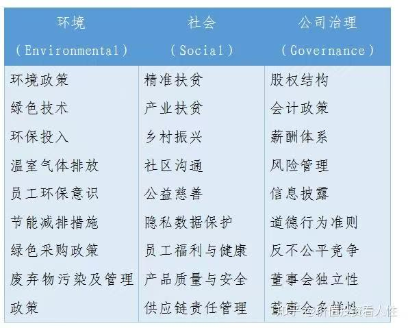

## 方向

十五五政策——区域性、地区性

三农：集体经济改革——三变改革（资源变资产，资金变股金，农民变股东）
社保政策：农村社保（作为三农里面的一个方面也行）、缴费结构（政府、企业、个人）、收益（跨期选择）、延迟退休
ESG（environmental-social-government）：企业融资、

多家企业的数据进行整合分析

劳动力市场：平台经济、

政治经济学分析：

十五五：

国企改革：

新能源汽车：补贴变化

AI：AI产业上下游（算力、数据中心、发电（新能源）、劳动力市场、企业生产力
